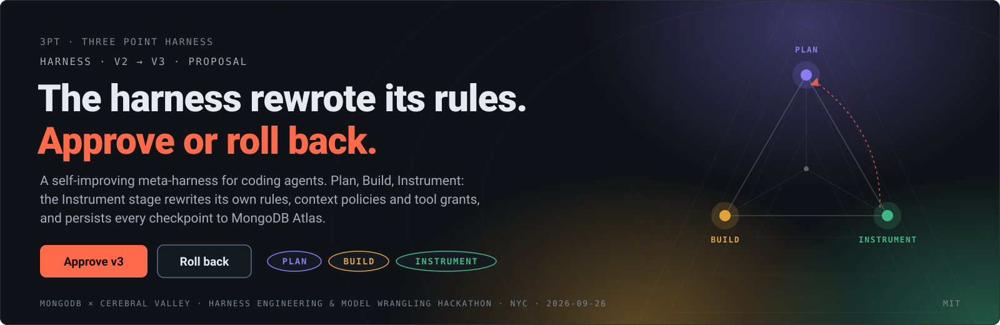
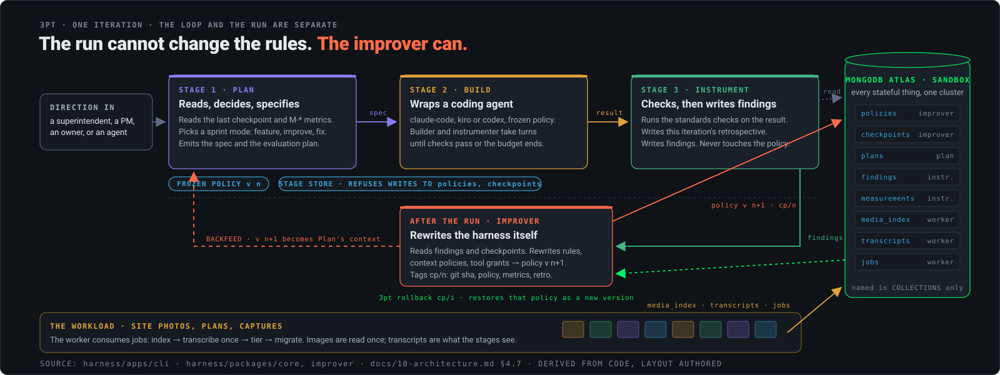
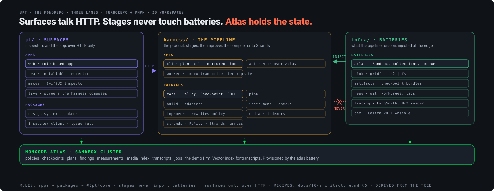
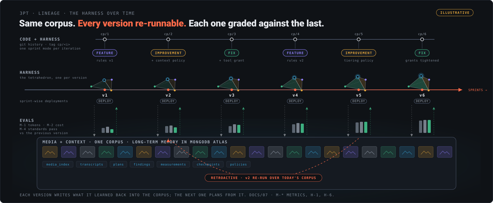

<p align="center"></p>

# 3PT — Three Point Harness
<!-- @s1.01 -->

**A self-improving harness for coding agents, for teams whose work is photos and plans, not code.**
Three stages, Plan → Build → Instrument, run in a loop. After each run an improver rewrites the
harness's own rules, context policies and tool grants as data, writes a checkpoint, and persists it to
MongoDB Atlas. Any checkpoint can be rolled back. Any version can be re-run over the same corpus and
graded against the last.

Built at the MongoDB × Cerebral Valley Harness Engineering & Model Wrangling Hackathon, NYC,
September 2026. MIT licensed.

| | |
|---|---|
| **What it is** | A meta-harness: it wraps a coding agent (Claude Code, Kiro, Codex, or a Strands harness compiled from a policy) and evolves the environment the agent runs in. |
| **Who it serves** | A construction firm's superintendents, project managers, owners, safety leads and trades. Secondary: any media-heavy team (interior design, creative ops, visual trend analysis). |
| **Why Atlas** | Every stateful thing lives in one Sandbox cluster: policies, checkpoints, plans, findings, measurements, the media index, transcripts and jobs. Long-term memory is the database, not the context window. |
| **The name** | A three-point harness twice over: the racing harness (three anchor points, one buckle: Plan, Build, Instrument around the policy) and the construction harness (anchorage, body, connector: Atlas, the policy, the loop). [`docs/00-vision.md` § The name](docs/00-vision.md#the-name). |
| **Why it gets better** | The run cannot change the rules. The improver can, and only from findings. Each version is scored on hard metrics against the previous one, so improvement is caused, not drifted. |

## Gist

- **Plan → Build → Instrument.** Each run uses a frozen policy, builds against it, and records findings.
- **Learn between runs.** The improver uses those findings to version the harness's rules, context policies and tool grants.
- **Keep the history.** MongoDB Atlas stores policies, checkpoints and workload context; rollback restores an earlier policy as a new version.
- **Work with growing media libraries.** Construction photos exercise context reuse, storage tiering and the tools a team needs over time.

## Setup

Requires Node 22+ and the pnpm version pinned in `package.json`.

```sh
node scripts/setup.mjs --site       # install dependencies; build workspaces and dist/web-site
# Configure Atlas through the local key page or host environment, then:
node scripts/setup.mjs --provision  # provision the configured batteries
node scripts/batteries.mjs          # verify database access and configured service keys
node harness/apps/cli/dist/index.js loop
```

Setup uses the existing Keychain, Atlas vault and host environment. Configure `ATLAS_HOST`,
`ATLAS_DBUSER`, `ATLAS_DBPASS` and `ATLAS_DB`; leave `ATLAS_URI` blank. Without an Atlas connection the CLI uses a local file store.
The loop prints its checkpoint tag; pass that tag to `rollback` to restore its policy.

For local server startup, service options and an agent operating procedure, read
[`docs/19-local-operations.md`](docs/19-local-operations.md). Provider choices are in
[`docs/14-setup-cascade.md`](docs/14-setup-cascade.md).

The policy loop, rollback and Strands compiler are implemented. Build calls a model when an
OpenRouter key is configured and otherwise runs without a model. Role screens use a simulated construction workflow; the local API still
needs its Atlas store wired through before its state survives restarts.

## Who it is for

The demo firm is Acme Builders, a made-up general contractor with twenty real buildings and four
live projects. The people are real roles; the harness composes a screen per role from what it has
learned about their photos.

| Role | Their question | What the harness learns to do |
|---|---|---|
| Superintendent | "Is there a photo of unit 206's plumbing with the wall open?" | Index every photo by unit, level, phase and wall state; ask the field for the missing one. |
| Project manager | "What changed on site this week, per project?" | Read each photo once, keep a transcript, compose the weekly update from transcripts. |
| Owner | "Are we on schedule, and what is the evidence?" | Build the owner pack from phase photos; that pack becomes a tool grant. |
| Safety | "Which photos show a hazard we have not closed?" | Route findings to the right person; keep the outcome. |
| Trade | "What do I need to see before I start?" | Surface the last photos of the same unit before drywall. |

The customer analysis and alternative use cases are in `docs/01-icp.md` and
`docs/08-icp-directions.md`. The longer story, an interior design firm, is `docs/06-goal-and-use-case.md`.

## How it works

<p align="center"></p>

| Stage | Reads | Writes | Never |
|---|---|---|---|
| **Plan** | last checkpoint, measurements, media context | `plans`: the spec, the evaluation plan, the sprint mode | the policy |
| **Build** | the plan, the frozen policy | the result, through the wrapped agent | the policy |
| **Instrument** | the result | `findings`, the retrospective | the policy |
| **Improver** (after the run) | `findings`, `checkpoints` | `policies` v n+1, `checkpoints` cp/n, the git tag | the code |

Sprint modes are selected one per iteration, never in parallel: feature, improvement, fix. The
Fix mode is triggered by the metrics, not by a prompt. The loop is separate from the run on purpose:
the stages hold a frozen policy and a store that refuses writes to `policies` and `checkpoints`.

## Architecture

<p align="center"></p>

| Lane | Apps | Packages | Rule |
|---|---|---|---|
| `harness/` the pipeline | `cli` (plan, build, instrument, loop, improve, rollback) · `api` (HTTP over Atlas) · `worker` (index, transcribe, tier, migrate) | `core` · `plan` · `build` · `instrument` · `improver` · `media` · `strands` | apps → packages → `@3pt/core`; stages never import batteries |
| `infra/` batteries | | `atlas` · `blob` · `artifacts` · `repo` · `tracing` · `box` | injected at the edge: cli, api, worker |
| `ui/` surfaces | `web` (role-based app, Playwright capture) · `pwa` · `macos` (SwiftUI) · `live` (screens the harness composes) | `design-system` · `inspector-client` | reach the harness only over HTTP |

| Atlas collection | Holds | Written by |
|---|---|---|
| `policies` | versioned rules, context policies, tool grants | improver |
| `checkpoints` | git sha, policy version, metrics, retrospective | improver |
| `plans` | Plan's output per iteration | plan |
| `findings` | standards-check results, the improver's input | instrument |
| `measurements` | hard metric signals per iteration (M-*) | instrument |
| `media_index` | asset id, tier, location, transcript ref | worker |
| `transcripts` | read-once extraction and embedding | worker |
| `jobs` | the worker queue | cli, worker |
| `demo_*`, `harness_versions` | the demo firm and every harness version's layouts by role | the demo seed |

Names live in `COLLECTIONS` in `harness/packages/core` and nowhere else. The full monorepo, its
eight perspectives and the recipes for adding anything are in `docs/10-architecture.md`. What we
build on, and what we struck, is in `docs/12-strands-archaeology.md`.

## The harness over time

<p align="center"></p>

One corpus, many harnesses. Each sprint tags a checkpoint and ships a deployment. The media and
everything learned about it stay in Atlas as long-term memory, so any version can be re-run over
today's corpus and graded against the previous one on the same evals. The figure is illustrative.

| Metric | Measures | Hypothesis it tests |
|---|---|---|
| M-1 `tokens_per_iteration` | prompt + completion tokens across the three stages | H-1: tokens and cost fall over iterations while the pass rate holds |
| M-2 `cost_per_iteration` | M-1 at provider rates | H-1 |
| M-3 `build_turns_to_pass` | builder ↔ instrumenter round-trips until checks pass | H-2; triggers a Fix sprint |
| M-4 `standards_pass_rate` | fraction of Instrument checks passing at checkpoint | H-1, H-2, H-7, H-8 |
| M-5 `image_reread_rate` | image reads beyond the first transcription | H-3: read once, reuse transcripts |
| M-14 `retrospective_attribution_rate` | policy changes that cite a finding | H-6: improvement is caused, not drifted |

The full measurement system, theses and requirement set: `docs/07-assessment-and-measurement.md`.

## The data

| Part | Source | Real? |
|---|---|---|
| Twenty buildings: street, neighborhood, type, stories, floor area | NYC Open Data, DOB Job Application Filings (`ic3t-wcy2`) | Real records; house numbers and names removed |
| Photos | `data/mock/media-pool`, CC0, public domain, CC BY, CC BY-SA | Real photos, not of these buildings |
| Firm, dates, schedule, people, activity, outcomes | `hub/site/sim-data.js`, fixed seed | Made up |

Credits and licences: `THIRD_PARTY.md`. Layout and what is real: `data/mock/README.md`.

<details>
<summary>Repository map</summary>

| Path | What lives here |
|---|---|
| `CLAUDE.md` / `AGENTS.md` | Context every coding agent loads before touching this repo |
| `harness/` | The pipeline: core, plan, build, instrument, improver, media, strands, cli, api, worker. `harness/README.md` |
| `infra/` | Batteries: atlas, blob, artifacts, repo, tracing, box. Provisioners, skills, MCP wiring. `infra/README.md` |
| `ui/` | Surfaces: web, pwa, macos, live; design-system and inspector-client. `ui/README.md` |
| `data/mock/` | Acme Builders: buildings, projects, photo pool, expected harness versions |
| `docs/` | The docs of record, numbered; `docs/assets/` holds the generated figures |
| `hub/` | The gated hub workspace over the docs, fully self-contained. `hub/README.md` |
| `scripts/` | `prov.mjs` provenance index · `worktree.sh` lane and verify worktrees · `banner.mjs`, `lineage.mjs`, `loop.mjs`, `architecture.mjs` generate the figures |
| `brainstorming.md` | The transcript, verbatim and append-only, with provenance markers between the lines |
| `LICENSE` · `THIRD_PARTY.md` | MIT; third-party photos, records and fonts under their own licences |
</details>

<details>
<summary>Docs of record</summary>

| Question | File |
|---|---|
| What we are building and why | `docs/00-vision.md` |
| Who it is for; five directions compared | `docs/01-icp.md`, `docs/08-icp-directions.md` |
| Goal over time, the use case, value props | `docs/06-goal-and-use-case.md` |
| Theses, hypotheses, the M-* metrics, the R-* requirements | `docs/07-assessment-and-measurement.md` |
| The monorepo and the recipes | `docs/10-architecture.md` |
| Strands: what we build on, what we struck; the questions answered with pointers | `docs/12-strands-archaeology.md`, `docs/13-strands-diagrams.md`, `docs/18-strands-questions.md` |
| Local build and services; provider setup; Atlas provisioning | `docs/19-local-operations.md`, `docs/14-setup-cascade.md`, `docs/16-sandbox-provisioning.md`, `docs/17-atlas-setup-dossier.md` |
| CI and deployment; worktrees; PR heraldry | `docs/13-ci-and-deployment.md`, `docs/11-worktrees.md`, `docs/pr-descriptions/README.md` |
| License and repository hygiene | `docs/15-open-source-checklist.md` |
| Provenance: where every idea came from | `docs/09-provenance.md`, `docs/provenance-index.md` |
| Terms | `docs/glossary.md` |
</details>

## Hub workspace

The docs above are rendered, behind a login, at **https://3pt.pages.dev**, with a preview per PR.
Everything about it is cordoned under `hub/`.

```sh
make -C hub preview   # local preview at http://127.0.0.1:8000/
make -C hub check     # lints: nav, viewer, diagrams, provenance, tersity
make -C hub deploy    # production deploy
```

## Team

Patrick Astarita, Yash Kothari.

## License

MIT. See `LICENSE`. Third-party code arrives as dependencies under their own licenses (AWS Strands
is Apache-2.0); nothing is vendored. Repository licensing and hygiene are tracked in
`docs/15-open-source-checklist.md`.

## Third-party material

Photos, building records and fonts keep their own free licences. List and credits: [`THIRD_PARTY.md`](https://github.com/pastarita/3pt/blob/main/THIRD_PARTY.md).
