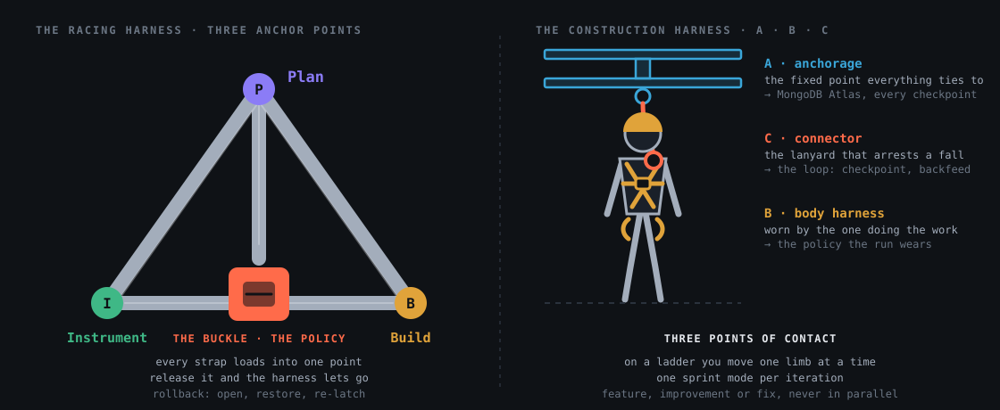

# 3PT — Vision

*Source of record. Distilled from the founding conversation (Patrick + Yash, Sep 2026).*

## One-paragraph pitch
<!-- @s1.01 @s1.02 -->

3PT ("Three Point Harness") is a meta-harness for coding agents aimed at **media-heavy
workflows**. It wraps any frontier coding agent (Claude Code, Kiro, Strands, …) in a
three-stage loop — **Plan, Build, Instrument** — and separates *what gets built* from
*the engineering standards it must eventually meet*. The frontier agent builds fast;
an instrumentation agent then refactors toward our standards, and those standards are
baked back into the harness code so the next iteration starts from a healthier base.

## The name

Two harnesses share the name, and 3PT means both.

| | Three points | In 3PT |
|---|---|---|
| **The racing harness** | Two shoulder straps and a lap strap, anchored at three points, loading into one buckle. | The points are Plan, Build and Instrument. The buckle is the policy: every strap loads into it, and releasing it lets the whole harness go. Rollback opens the buckle, restores an earlier setting, re-latches. |
| **The construction harness** | Fall protection is taught as A, B, C: an **anchorage** the structure provides, a **body harness** worn by the one doing the work, a **connector** that arrests the fall. | The anchorage is MongoDB Atlas, the fixed point every version ties to. The body harness is the policy the run wears. The connector is the loop: checkpoint, backfeed, rollback. |
| **Three points of contact** | On a ladder you move one limb at a time, never two. | One sprint mode per iteration: feature, improvement or fix, never in parallel. |

The workload is construction photos, so the second reading is the one a superintendent hears first.

## The three points
<!-- @s1.01 @s1.04 -->

| Stage | Job | Owns |
|---|---|---|
| **Plan** | Polyglot gateway. Decides what to build *and* how it will be evaluated and instrumented. Reads harness health, checkpoint retrospectives, and the media-context state. | Roadmap, acceptance criteria, evaluation plan, sprint mode selection |
| **Build** | Meta-harness over any existing agent harness. Runs a *build-with-instrumentation* loop: the frontier model builds, the instrumentation model reviews for SE principles and repo patterns and pushes fixes back. | Feature code, tests, pipelines |
| **Instrument** | Observability, DevX, CI/CD, deployments, memory. Standards here are enforced on the codebase and **backfed** into the harness and into Plan's prompt gateway. | Standards, checks, dashboards, memory schema |

### Loops inside the loop
<!-- @s1.02 @s1.03 @s1.04 @s1.12 -->

- **Build-with-instrumentation loop** — builder ↔ reviewer, back and forth until standards pass, then return to Plan.
- **Instrumentation backfeed** — what Instrument learns becomes harness code and Plan context.
- **Checkpoint retrospectives** — at each checkpoint the harness keeps only checkpoint-level memory and reflects on it. Retrospectives feed a fourth, emergent dimension: **Measurement** of the harness's own evolution. Checkpoints are git-native (worktrees, tags) so rolling back to a healthier harness is cheap.
- **Sprint modes** (Plan selects one per iteration, sequentially, never in parallel):
  1. **Feature** sprint — launch new capability.
  2. **Improvement** sprint — refine what exists.
  3. **Fix** sprint — find and reduce errors.

## Two sides of the triangle
<!-- @s1.07 @s1.08 -->

Think of the stack as a triangle drawn per iteration.

- **Right side — harness history.** The git history of the harness code itself, mapped to Plan/Build/Instrument.
- **Left side — media context.** At each instantiation, how the media inputs are intermediated: terse indexes over large assets, blob/NoSQL stores, embeddings, and the codified pipelines that live *inside the running repo*. This context also needs migrations over time, driven by the state of the right side.

We want a **polyglot** left side: a plurality of methods for indexing, parsing, and running maintenance jobs over long-lived media data, with a temporal-segmentation visualization for humans.

## Hackathon framing (revised 2026-09-26 against the rules)
<!-- @s1.06 @s1.20 @s1.22 -->

The rules ban **Image Analyzers**, **dashboards as the main feature**, and **basic RAG**
(`docs/05-rules.md`). The original "generate context from image feeds, spot trends" pitch reads
as an image analyzer. The revision:

- **The harness is the product.** What we demo is a harness that rewrites its own rules, context
  policies, and tool grants, checkpoints to Atlas, and rolls back. That is Problem Statement 1,
  Recursive Harnessing, almost verbatim.
- **Images are the workload, not the feature.** A media-heavy corpus is what makes context
  budgets, storage tiering, and read-once transcripts hard. It supplies the hard metric signals
  (storage cost, hot-tier hit rate, transcript reuse, tokens per iteration) the harness optimizes.
  No feature of ours classifies, captions, or judges images for a user.
- **The UI is an inspector.** The spatial thumbnail view stays on the roadmap as a way for a human
  to supervise, but it is not the headline and may not ship today.
- **Retrieval serves the harness, not the user.** Embeddings and vector search exist so Plan can
  select the right context and Instrument can find prior retrospectives, not to answer questions.
- **Atlas is the memory and state layer** for policies, checkpoints, retrospectives, media indexes,
  transcripts, and measurements.

## Scope for the hackathon
<!-- @s1.08 @s1.10 @s1.14 @s1.21 -->

- **Images only.** No video, no audio.
- **Context maintenance, not image analysis and not generation.** The harness maintains indexes,
  transcripts, and tiering over an image corpus that keeps growing, and evolves its own policies
  for doing so. Trend analysis is a downstream possibility for an ICP, not a hackathon feature.
- **Personal / single-user.** No collaboration, no role-based access managed by the harness. Humans manage access; the AI never controls roles. (Permissioning layer is a possible later additionality.)
- **Storage tiering is in scope:** hot vs. cold, what must be instantly accessible, what can sleep.
- **Read once, trust the transcript.** Extract context from an image once, store it as source of truth, re-read only deliberately. Repeated re-reading is a hallucination vector.

## Problems we are addressing (statement of need)
<!-- @s1.13 -->

1. Hot/cold storage management for media, and relevance-driven promotion/demotion.
2. Transcription of images into durable, non-hallucinated context.
3. Engineers building their own classification / segmentation / extraction / regeneration pipelines need to organize and index large datasets and stratify them across stores.
4. Local media organization is personal; the harness must adapt its storage layout to the user over time.

## The supervisory UI
<!-- @s1.09 @s1.29 -->

A terse spatial view: 3D thumbnail stacks whose scale reflects corpus magnitude at each node, with drill-in inspectability so a human can quickly evaluate images and judge how pipelines are performing. This is the human's supervisory mode over long-running agent iteration. First target: a macOS SwiftUI app (`apps/3PT`).

## Names
<!-- @s1.02 @s1.07 @s1.16 -->

- **Install loop** — merge → download → build → install, run between team machines fast. See `docs/03-workflow.md`.
- **Instrumentation loop** — the area that manages all instrumentation systems.
- **Furnace** — informal name for the right-side harness state that drives left-side migrations.
