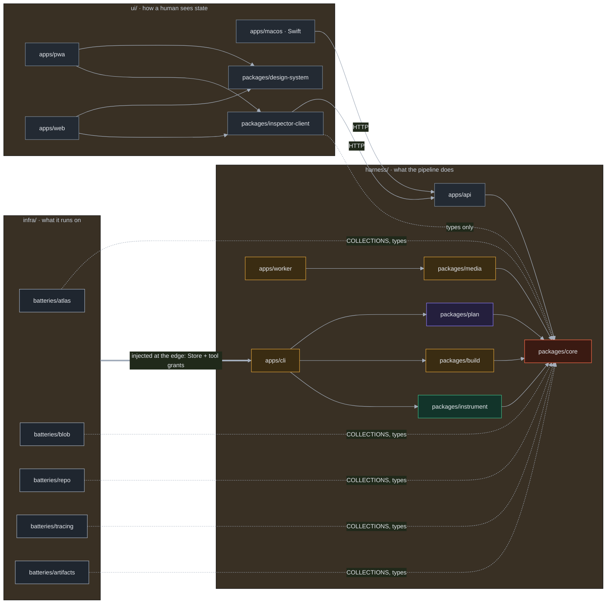
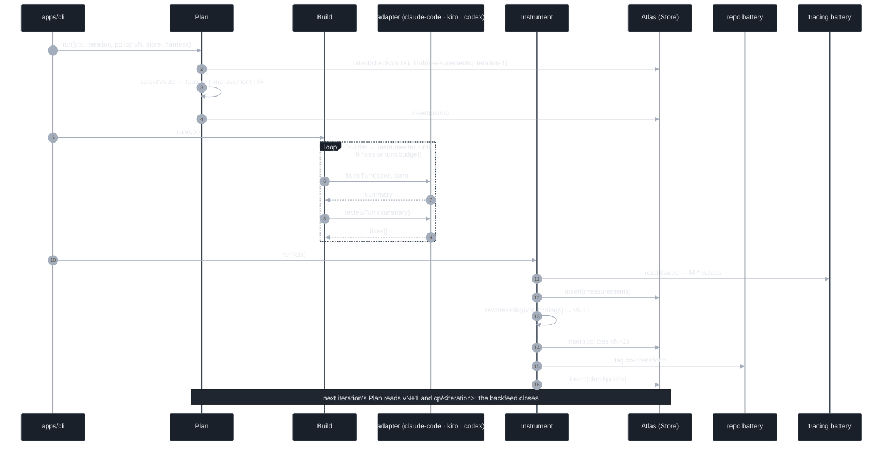
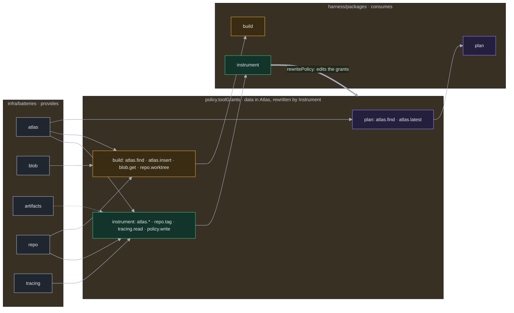
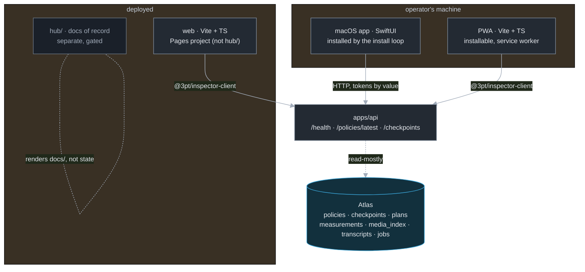
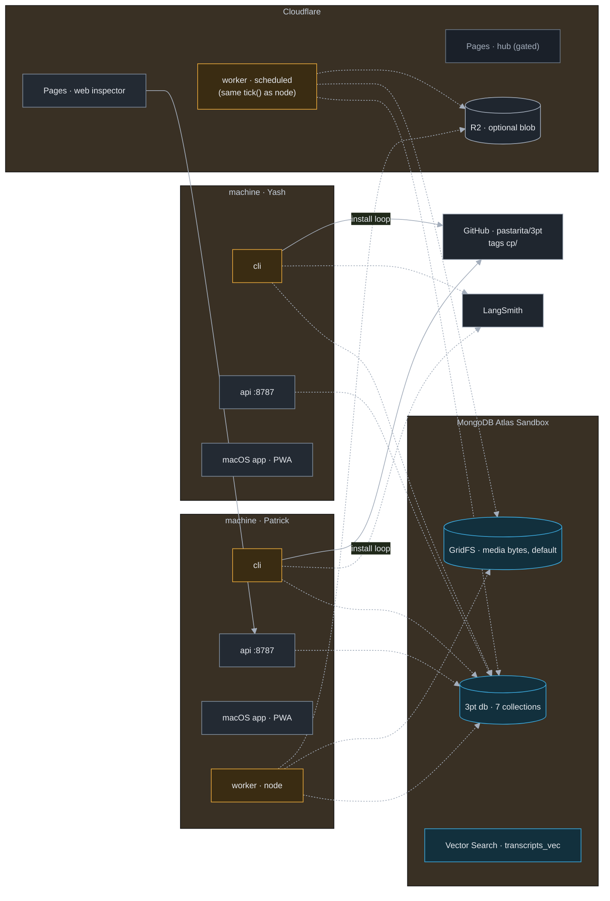
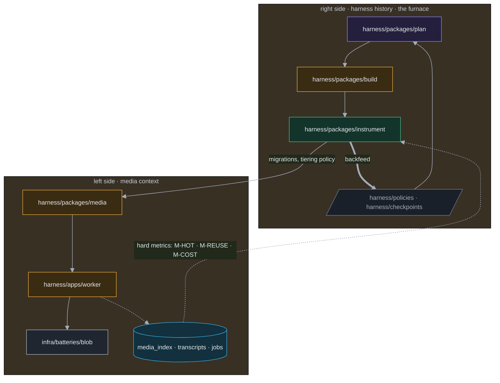
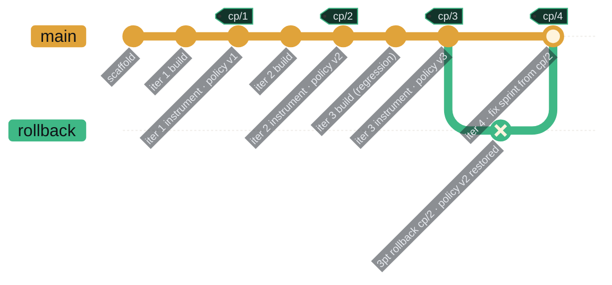

# Architecture: the polyglot monorepo

*Source of record. Decided 2026-09-26 (Patrick, Yash). Implemented the same day: the tree below
exists, installs, and builds. Diagrams here are Mermaid (GitHub renders them). The same
architecture is drawn as first-class SVG on the hub leaf `hub/site/architecture.html`; when one
changes, change the other. Mermaid here, SVG there, one set of names.*

## 1. The decision
<!-- @s1.14 @s1.16 -->

Three top-level lanes, and only three. Each lane owns one question.

| Lane | Question it answers | Turborepo convention inside |
|---|---|---|
| `ui/` | How does a human see harness state? | `apps/` (pwa, web, macos) + `packages/` (design-system, inspector-client) |
| `harness/` | What does the running pipeline do? | `apps/` (cli, api, worker) + `packages/` (core, plan, build, instrument, media) + `policies/`, `checkpoints/` as data |
| `infra/` | What does the pipeline run on, and how is it stood up? | `batteries/` (atlas, blob, artifacts, repo, tracing), one package each |

**Turborepo, not Bazel.** Bazel would give hermetic polyglot builds we do not need today and would
cost the afternoon. Turborepo runs any workspace with a `package.json`, so the Swift app is driven
by a thin wrapper (`ui/apps/macos/package.json`) and `pnpm turbo run build` covers the whole tree.
Everything Turborepo caches is a `dist/`; the Swift build is excluded on machines without Xcode.
Revisit Bazel only if a second native toolchain (Rust, Python wheels) joins the tree.

**Batteries included.** A battery is an instantiable artifact: a package that can stand up one thing
the pipeline runs on (a database, a blob store, a repo, a tracing project), idempotently, plus the
agent skill and MCP wiring for using it. Stages never import batteries. They receive what a battery
provides at the edge: a `Store`, a tool grant. That indirection is what lets the Instrument stage
rewrite tool grants (data in Atlas) without touching stage code, which is the Recursive Harnessing
mechanism in the dependency graph rather than in prose.

**Two hosts for the same surface.** The hub (`hub/`) renders the repo and stays cordoned. The web
inspector (`ui/apps/web`) is a separate Pages project. Harness code never goes in `hub/`.

## 2. The tree

```
3pt/
  package.json  pnpm-workspace.yaml  turbo.json  tsconfig.base.json  Makefile  .env.example
  scripts/        bootstrap.sh · install-loop.sh · prov.mjs
  docs/           source of record (this file is docs/10)
  hub/            gated Pages site over docs/ (cordoned; see hub/README.md)
  ui/
    apps/pwa            @3pt/pwa           Vite + TS, manifest + service worker, local-first inspector
    apps/web            @3pt/web           same inspector, plain, deployable for judges
    apps/macos          @3pt/macos         SwiftUI, xcodegen project.yml, turbo-driven wrapper
    packages/design-system   @3pt/design-system   tokens mirrored from hub/site/3pt.css
    packages/inspector-client @3pt/inspector-client typed client over @3pt/api
  harness/
    packages/core       @3pt/core          stage contract, runner, record types, COLLECTIONS, seed policy
    packages/plan       @3pt/plan          sprint-mode selector, plan writer
    packages/build      @3pt/build         harness adapters, builder ↔ instrumenter loop
    packages/instrument @3pt/instrument    checks, retrospective, policy rewrite, checkpoint
    packages/media      @3pt/media         tiering, read-once rules, job derivation (left side)
    apps/cli            @3pt/cli           3pt plan|build|instrument|loop|rollback
    apps/api            @3pt/api           HTTP for the surfaces
    apps/worker         @3pt/worker        job drainer; node locally, Cloudflare Worker deployed
    policies/           v<n>.json, git mirror of the policies collection
    checkpoints/        cp-<n>.md, git mirror of the checkpoints collection
  infra/
    batteries/atlas     @3pt/battery-atlas     db, 7 collections, indexes, vector index, MCP server
    batteries/blob      @3pt/battery-blob      gridfs | r2 | fs for image bytes
    batteries/artifacts @3pt/battery-artifacts checkpoint bundles by tag
    batteries/repo      @3pt/battery-repo      worktrees per iteration, tags per checkpoint, rollback
    batteries/tracing   @3pt/battery-tracing   LangSmith project, M-* reader
```

Dependency direction, everywhere: `apps → packages → @3pt/core`, and `@3pt/core` imports nothing
from the workspace. Surfaces import `@3pt/core` for types only. Batteries import `@3pt/core` for
`COLLECTIONS` and record types only.

## 3. Diagram design system

Every diagram below shares one vocabulary so the same thing looks the same everywhere. Colors are
the hub tokens (`hub/site/3pt.css`, mirrored in `@3pt/design-system`).

| Class | Meaning | Fill | Stroke |
|---|---|---|---|
| `plan` | Plan stage and its artifacts | `#241f3d` | `#8b7cf6` |
| `build` | Build stage, adapters, the builder ↔ instrumenter loop | `#3a2c12` | `#e0a33a` |
| `inst` | Instrument stage, checks, backfeed | `#12342a` | `#3fb886` |
| `atlas` | Atlas collections and the Store | `#12303d` | `#3aa6d9` |
| `surface` | A UI surface or the API it reads | `#232a33` | `#7d8a99` |
| `battery` | An infra battery | `#1f262f` | `#a3adbb` |
| `data` | Data-as-files (policies/, checkpoints/) | `#1a2029` | `#6b7684` |
| `flag` | The one thing to look at first | `#3a1a12` | `#ff6b4a` |

Edges: solid = code dependency or call; dashed = data flow through Atlas; thick = the backfeed.
Every diagram starts with the same init block so it renders on the dark hub tokens.

```mermaid
%%{init: {"theme":"base","themeVariables":{"background":"#0f1216","primaryColor":"#1a2029","primaryTextColor":"#e6e9ee","primaryBorderColor":"#3a4552","lineColor":"#a3adbb","secondaryColor":"#151a21","tertiaryColor":"#1f262f","fontFamily":"ui-monospace, Menlo, monospace","fontSize":"13px"}}}%%
flowchart LR
  P[plan]:::plan --- B[build]:::build --- I[inst]:::inst --- A[(atlas)]:::atlas --- S[surface]:::surface --- T[battery]:::battery --- D[/data/]:::data --- F{{flag}}:::flag
  classDef plan fill:#241f3d,stroke:#8b7cf6,color:#e6e9ee
  classDef build fill:#3a2c12,stroke:#e0a33a,color:#e6e9ee
  classDef inst fill:#12342a,stroke:#3fb886,color:#e6e9ee
  classDef atlas fill:#12303d,stroke:#3aa6d9,color:#e6e9ee
  classDef surface fill:#232a33,stroke:#7d8a99,color:#e6e9ee
  classDef battery fill:#1f262f,stroke:#a3adbb,color:#e6e9ee
  classDef data fill:#1a2029,stroke:#6b7684,color:#a3adbb
  classDef flag fill:#3a1a12,stroke:#ff6b4a,color:#e6e9ee
```



## 4. Perspectives

Eight views of one tree. Each answers a different question; together they are the extension
manual. The recipes in §5 point back at them.

### 4.1 The triplet and the direction of dependency

*Question: who is allowed to import whom?*



Read it as three rules. Surfaces reach the harness only over HTTP. Stages reach `core` only.
Batteries are injected into the apps, never imported by stages.

### 4.2 One iteration

*Question: what happens when `3pt loop` runs?*



### 4.3 Batteries, tool grants, stages

*Question: how does Instrument change what a stage may do without changing stage code?*



The middle column is a document, not code. `harness/policies/v<n>.json` mirrors it in git.

### 4.4 The surfaces

*Question: how does each UI reach state, and what is it allowed to do?*



Surfaces are read-mostly by rule (the UI is an inspector). Any verb a surface gains lands in
`apps/api` and is granted like any other tool.

### 4.5 Deployment topology

*Question: what runs where?*



Nothing stateful lives on either machine. Two machines running the loop against one cluster is
the install-loop demo. The deployed worker runs the same `tick()` as the local one.

### 4.6 The triangle, mapped to directories

*Question: where do the left and right sides of the triangle live?*



### 4.7 Checkpoints and rollback in git

*Question: what does the install loop see over five iterations and one rollback?*



A checkpoint is the pair (git tag, Atlas document). `3pt rollback cp/2` checks out the tag through
the repo battery and restores policy v2 through the atlas battery. Both machines pick it up on the
next install-loop pass.

### 4.8 Task graph

*Question: what does `pnpm turbo run build` actually do?*

```mermaid
%%{init: {"theme":"base","themeVariables":{"background":"#0f1216","primaryColor":"#1a2029","primaryTextColor":"#e6e9ee","primaryBorderColor":"#3a4552","lineColor":"#a3adbb","fontFamily":"ui-monospace, Menlo, monospace","fontSize":"12px"}}}%%
flowchart BT
  CORE["@3pt/core"]:::flag
  PL["@3pt/plan"]:::plan --> CORE
  BU["@3pt/build"]:::build --> CORE
  IN["@3pt/instrument"]:::inst --> CORE
  ME["@3pt/media"]:::build --> CORE
  CLI["@3pt/cli"]:::build --> PL & BU & IN
  API["@3pt/api"]:::surface --> CORE
  WK["@3pt/worker"]:::build --> ME
  DS["@3pt/design-system"]:::surface
  IC["@3pt/inspector-client"]:::surface --> CORE
  PWA["@3pt/pwa"]:::surface --> DS & IC
  WEB["@3pt/web"]:::surface --> DS & IC
  MAC["@3pt/macos · xcodegen + xcodebuild\n(skips without Xcode)"]:::surface
  BA["@3pt/battery-atlas"]:::battery --> CORE
  BB["@3pt/battery-blob"]:::battery --> CORE
  BF["@3pt/battery-artifacts"]:::battery --> CORE
  BR["@3pt/battery-repo"]:::battery --> CORE
  BT["@3pt/battery-tracing"]:::battery --> CORE
  classDef plan fill:#241f3d,stroke:#8b7cf6,color:#e6e9ee
  classDef build fill:#3a2c12,stroke:#e0a33a,color:#e6e9ee
  classDef inst fill:#12342a,stroke:#3fb886,color:#e6e9ee
  classDef surface fill:#232a33,stroke:#7d8a99,color:#e6e9ee
  classDef battery fill:#1f262f,stroke:#a3adbb,color:#e6e9ee
  classDef flag fill:#3a1a12,stroke:#ff6b4a,color:#e6e9ee
```



`build` depends on `^build` (upstream first), outputs `dist/**`, and is cached by content hash.
`provision` is never cached and reads the env keys listed in `turbo.json`. Live graph:
`pnpm graph` writes `docs/generated/turbo-graph.html` (gitignored).

## 5. Extension recipes

Each recipe is a fixed number of moves. If a change needs more, the architecture is wrong, not the change.

| To add… | Moves | Diagram |
|---|---|---|
| **A surface** (a new UI) | 1. `ui/apps/<name>` depending on `@3pt/design-system` + `@3pt/inspector-client`. 2. Nothing else. If it needs a verb the API lacks, that is an API change, made first. | 4.1, 4.4 |
| **A build harness** (Kiro, Codex, Strands) | 1. One `HarnessAdapter` in `harness/packages/build`. 2. Add its key to `HarnessKind` in core. 3. `THREEPT_HARNESS=<kind>`. | 4.2 |
| **A battery** (a new data source, store, or service) | 1. `infra/batteries/<name>` with the four files (package, descriptor, provision, SKILL). 2. Name its grants in the descriptor. 3. Nothing in `harness/` changes until a policy grants them. | 4.3 |
| **A measurement** (a new M-*) | 1. Add the id to `METRICS` in the tracing battery and define it in docs/07. 2. Instrument writes it; Plan may read it. | 4.2, 4.6 |
| **A collection** | 1. `COLLECTIONS` in core. 2. Its indexes in the atlas battery. 3. A record type in core if stages touch it. | 4.5 |
| **A left-side job** (indexer, transcriber, migration) | 1. A `Job['kind']` in core. 2. Its derivation in `@3pt/media`. 3. Its handler in `apps/worker`. | 4.6 |

Not extensible by design: the number of stages (three), the number of lanes (three), the state
store (Atlas). Those are the product.

## 6. Open and decided

| Item | State |
|---|---|
| Monorepo tool | **Decided:** Turborepo + pnpm workspaces. Bazel rejected for the hackathon. |
| Top-level lanes | **Decided:** `ui/`, `harness/`, `infra/`. `hub/` is a fourth directory but not a lane; it renders the repo. |
| Swift in the task graph | **Decided:** wrapper package, skipped without Xcode. |
| Blob backend | **Decided default:** GridFS inside the Sandbox (eligibility). R2 and fs are one env var away. |
| Worker runtime | **Open:** node locally today; Cloudflare Worker deploy (`wrangler`) when the jobs collection is live. |
| Web inspector host | **Open:** a second Pages project, or v0 if the afternoon runs short. Never inside `hub/`. |
| Atlas driver in the atlas battery | **Open (lane 4):** `provision.ts` prints its plan until `mongodb` is added and `ATLAS_URI` exists. |
| Mermaid in the hub Viewer | **Decided:** no. Leaves are self-contained (no CDN). The hub carries the SVG leaf instead. |
