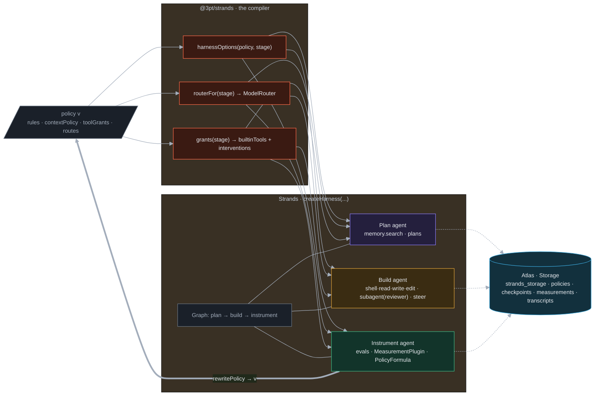

# Strands archaeology: what we build on, what we do not rebuild

*Source of record. Decided 2026-09-26 ~13:00 ET (Patrick, Yash): the harness is built **on top of
AWS Strands**, and iterated there. This document is the archaeology (source register → capability
ledger → lexicon) that turns Strands into a semantically referenceable basis the two of us and our
agents can invoke by name. Every claim cites a fetched source; nothing here is from memory.
Method: the archaeology steps of the `mailer-program` skill, applied to a framework instead of a
corpus. Machine-readable twin: `harness/packages/strands/topology.json`.*

## 0. The finding that changes the plan

Strands is no longer only an agent SDK. Since 2026-09-21 it ships a **harness layer**:
`createHarness()` returns a fully assembled agent with shell, file and web tools, a helper
subagent, a checklist tracker, long-term memory, context management, prompt caching, sessions,
skills, and approval gates, all overridable. It also ships a **ModelRouter**, **steering**,
**checkpoints**, an **evals SDK**, and a **harness optimizer** that treats the harness
configuration as trainable parameters. Most of what `docs/03-workflow.md` planned to write
already exists there. So:

> **3PT is a policy-to-harness compiler on Strands.** A 3PT `Policy` document (rules, context
> policy, tool grants, model routes) compiles into `createHarness()` options. The Instrument stage
> rewrites the Policy; the next iteration's harness is built from the rewrite. The three stages are
> three harness invocations wired as a Strands `Graph`. Atlas is the `Storage` behind sessions,
> memory and checkpoints. That is the whole build.

## 1. Source register

Fetched 2026-09-26 between 12:55 and 13:10 ET. Verdicts: `DIRECT` = we call it as is; `DIALECT` =
the machinery transfers, we supply the vocabulary; `PATTERN` = adopt the shape, not the artifact;
`ASSET` = a file or server to consume.

| # | Source | What it is | Version / date | Verdict | Backs |
|---|---|---|---|---|---|
| S1 | https://github.com/strands-agents/harness-sdk | The monorepo: `harness-py/`, `harness-ts/`, `strands-cli/`, `strands-py/`, `strands-ts/`, `strands-mcp/`, `site/`, `team/`. Apache-2.0. | pushed 2026-09-25, 8,450 stars; tags `python/v1.57.1`, `harness-cli/v0.1.4`, `mcp/v0.3.0` | DIRECT | L1–L20 |
| S2 | `harness-ts/README.md` (S1) | TypeScript harness API: `createHarness()` options, built-in tools, subagents, interventions, plugins, MCP, sessions, memory, skills, caching, tracing | npm `@strands-agents/harness` **0.1.1** (peer `@strands-agents/sdk >=1.19.0 <2`) | DIRECT | L1, L3–L9 |
| S3 | `harness-py/README.md` (S1) | Python harness API: `create_harness()`, same surface plus `search_memory` tool and `checkpointing=True` passthrough | PyPI `strands-harness` **0.1.2** | DIRECT | L1, L11 |
| S4 | `harness-ts/src/index.ts`, `models.ts`, `types/agent.ts` (S1) | The real exports: `createHarness`, `HarnessAgentOptions`, `HARNESS_CONTRACT`, `buildSystemPrompt`, `supportsThinking`, `supportsWebSearch`, `configureLogging`, `EnvironmentContext`, `Todos`; provider table `bedrock · bedrock-mantle · anthropic · openai · google · ollama · litellm`; `Effort` = `auto·off·minimal·low·medium·high·xhigh·max`; `MemoryConfig.stores?: MemoryStore[]`; `SessionConfig {id?, dir?}` | main, 2026-09-25 | DIRECT | L1, L2, L6 |
| S5 | https://strandsagents.com/docs/api/typescript/ModelRouter/ and `.../python/strands.models.routing.router/` | `new ModelRouter(candidates, {strategy, maxSwitches})`, passed as `model:`; `FallbackStrategy` (default: fewest failures, declaration order), `ClassifierStrategy` (LLM picks by candidate evidence; options `systemPrompt · timeoutMs · maxMessageChars · maxAgentInstructionsChars · maxCandidateChars`), custom `RoutingStrategy`; nested routers are one opaque candidate | docs, current | DIRECT | L2 |
| S6 | https://strandsagents.com/docs/api/typescript/AgentConfig/ | Everything the harness passes through: `model · tools · systemPrompt · appState · conversationManager · contextManager · plugins · backgroundTasks · retryStrategy · interventions · structuredOutputSchema · sessionManager · memoryManager · traceAttributes · name · description · id · toolExecutor · checkpointing · sandbox · storage` | docs, current | DIRECT | L1, L7, L11 |
| S7 | https://strandsagents.com/docs/api/typescript/StopReason/ | `cancelled · checkpoint · contentFiltered · endTurn · guardrailIntervened · interrupt · maxTokens · limitOutputTokens · limitTotalTokens · limitTurns · pauseTurn · refusal · stopSequence · toolUse · modelContextWindowExceeded` | docs, current | DIRECT | L10 |
| S8 | https://strandsagents.com/docs/api/typescript/Storage/ | Unified `Storage`: `write(key, bytes) · read(key) · delete(key) · list(prefix) · namespace(prefix)? · search(query)?`; shipped `FileStorage · S3Storage · InMemoryStorage`; plugs into `SessionManagerConfig.storage` and `AgentConfig.storage` for sessions, memory, snapshots | docs, current | DIALECT | L7 |
| S9 | https://strandsagents.com/docs/api/typescript/MemoryStore/ | `MemoryStore`: `name · description? · maxSearchResults? · extraction? · writable`; `search(query, opts) · add(content, meta)? · addMessages(msgs)? · initialize()? · getTools()?` | docs, current | DIALECT | L8 |
| S10 | https://strandsagents.com/docs/user-guide/sdk/agents/session-management/ | Sessions persist messages, agent state, conversation-manager state; multi-agent sessions persist orchestrator state and node transitions; TS `SessionManager` + `SnapshotStorage` (deprecated for `Storage`); snapshot ids are UUID v7 with `immutable_history/` | docs, current | DIRECT | L7, L11 |
| S11 | `.../python/strands.experimental.checkpoint.checkpoint/` | `Checkpoint {position: after_model|after_tools, cycle_index, schema_version}`; stop with `stop_reason="checkpoint"`, resume with `{"checkpointResume": {"checkpoint": ckpt.to_dict()}}`; stores no conversation state, pair with a SessionManager | docs, experimental | DIALECT | L11 |
| S12 | https://strandsagents.com/docs/api/typescript/Plugin/ | `Plugin {name, initAgent(agent), getTools()?}`; `agent.addHook(EventClass, cb)`; events `BeforeInvocation · AfterInvocation · BeforeModelCall · AfterModelCall · BeforeToolCall · AfterToolCall · BeforeTools · AfterTools · MessageAdded · Initialized · Interrupt · ToolResult` | docs, current | DIRECT | L9, L12 |
| S13 | https://strandsagents.com/blog/steering-accuracy-beats-prompts-workflows/ | Steering handlers: `steer_before_tool` / `steer_after_model` returning `Proceed(reason)` or `Guide(reason)`; measured 100% pass at 66% fewer input tokens than SOP prompting over 600 runs | blog | DIRECT | L13 |
| S14 | https://strandsagents.com/blog/introducing-harness-optimizer/ | `strands-harness-optimizer`: `Formula` (`process · get_tunable_params · update_params`), `RewardFunction`, `FormulaOptimizer` (`ContrastiveReflectionOptimizer`, `MultiAgentOptimizer`), `Trainer.fit()`, `LocalRolloutEngine`; today only `SystemPromptFormula`; AppWorld 72.6→95.8 | blog 2026-07-10; PyPI **0.0.1** | PATTERN | L14 |
| S15 | https://strandsagents.com/blog/evaluating-ai-agents-practical-guide-strands-evals/ and user-guide `evals-sdk/` | `strands_evals`: `Case · Experiment · EvaluationReport`, evaluators (Output, Trajectory, Interactions, Helpfulness, Faithfulness, Harmfulness, ToolSelectionAccuracy, ToolParameterAccuracy, GoalSuccessRate, plus ~25 more incl. skill-selection and multimodal), `ActorSimulator`, `ExperimentGenerator`; online and offline task functions | PyPI **0.0.1**; no npm package found | DIRECT (Python) | L15 |
| S16 | https://strandsagents.com/blog/introducing-strands-agent-sops/ | Agent SOPs: markdown with RFC-2119 steps, parameters, progress tracking; served as MCP prompts or system prompts; `strands-agents-sops skills` converts to Skills format | PyPI **1.1.3** | PATTERN | L16 |
| S17 | https://strandsagents.com/blog/introducing-strands-harness/ | Harness = "a fully assembled, customizable, state-of-the-art agent"; layers SDK → harness → CLI; tool results over ~1500 tokens truncated, summarization at >85% context; "28% lower token cost" | blog 2026-09-21 | DIRECT | L1, L5 |
| S18 | `strands-cli/README.md` (S1) | `strands` TUI over `createHarness`; `/export` writes a TS or Python harness project; `--model provider/id`, `--effort`, `--session-id`, `--mcp-config`, `--builtin-tools`; reads keys from env (`ANTHROPIC_API_KEY`, `OPENAI_API_KEY`, `GEMINI_API_KEY`, `LITELLM_BASE_URL`, AWS chain) | npm `@strands-agents/cli` **0.1.4** | ASSET | L17 |
| S19 | `strands-mcp/README.md` (S1) | `strands-agents-mcp-server`: `search_docs(query, k)` + `fetch_doc` over Strands' llms.txt; `claude mcp add strands uvx strands-agents-mcp-server` | PyPI **0.3.0** | ASSET | L18 |
| S20 | https://strandsagents.com/blog/strands-agents-typescript-v1/ | TS 1.0 on 2026-04-30; `tool({name, description, inputSchema: z.object(...), callback})`; `Graph` (DAG) and `Swarm` (handoff); runs in browser | blog | DIRECT | L19, L20 |
| S21 | `docs/sources/hackathon-resource-guide.md` (local) | The official guide lists **Kiro** (AWS) with credits; it does **not** mention Strands or Bedrock; no Anthropic or AWS credits are provided | pulled 2026-09-26 | — | caution on L2 |

**Self-description worth quoting** (S17): a harness is "a fully assembled, customizable,
state-of-the-art agent you run locally or deploy anywhere." That sentence is the reason 3PT does not
write an agent loop.

**Two worked examples worth keeping** (S2): the reviewer subagent preset
(`makeSubagent({ presets: { reviewer: new Preset({ instructions: 'You review diffs.' }) }, model: new Inherit() })`)
is the builder ↔ instrumenter pair in eight lines; and the interventions ladder
(`'ask' → 'smart' → 'Read-only, but writes under ./out are fine' → './agent.cedar' → [cedar, 'ask']`)
is a tool-grant policy expressed as data, which is exactly what `policy.toolGrants` must compile to.

## 2. Capability ledger

Grades: `DISPATCHABLE` = Strands ships it, we configure it; `COMPOSABLE` = Strands defines the
interface, we implement a small adapter; `TO-BUILD` = ours, real work; `SEED` = a number or route
not yet verified. **Caution:** graded from fetched docs and source. The `@3pt/strands` package
could not be compiled on 2026-09-26 (machine disk full, see §6), so nothing below is
compiler-verified yet; the first `pnpm install` will promote or demote rows.

| Id | 3PT need (from docs/00, 03, 07) | Strands affordance | Grade | Source | Caution |
|---|---|---|---|---|---|
| L1 | The Build stage: an agent that edits a repo under our rules | `createHarness({ instructions, builtinTools, interventions, session, memory, skills, plugins })` | DISPATCHABLE | S2, S3 | 0.x; pin `~0.1` |
| L2 | **A model router** (planner vs builder vs instrumenter, cheap fallbacks) | `new ModelRouter([RoutingCandidate…], { strategy: FallbackStrategy \| ClassifierStrategy, maxSwitches })` passed as `model`; provider strings `anthropic/…`, `openai/…`, `google/…`, `ollama/…`, `litellm/…`, `bedrock/…`; `effort` per call | DISPATCHABLE | S4, S5 | Bedrock needs AWS creds nobody provides (S21). OpenRouter reachable through the `litellm` provider (`LITELLM_BASE_URL=https://openrouter.ai/api/v1`) is **SEED** until tried |
| L3 | Rules injected into every stage prompt | `instructions` appended under `HARNESS_CONTRACT` via `buildSystemPrompt(instructions, contextParts)` | DISPATCHABLE | S2, S4 | |
| L4 | Tool grants per stage, rewritable as data | `builtinTools` (list pins, map edits, `{'*': false, read: true}`), `interventions` (`'ask'`, `'smart'`, policy text, `.cedar`, handler, layered) | DISPATCHABLE | S2, S3 | Cedar needs `strands-agents[cedar]` (py) |
| L5 | Context policy: budgets, read-once, caching | `contextManager: 'auto' \| 'agentic'`, `caching: 'auto'`, harness defaults (1500-token tool-result truncation, summarize at 85%) | DISPATCHABLE | S2, S17 | Read-once is ours (L21) |
| L6 | Custom tools for the media workload | `tool({ name, description, inputSchema: z.object(…), callback })`; MCP servers namespaced `<server>_<tool>` | DISPATCHABLE | S2, S20 | tools themselves are L21 |
| L7 | **Atlas as the state store** for sessions and checkpoints | Implement `Storage` (`write/read/delete/list`, optional `namespace/search`) once; pass as `AgentConfig.storage` and `SessionManagerConfig.storage` | COMPOSABLE | S6, S8, S10 | 6 methods over one collection `strands_storage {key, bytes, ns}`; that is the atlas battery's real job |
| L8 | Retrieval that serves the harness (Plan context, prior retrospectives) | Implement `MemoryStore` over Atlas Vector Search (`search`, `add`, `initialize`); pass in `memory: { stores: [atlasMemory] }` | COMPOSABLE | S4, S9 | Voyage embeddings inside `add` |
| L9 | Hard metric signals per iteration (M-*) | `Plugin` with `AfterModelCallEvent`, `AfterToolCallEvent`, `AfterInvocationEvent` → write `measurements`; plus OTel (`OTEL_TRACES_EXPORTER=otlp`) to LangSmith | COMPOSABLE | S2, S12 | LangSmith OTLP ingest **SEED** |
| L10 | Turn budget for builder ↔ instrumenter | SDK lifecycle stop reasons `limitTurns · limitTotalTokens · limitOutputTokens`; `agent.cancel()` | DISPATCHABLE | S7 | option names for the limits not captured; read `AgentConfig` when compiling |
| L11 | **Checkpoint = git tag + Atlas document**, rollback in one command | SDK `checkpointing: true` (cycle pause points) + session snapshots with immutable UUID v7 history in `Storage` | COMPOSABLE | S6, S10, S11 | Checkpoints hold no state; the pair (snapshot id, git tag, policy version) is the 3PT checkpoint record |
| L12 | The builder ↔ instrumenter loop | built-in `subagent` tool, or `makeSubagent` presets (`reviewer`), or `agent.asTool()`; `subagent: { maxDepth }` | DISPATCHABLE | S2 | |
| L13 | Standards enforced *during* the build, not after | Steering handlers `steer_before_tool` / `steer_after_model` → `Proceed` / `Guide` (vended `steering` plugin) | DISPATCHABLE | S13 | Python vended plugin documented; TS equivalent to confirm |
| L14 | **Instrument rewrites the policy** (the Recursive Harnessing proof) | Optimizer loop: `Formula` → `RewardFunction` → `FormulaOptimizer` → `Trainer.fit()`; our `PolicyFormula` exposes `rules · toolGrants · routes` as tunable params | PATTERN → TO-BUILD | S14 | Only `SystemPromptFormula` ships; ours is a Formula subclass, Python |
| L15 | Evaluation plan Plan emits, Instrument runs | `strands_evals.Case/Experiment`, `GoalSuccessRateEvaluator`, `TrajectoryEvaluator`, offline task functions over recorded traces | DISPATCHABLE (Python) | S15 | no TS package |
| L16 | Sprint modes as procedures | Agent SOPs (RFC-2119 markdown) per sprint mode: `feature.sop.md · improvement.sop.md · fix.sop.md`, loaded as instructions or MCP prompts | PATTERN | S16 | |
| L17 | Try a harness config by hand before wiring it | `strands` CLI, `/export` to a TS/Python project | ASSET | S18 | |
| L18 | Agents that know Strands while building on it | `strands-agents-mcp-server` (`search_docs`, `fetch_doc`) in `.mcp.json` | ASSET | S19 | uvx |
| L19 | Plan → Build → Instrument, sequential, never parallel | `Graph` (explicit DAG of three harness agents); multi-agent session persists node transitions | DISPATCHABLE | S10, S20 | |
| L20 | Batteries' `SKILL.md` reach the agent | `skills: ['./infra/batteries', './.agent/skills']` (dirs with `SKILL.md` + frontmatter) | DISPATCHABLE | S2, S3 | our battery dirs already qualify |
| L21 | The media workload: indexer, read-once transcriber, tiering, migrations | custom tools + `@3pt/media` rules + `apps/worker` | TO-BUILD | — | ours; unchanged |
| L22 | Two machines, one cluster (install loop demo) | Sessions in Atlas `Storage` → `session: { id }` resumes from either machine | COMPOSABLE | S8, S10 | needs L7 |

### Strike list (things we now do **not** build)

| Struck | Why | Replaced by |
|---|---|---|
| Our own agent loop (`runIteration` as a loop) | Strands is the loop | `runIteration` stays as the *orchestration* of three harness invocations; better, a `Graph` (L19) |
| Our own model router | L2 exists, with two strategies and nesting | `ModelRouter` configured from `policy.routes` |
| Our own session manager / checkpoint format | L7, L10, L11 | `Storage` over Atlas; checkpoint record = (snapshot id, git tag, policy version) |
| `HarnessAdapter` for claude-code / kiro / codex as *the* build harness | Strands **is** the harness we iterate on | Claude Code and Kiro remain available as **tools** the harness can shell out to, and Kiro remains the credited partner surface for the demo; the "any harness" claim is now "any model, any tool, one harness" |
| Our own tool-permission checker | L4 | `interventions` + `builtinTools` compiled from the policy |
| Our own tracing | L9 | OTel env vars + a measurement plugin |

## 3. Lexicon: the semantic basis

The words Patrick, Yash, and every agent use for the harness. Left column is the **handle** we say;
it resolves to one Strands identifier and one 3PT location. A handle that is not in this table is
not a thing. Machine-readable in `harness/packages/strands/topology.json`.

| Handle | Strands identifier | Where it lives in 3PT | Stage |
|---|---|---|---|
| **harness** | `createHarness(options)` → `Agent` | `harness/packages/strands` builds it from a Policy | all |
| **policy** | (ours) `Policy {rules, contextPolicy, toolGrants, routes}` | `@3pt/core`, `harness/policies/v<n>.json`, Atlas `policies` | Instrument writes, all read |
| **route** / **router** | `ModelRouter`, `RoutingCandidate`, `FallbackStrategy`, `ClassifierStrategy` | `policy.routes[stage]` → `routerFor(stage)` | per stage |
| **effort** | `effort: 'auto'…'max'` | `policy.routes[stage].effort` | per stage |
| **grant** | `builtinTools` + `interventions` | `policy.toolGrants[stage]` compiles to both | per stage |
| **gate** | `interventions: 'ask' \| 'smart' \| text \| .cedar \| handler` | `harness/policies/gates/<stage>.cedar` (when written) | Build, Instrument |
| **steer** | steering handler → `Proceed` / `Guide` | `harness/packages/instrument` standards as steering | Build |
| **hook** / **plugin** | `Plugin.initAgent` + `agent.addHook(Event, cb)` | `MeasurementPlugin` in `@3pt/strands` | Instrument |
| **session** | `session: { id, dir }`, `SessionManager`, `Storage` | Atlas `strands_storage` via `AtlasStorage` | all |
| **memory** | `memory: { stores }`, `MemoryStore`, `search_memory` | `AtlasMemoryStore` over `transcripts` + vector index | Plan |
| **skill** | `skills: [dirs]`, `SKILL.md` | `infra/batteries/*/SKILL.md`, `.agent/skills/` | all |
| **sop** | Agent SOP markdown, RFC-2119 | `harness/policies/sops/<mode>.sop.md` | Plan selects |
| **subagent** | built-in `subagent`, `makeSubagent`, `Preset`, `Inherit`, `Fixed` | `builder` / `instrumenter` presets | Build |
| **graph** | `Graph` nodes and edges | Plan → Build → Instrument | loop |
| **checkpoint** | `checkpointing: true`, snapshot ids, `stop_reason: checkpoint` | Atlas `checkpoints` = (snapshot id, git tag, policy version) | Instrument |
| **stop** | `StopReason` (S7) | measured per invocation | Instrument |
| **eval** | `strands_evals.Experiment`, evaluators | `harness/evals/` (Python) | Plan emits, Instrument runs |
| **optimize** | `Trainer.fit()` over a `Formula` | `PolicyFormula` (Python) | Instrument |
| **mcp** | `mcpServers`, `<server>_<tool>` | `infra/batteries/atlas/mcp.json` + Strands docs server | Build, Instrument |
| **trace** | OTel spans (`OTEL_TRACES_EXPORTER`) | LangSmith via OTLP (SEED) | Instrument |

Ban list for prose about the harness: *orchestrator*, *framework*, *pipeline engine*, *wrapper*,
*platform*. Say **harness**, **policy**, **route**, **grant**, **gate**, **steer**.

## 4. Topology

How the Strands anatomy maps onto the three points. Solid = configuration we set; thick = the
backfeed; dashed = state through Atlas `Storage`.

### What each stage's harness is, concretely

| Stage | `model` | `builtinTools` | `interventions` | `memory` | `plugins` | extra tools |
|---|---|---|---|---|---|---|
| Plan | router: cheap classifier candidate first, strong fallback; `effort: 'low'` | `{'*': false, read: true, web_fetch: true}` | `'Read-only.'` | Atlas store, search on | Measurement | `atlas_latest_checkpoint`, `atlas_measurements` |
| Build | router: strong first, mid fallback; `effort: 'high'` | `shell · read · write · edit · subagent(maxDepth 1)` | `.cedar` (writes inside worktree only) + `'smart'` | read-only | Measurement, steering | media tools, `repo_worktree` |
| Instrument | router: mid; `effort: 'medium'` | `read · shell` | `'Read-only, but writes under harness/policies and harness/checkpoints are fine'` | Atlas store, writes on | Measurement | `policy_write`, `repo_tag`, `evals_run` |

## 5. What is genuinely net-new (sized)

| Item | Size | Risk | Ledger |
|---|---|---|---|
| `AtlasStorage implements Storage` (6 methods, one collection) | half a day | low | L7, L22 |
| `AtlasMemoryStore implements MemoryStore` with Voyage embeddings + Atlas Vector Search | one day | medium (embedding calls, index creation) | L8 |
| `MeasurementPlugin` → `measurements` (tokens, turns, stop reasons, tool calls) | two hours | low | L9 |
| `policyToHarness()` compiler and `routerFor()` | half a day | low | L1–L5 |
| `PolicyFormula` for the optimizer (Python) and the reward from evals | one day | high (0.0.1 packages; reward design) | L14, L15 |
| Media tools (index, transcribe read-once, tier) | one day | medium | L21 |
| Provider path without Bedrock (OpenRouter through `litellm`, or Anthropic key) | one hour to verify | medium (credits) | L2 |

Not net-new, and no longer ours: the loop, the router, sessions, checkpoints, tool gating,
subagents, skills loading, tracing plumbing.

## 6. State on 2026-09-26

- `harness/packages/strands` is written against S2–S12 but **excluded from the pnpm workspace**
  (`pnpm-workspace.yaml`) because the machine had 220 MiB free and `pnpm install` failed with
  `No space left on device` while fetching `@opentelemetry/*` peers. Re-enable by deleting the
  exclusion line and running `pnpm install`; then `pnpm --filter @3pt/strands typecheck` promotes
  or demotes every ledger row.
- The docs MCP server is the fastest way to keep the ledger honest while building:
  `claude mcp add strands uvx strands-agents-mcp-server`.
- Hackathon caution (S21): Strands is free and Apache-2.0, but the guide provides no AWS or
  Anthropic credits. The router's first candidate must be a provider we hold a key for.
