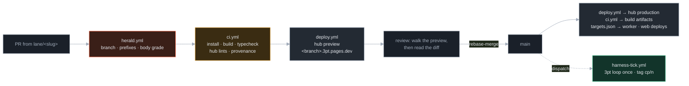
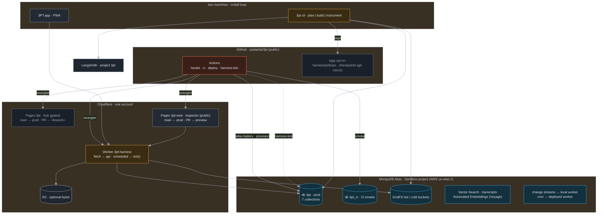

# CI and deployment: build, deploy, topology, credits

*Contemplation, not yet decided. Written 2026-09-26 against the tree as committed, the hub's
`deploy.yml`, `docs/10-architecture.md` §4.5, and the Atlas documentation looked up today. The
resolver for "where does this service run" is `infra/targets.json`, read by `scripts/target.mjs`.
Diagrams are Mermaid (GitHub renders them; the hub Viewer shows them as code by decision).*

## 0. What exists, what does not

**Connection audit, 2026-09-26:** the target register now includes Patrick’s second Worker at
`https://3pt-harness.patrickastarita.workers.dev`. Its old health response does not prove Atlas
connectivity. Yash’s Worker initially timed out, then passed the Atlas check at 20:43 UTC. Use
`pnpm batteries --deployed-only` for current results; see [Connection checks](20-battery-checks.md).
The web root is now the landing page; the live app is at `/app/`.

| Thing | State today |
|---|---|
| Hub CI (`.github/workflows/deploy.yml`) | Live. Push to `main` deploys `hub/_site` to Cloudflare Pages; PRs get `https://<branch>.3pt.pages.dev` and a sticky comment. Lints: nav, view, provenance. Deploy no-ops with a notice until the two Cloudflare secrets exist. |
| Monorepo build in CI | None until this PR. The skeleton (`package.json`, `turbo.json`, `ui/ harness/ infra/`) was committed in `0fd66df` while this was written; `ci.yml` still gates the workspace build on `package.json` being present so it degrades to a notice, never a red, if the tree is ever reshaped. |
| Monorepo installability | **Green since 2026-09-26 14:25 ET.** The root `.gitignore` rule `build/` hid `harness/packages/build`, so the package never reached origin. The rule is now `ui/apps/macos/build/`. `@3pt/build` is a dry-run stage until `@3pt/strands` compiles. The lockfile is regenerated. |
| Branching | No protection on `main`; commits land directly. Worktree policy (`docs/11-worktrees.md`) already assumes `lane/<slug>` branches. |
| Deploy of `api`, `worker`, `web`, `pwa` | **`web` and the Worker are live since 2026-09-26 15:00 ET**, from Yash's Cloudflare account (not the hub's). Public, no login: https://3pt-web.pages.dev (`ui/apps/live` at `/`, `ui/apps/web` at `/studio/`) and https://3pt-harness.3pt-worker.workers.dev. Deployed by hand with `scripts/build-web-site.sh` and `wrangler`; CI does not deploy them yet. The Worker is wired to Atlas: with the `ATLAS_URI` Worker secret set, every request reads the newest `app_state` snapshot and each tap, approve, reject, rollback or reset appends one; each tap also goes to `app_events`. `/health` reports `store: atlas|memory` and the newest snapshot. Tested in `wrangler dev` against a local mongod: 4 taps, a proposal, approve, v11 read back across requests. Smoke-tested in `wrangler dev` against a local mongod; not yet against the Sandbox (secret not set). `pwa` is not deployed. |
| Atlas | Sandbox project not yet created. The atlas battery prints its plan until `ATLAS_URI` exists. |
| Secrets in GitHub | None set (`CLOUDFLARE_*` pending). |

## 1. Build infrastructure

**GitHub Actions, one workflow per concern, all on `ubuntu-latest`.** The repo is public, so
minutes are free; that is the entire build budget and it is enough.

| Workflow | Trigger | Job | Gate it enforces |
|---|---|---|---|
| `herald.yml` | every PR | branch name is `lane/<slug>`; commit prefixes are from the allowed set; PR body passes `scripts/pr-validate.mjs` at grade B or better | the branching mechanism and the paperwork, first, before any build |
| `ci.yml` | PR and push to `main` | resolver check · description grades · hub lints · provenance · `pnpm install --frozen-lockfile` · `turbo run build typecheck` (macOS wrapper excluded) | `make check`, the same command a machine runs before pushing |
| `deploy.yml` | push to `main`, PR touching hub or docs | hub stage + lints + Pages deploy | the hub is never red |
| `harness-tick.yml` (proposed) | `workflow_dispatch`, later cron | one `3pt loop` iteration against the Sandbox, tag `cp/<n>`, push the tag | the harness improves itself from CI, not only from a laptop |

Caching: `actions/setup-node` with the pnpm store, plus `.turbo/` keyed on the lockfile. Turborepo
remote cache is not worth a login today. The Swift app never builds in CI: macOS runners are slow
and the install loop already builds it on both machines; a tag build is a post-hackathon item.

## 2. Deployment infrastructure

Everything stateful is Atlas. Everything else is a stateless deployable with one host, one deploy
command, one health URL, recorded once in `infra/targets.json`.

| Service | Host | Why this host | Status |
|---|---|---|---|
| `hub` | Cloudflare Pages project `3pt`, gated | exists, works, previews per PR | live |
| `web` (judges' demo link) | Cloudflare Pages project `3pt-web`, public: `/` landing page, `/app/` the app (`ui/apps/web`), `/results/` replay results, `/studio/` redirects to `/app/` | same toolchain as the hub, no login for judges (a submission requirement) | live, https://3pt-web.pages.dev |
| `pwa` | same Pages project as `web`, `/app` path, or its own project `3pt-app` | installable from the same origin; decide when `web` deploys | planned |
| `api` + `worker` | **one** Cloudflare Worker `3pt-harness`: `fetch()` serves the API, `scheduled()` runs the worker `tick()` | the Node driver works on Workers since the 2025-01 `nodejs_compat` TCP support (compat date ≥ 2024-09-23); one deploy instead of two; cron replaces a long-lived change stream, which a Worker cannot hold | planned, driver-on-Workers is TO CONFIRM by a smoke test |
| `macos` | the two machines, via the install loop | no partner support for Swift; ad-hoc builds only | live locally |
| state | Atlas Sandbox cluster, one database per environment | required for eligibility | pending |
| bytes | GridFS in the Sandbox by default; R2 optional | keeps media inside the required component | pending |
| tracing | LangSmith project `3pt` | $50 credit, the M-* reader lives in the tracing battery | pending |

**Resolver.** `scripts/target.mjs resolve api` prints host, URL, deploy command, health URL and
the secrets the deploy needs; `scripts/target.mjs list` prints the table; `scripts/target.mjs
matrix` emits the JSON matrix `ci.yml` uses to fan out deploys. Adding a deployable is one record.
The Makefile gets `make where SERVICE=api`.

**Why not Vercel for the app surfaces.** The $30 is v0 credit, not hosting. Hobby hosting is free
but adds a third provider to a two-person afternoon. Vercel stays the fallback if a Pages project
misbehaves; `targets.json` records `fallback: vercel` on `web`.

**Why not AWS.** See §5: there are no AWS compute credits in this hackathon.

## 3. Deployment topology

Environments are databases, not clusters. The Sandbox is one cluster; `3pt` is production,
`3pt_ci` is what CI smoke-tests against on `main`, and a PR never touches Atlas (its previews are
static). Nothing stateful lives on a machine or in a Worker.

## 4. Using as much of Atlas as the tier allows

Looked up 2026-09-26. The Sandbox cluster's tier is **TO CONFIRM** at creation; the table assumes
Free (M0) or Flex, which share most limits.

| Atlas capability | Use in 3PT | Tier note |
|---|---|---|
| Sandbox cluster, one db per environment | all seven collections, policies, checkpoints, measurements | required; Free is 0.5 GB, 500 connections, 100 ops/s; Flex is 5 GB, 500 ops/s |
| GridFS | image bytes, two buckets (`hot`, `cold`) so tiering is real inside the required component | fine on any tier; counts against storage |
| Vector Search + Automated Embeddings (Voyage) | `transcripts` embedded in-database; the Plan gateway's context selection | available on Free and Flex; 200M Voyage tokens |
| Atlas Search | full-text over transcripts and retrospectives for the instrumenter | available; index count limits on small tiers |
| Change streams | wakes the local worker on a new `media_index` document | supported; filter on `ns` limited to strings and regex |
| Atlas CLI + `mongodb/atlas-github-action@v0.2.0` | `ci.yml` runs the atlas battery's `provision` idempotently on `main` with a **service account** (`MONGODB_ATLAS_CLIENT_ID` / `CLIENT_SECRET`), never an API key pair in a laptop `.env` | Linux runners only |
| Atlas Local (`atlas deployments setup --type local`) | ephemeral MongoDB in CI for battery and store tests, no Sandbox traffic from PRs | Docker on the runner |
| MongoDB MCP Server + Agent Skills | the builder and instrumenter agents, locally; not in CI | — |
| Online Archive | the obvious cold tier | **M10+ only**; not on Free or Flex, so cold is a GridFS bucket and a `tier` field today |
| Atlas Stream Processing | replace the cron poll with a stream that enqueues jobs | needs its own workspace; **TO CONFIRM** it attaches to a Flex cluster; not today |
| Data API / HTTPS endpoints | the Swift path `docs/04-resources.md` assumed | **gone**: end of life 2025-09-30. Swift talks to our `api` on the Worker, never to Atlas directly. Update D4. |
| Triggers | wake the worker | still available but tied to App Services; change streams plus cron cover it without a second control plane |
| Charts | — | no: a dashboard cannot be the feature |

## 5. Credits, and what they can actually deploy

| Credit | What it is | Deploy surface it funds |
|---|---|---|
| MongoDB Atlas Sandbox | the required cluster | all state, GridFS bytes, vector and text search |
| Voyage AI, 200M tokens | embeddings and reranking | Automated Embeddings on `transcripts`; reranking in the Plan gateway |
| MongoDB for Startups (after) | Atlas credits + Voyage | the post-hackathon cluster upgrade to M10 for Online Archive |
| **AWS Kiro** | 50 credits/month + 500 bonus, **no AWS account, no card** | nothing: these are coding-agent credits. There is no Lambda, ECS or Bedrock allotment in this hackathon. The only AWS in the topology is the region the Sandbox runs in; pick `us-east-1` so Atlas, Cloudflare and GitHub sit close. |
| Vercel, $30 v0 | scaffolding credit, not hosting | none by default; hobby hosting is the fallback for `web` |
| LangSmith, $50 | tracing | every `3pt loop` run, including the `harness-tick` runs from Actions |
| OpenRouter, Codex | model calls | the Build stage inside `harness-tick`; cost-capped per run by the policy's guardrails |
| Cloudflare (own account) | Pages, Workers, R2 free tiers | hub, web, the Worker, optional bytes |
| GitHub (public repo) | Actions minutes | every workflow above |

The honest summary: MongoDB credits fund the state layer completely; nothing else in the credit
ledger funds compute; the compute we deploy runs on Cloudflare's free tier and GitHub's free
minutes, and that is sufficient for the demo and the week after.

## 6. Branching, and the herald that guards it

The first gate is the branching mechanism, not the build. `herald.yml` runs on every PR before
`ci.yml` and fails fast on three things: the branch is not `lane/<slug>`; a commit subject is not
`<prefix>: …` or `<prefix>(<scope>): …` with a prefix from `plan build instrument media app docs
chore hub ci`; the PR body grades below B under `scripts/pr-validate.mjs`. The PR body **is** the
description file in `docs/pr-descriptions/`, opened with `gh pr create --body-file`. The convention,
the template and the completeness tracker are in `docs/pr-descriptions/README.md`.

Landing is **rebase-merge** on GitHub, so history stays linear and the worktree policy's
fast-forward rule holds. Branch protection on `main` (require PR, require `herald` and `check`)
is one `gh api` call, listed under next steps and not made by this PR.

## 7. Next steps, in order

1. Create the Sandbox project from the email link; record tier and region here. Set `ATLAS_URI`.
2. ~~Harness lane: commit `harness/packages/build` and regenerate the lockfile.~~ Done 2026-09-26. Next: replace the dry run with the Strands compiler.
3. `gh secret set CLOUDFLARE_API_TOKEN` and `CLOUDFLARE_ACCOUNT_ID`; hub deploys go live.
4. Protect `main`: require PR, require `herald` and `check`, allow rebase-merge only.
5. Pages project `3pt-web`; `wrangler.jsonc` for the Worker with `nodejs_compat`; smoke-test the driver from a Worker before promising it in the video.
6. Service account in the Sandbox project; `MONGODB_ATLAS_CLIENT_ID/SECRET` as repo secrets; `ci.yml` runs `provision` on `main`.
7. `harness-tick.yml` once `3pt loop` runs against the real Store.
