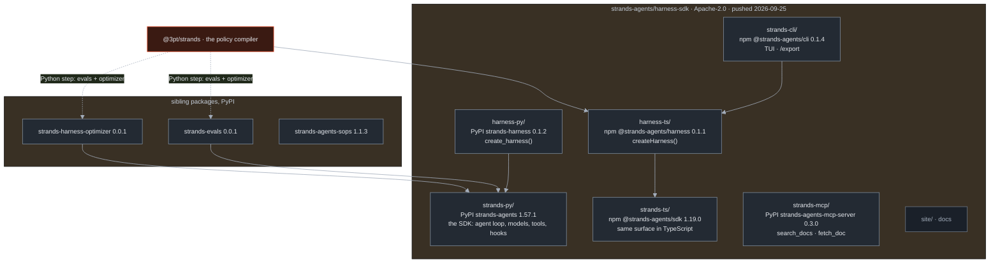
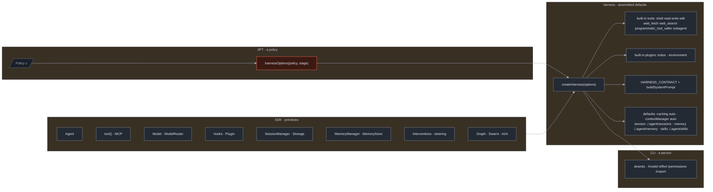
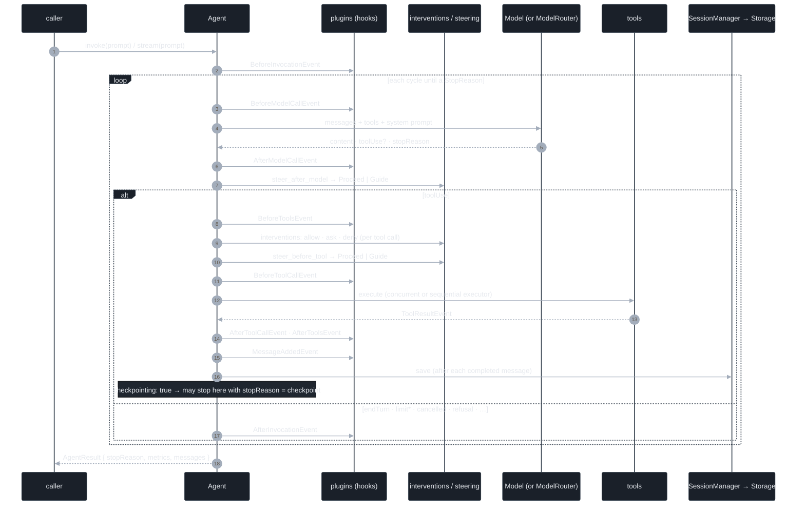
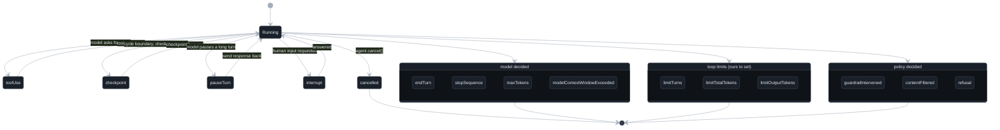
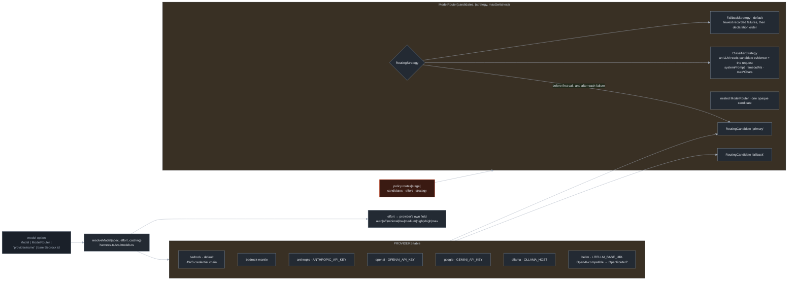
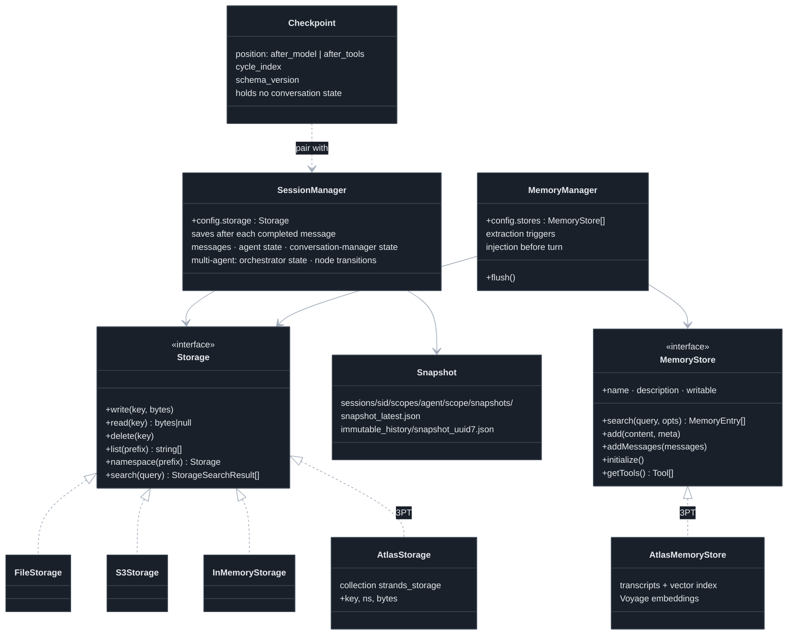
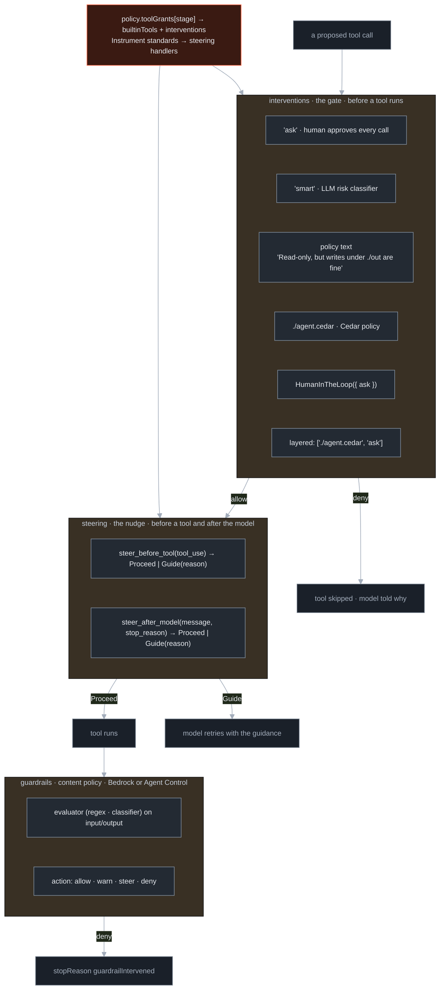
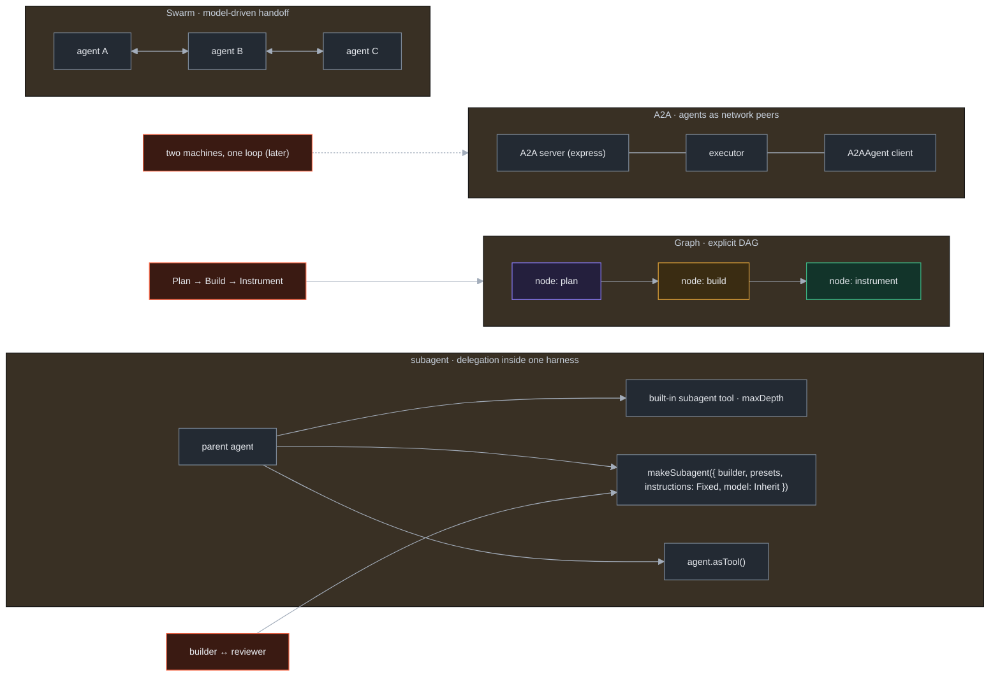
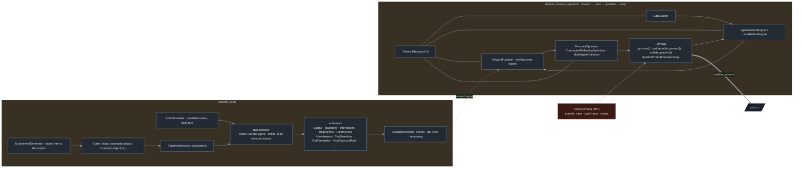
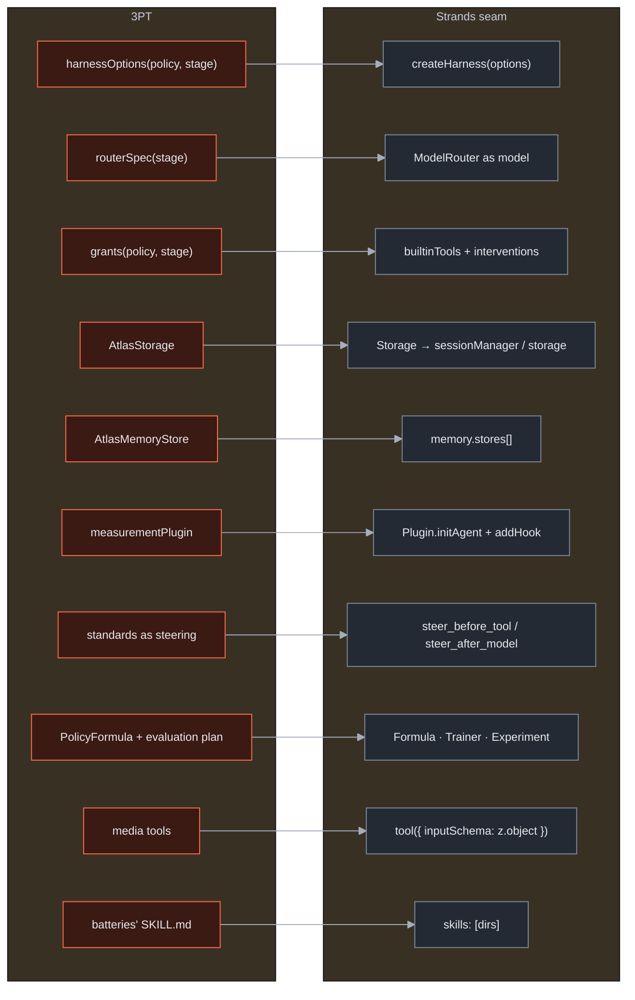

# Strands, drawn: architecture diagrams of the systems we build on

*Source of record for learning Strands. Nine Mermaid diagrams, one per system, drawn from the
sources registered in `docs/12-strands-archaeology.md` (S1–S20). Where a diagram shows structure
the docs only imply, the caption says "inferred". Colours follow the diagram design system in
`docs/10-architecture.md` §3 plus one class, `strands` (slate), for things that are theirs, not ours.
Companion to the SVG sketches on the hub (`hub/site/sketches.html`).*

Class key used below: `strands` = a Strands component we call as is · `ours` (flag) = what 3PT adds ·
`atlas` = state · `plan / build / inst` = our stages when they appear.

## 1. The monorepo and its packages

*What ships from `strands-agents/harness-sdk`, and which package we import from.* (S1, S2, S3, S18, S19)

The harness packages are thin: they compose the SDK with defaults. The CLI composes the harness.
We compose the harness too, one level beside the CLI, from a Policy instead of a config file.

## 2. The layers: SDK → harness → CLI → 3PT

*Which layer owns which decision.* (S2, S17, S18)

## 3. One invocation: the agent loop with its hooks

*Where a plugin can see or change things.* (S6, S7, S12, S13) Hook order within a step is inferred.

## 4. Stop reasons as a state machine

*Every way an invocation ends, grouped by who decided.* (S7)

For 3PT the loop-limit group is the turn budget, the policy group is what Instrument counts as
M-ERR, and `checkpoint` is the boundary a 3PT checkpoint record points at.

## 5. Model resolution and the router

*How a `provider/name` string becomes a Model, and how a ModelRouter chooses among candidates.* (S4, S5)

Success re-arms every candidate for the next invocation; a failed call re-consults the strategy
unless another hook (a retry strategy) claims the retry.

## 6. Persistence: Storage, sessions, snapshots, memory

*One byte-store interface under three subsystems. This is the seam Atlas plugs into.* (S6, S8, S9, S10, S11)

## 7. Control: interventions, steering, guardrails

*Three mechanisms that can say no, and when each speaks.* (S2, S13; Agent Control from the blog `strands-agents-with-agent-control`)

Subagents inherit the intervention policy; calls inside `programmatic_tool_caller` are gated too.
Steering won 100% pass at 66% fewer input tokens than SOP prompting in Strands' own 600-run test.

## 8. Multi-agent: subagents, Graph, Swarm, A2A

*Four ways agents call agents, and which one each 3PT relation uses.* (S2, S20; A2A from `strands-ts/src/a2a/`)

Multi-agent sessions persist orchestrator state, per-node results, shared context, and the node
transition history, so a `Graph` run is inspectable after the fact.

## 9. Evaluation and the optimizer loop

*How Strands scores an agent, and how the optimizer turns scores into a better harness. This is the mechanism under 3PT's Instrument stage.* (S14, S15)

Strands' numbers, system prompt only, Claude Sonnet 4.6: AppWorld 72.6 → 95.8, WebShop 56.5 → 67.5.
Our `PolicyFormula` is the Formula whose tunable parameters are the whole 3PT Policy, and the
evaluation plan that Plan hands to Instrument (sketch 4) is the `Experiment` that produces the reward.

## 10. Where 3PT touches Strands, on one page

*Every 3PT component and the one Strands seam it uses.* (summary of the above)

Ten seams, ten lines. Anything 3PT wants that is not one of these lines is either a new seam to
find in Strands first, or a thing we should not build.
