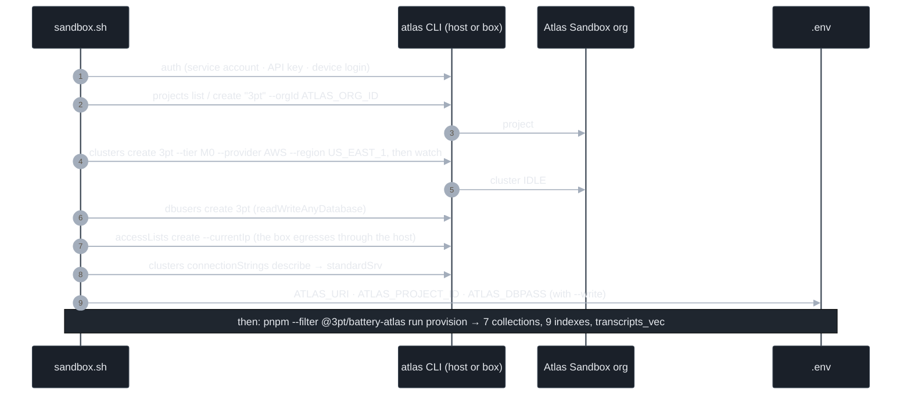

# Sandbox provisioning: the box and the Sandbox cluster

*Source of record. Decided and implemented 2026-09-26 (Patrick). Two batteries: `infra/batteries/box`
(the machine) and `infra/batteries/atlas` (the cluster). Mermaid here; the Viewer renders it. Verified
rows in §5 come from a real run on Patrick's laptop; everything else is design.*

## 1. The decision
<!-- @s1.14 @s1.16 @s5.03 -->

The workload needs a machine, and every stateful thing must live in the Atlas Hackathon Sandbox. So
the machine is disposable, the cluster is not, and provisioning is a deterministic flow the harness
can re-run, inspect, and eventually rewrite.

| Question | Decision | Why |
|---|---|---|
| What is a box | A **Colima VM** (Ubuntu 24.04, Docker runtime), converged by an **Ansible playbook** from the host | Colima is already on the laptop; one VM holds the worker, the MongoDB toolbelt, and Atlas Local's container. Containers alone cannot run `atlas deployments` |
| Who runs Ansible | The host, through `uvx --from ansible-core` | No global install; the box needs only Python, which Ubuntu cloud images carry |
| Where state lives | Atlas only. `/opt/3pt` in the box is a copy; `box.sh destroy` loses nothing | Rule 1 of `docs/05-rules.md`; the deployment topology in `docs/10-architecture.md` §4.5 |
| How the cluster is made | **Atlas CLI** inside the Sandbox org (`sandbox.sh`), or the same steps as `atlas-*` MCP tools | Defer to Atlas conventions where they exist: project, cluster, db user, access list, connection string |
| Offline substitute | **Atlas Local** inside the box, opt-in | Search and Vector Search with the same driver calls; not eligible for judging, so never the default |
| AWS | Not now | Nothing in the flow is laptop-specific except `BOX_PROFILE=default`; an EC2 host is one inventory line away |

## 2. The box

*Question: what does `box.sh up` do, in order?*

```mermaid
%%{init: {"theme":"base","themeVariables":{"background":"#0f1216","primaryColor":"#1a2029","primaryTextColor":"#e6e9ee","primaryBorderColor":"#3a4552","lineColor":"#a3adbb","fontFamily":"ui-monospace, Menlo, monospace","fontSize":"12px"}}}%%
flowchart LR
  G["guard\nhost free disk ≥ floor"]:::flag --> V["vm\ncolima start -p $BOX_PROFILE"]:::battery --> P["ping\ninventory from colima ssh-config"]:::battery
  P --> R1["base\napt: git rsync jq curl …"]:::build --> R2["node\nNode 22 + pnpm 12.6"]:::build --> R3["atlas_tools\nmongosh · atlas · mongoimport · mcp"]:::atlas
  R3 --> R4["atlas_local\n(BOX_ATLAS_LOCAL=1)"]:::atlas -.-> R5
  R3 --> R5["workload\nrsync → /opt/3pt · install · build · provision · 3pt-worker.service"]:::build --> X["verify\nversions · worker · ping ATLAS_URI"]:::inst
  classDef build fill:#3a2c12,stroke:#e0a33a,color:#e6e9ee
  classDef inst fill:#12342a,stroke:#3fb886,color:#e6e9ee
  classDef atlas fill:#12303d,stroke:#3aa6d9,color:#e6e9ee
  classDef battery fill:#1f262f,stroke:#a3adbb,color:#e6e9ee
  classDef flag fill:#3a1a12,stroke:#ff6b4a,color:#e6e9ee
```

| Phase | Idempotent by | Cost on the host disk |
|---|---|---|
| guard | reads `df`; refuses under `BOX_MIN_FREE_GB` (2) to start, `BOX_NEW_MIN_FREE_GB` (8) to create | none |
| vm | `colima status`; starts an existing profile, creates one only if absent | new profile ≈ 1 GB base image; existing ≈ 0 |
| ping, roles | Ansible: package states, `creates:`, file states | apt + node + toolbelt ≈ 0.4 GB inside the VM disk |
| workload | rsync `--delete`, `pnpm install --frozen-lockfile`, `turbo run build`, `turbo run provision`, systemd unit | node_modules ≈ 0.3 GB |
| atlas_local | `atlas deployments list` before `setup` | image ≈ 1 GB; guarded at 4 GB free |

`box.sh exec '<cmd>'` runs inside `/opt/3pt` with the box's `.env` loaded; that is the `box.exec` grant.
The generated inventory, ssh config and vars are gitignored; nothing per-machine is committed.

## 3. The Sandbox cluster, the Atlas way

*Question: how does a fresh team member get `ATLAS_URI` without touching the Atlas UI?*

| Atlas affordance | Used for | Where |
|---|---|---|
| Sandbox org (email link) | Eligibility: project and cluster must be created inside it | `ATLAS_ORG_ID` |
| Atlas CLI | Project, cluster, user, access list, connection string, `deployments` (Atlas Local) | `sandbox.sh`, `atlas_tools` role |
| Service accounts | Non-interactive auth for the CLI and the MCP server | `ATLAS_CLIENT_ID/SECRET` |
| MongoDB MCP Server `atlas-*` tools | The same steps, one tool call at a time, from any agent | `infra/batteries/box/mcp.json` |
| Driver `createSearchIndex` | The vector index over `transcripts`, on the cluster and on Atlas Local alike | `atlas/src/provision.ts` |
| M0 | Free; Vector Search allowed, three search indexes max | `ATLAS_TIER` |
| GridFS | Image bytes inside the Sandbox, the eligibility-safe default | blob battery |

## 4. The provisioning MCP, and what "improvable" means

The MCP is not ours. It is the **MongoDB MCP Server** given an Atlas service account, which turns on
its `atlas-*` provisioning tools next to the data tools. `sandbox.sh` is the deterministic transcript
of what an agent holding that MCP would do; the skills (`SKILL.md` in each battery) tell it when.

What the harness may rewrite, because it is data and not code:

| Knob | Lives in | Rewritten by |
|---|---|---|
| `box.*` tool grants per stage | `policy.toolGrants` (Atlas) | Instrument |
| Box size, Atlas Local on/off, repo mode | `BOX_*` in `.env`, read by `box.sh` and `.vars.json` | Instrument, via a checkpoint's `.env.example` diff |
| Which roles run | `--tags` on `box.sh play` | a Plan spec |
| Cluster tier, region, open access | `ATLAS_*` in `.env` | a human, today |

## 5. Verified

*Patrick's laptop, 2026-09-26 14:00 to 14:20 ET. `BOX_PROFILE=default` reused the Colima profile already
on disk; no new profile was created. Two runs: the first stopped in `atlas_tools` when a concurrent
session removed the generated ssh config, the second stopped at `pnpm install`
(`ERR_PNPM_IGNORED_BUILDS`, fixed in `pnpm-workspace.yaml` `allowBuilds`); `box.sh play workload` then converged.*

| Check | Result |
|---|---|
| `pnpm turbo run build` / `typecheck` with `@3pt/battery-box`, the atlas driver, `worker/main.ts` | 18 of 18 · 26 of 26 green |
| Playbook `--syntax-check` | pass |
| `box.sh ping` | pong over the generated inventory |
| roles base, node, atlas_tools | node 22.23.3 · pnpm 12.6.0 · mongosh 2.12.0 · Atlas CLI 1.58.3 (apt path, no fallback needed) · mongoimport 100.19.0 · Docker 27.4.0 |
| role workload | rsync → `/opt/3pt`, install, build, `turbo run provision` (plan-only: no `ATLAS_URI`), `3pt-worker` active, ticking `0 assets scanned, 0 jobs queued` |
| host disk cost | VM diff disk 9.6 → 12 GB; host free went from about 3 to 1 GB. The diff disk never shrinks; `box.sh destroy` is the only way back |
| `sandbox.sh up` | **not run**: no Sandbox org id or credentials on this machine yet |
| Atlas Local | **not run**: `BOX_ATLAS_LOCAL=1` needs 4 GB free on the host |

## 6. Open and decided

| Item | State |
|---|---|
| Box substrate | **Decided:** Colima VM + Ansible from the host. Plain containers rejected: Atlas Local needs Docker inside. |
| Ansible delivery | **Decided:** `uvx --from ansible-core`; a global `ansible-playbook` is used when present. |
| Profile on this laptop | **Decided today:** `default`. A `3pt` profile once the disk has 8 GB free. |
| Sandbox cluster | **Decided 15:00:** created by hand in the console (Project 0 / 3PT-Cluster, Free). `sandbox.sh` stays the scripted path; `docs/17-atlas-setup-dossier.md` has the screens, ids, and the scaling verbs. Service account still missing. |
| Worker duplicates jobs | **Open (harness lane):** `tick()` re-queues a `transcribe` job for every untranscribed asset on every tick. |
| AWS host | **Open:** same playbook, an EC2 inventory line, `repo_mode=clone`. |
