# Atlas setup dossier: the Sandbox cluster, screen by screen

*Source of record. Captured 2026-09-26 15:00 ET from Patrick's Atlas console (organization
"Patrick's Org - 2026-09-26", Project 0, cluster 3PT-Cluster, Free tier). Fifteen screenshots in
`docs/assets/atlas/`. Companion to `docs/16-sandbox-provisioning.md`, which is the flow; this is what
the flow looks like in the console, and what the console offers that the flow should use. Numbers
marked DERIVED come from the screens or the docs cited; TO CONFIRM is unverified.*

## 1. Intro: five pieces, one state store
<!-- @s1.14 @s5.03 -->

| Piece | Role | Where | State today |
|---|---|---|---|
| **Cluster** | The only state store. Free (M0): 512 MB, shared RAM, 100 ops/s, 500 connections | Project 0 → 3PT-Cluster, AWS us-east-1, MongoDB 8.0 | active, 93 MB used (sample dataset) |
| **Box** | The machine the worker runs on; disposable | `infra/batteries/box` | stopped (`colima stop`) |
| **CLI** | The deterministic, scriptable path: project, cluster, user, access list, URI, scale | `infra/batteries/atlas/sandbox.sh` over the Atlas CLI | ready; needs a service account |
| **MCP** | The agent path: the same operations as tools, plus data tools, plus `atlas-upgrade-cluster` | `infra/batteries/*/mcp.json` → MongoDB MCP Server | ready; needs the same service account |
| **Driver** | What the harness itself uses: `atlasStore()`, `provision.ts` | `infra/batteries/atlas/src` | built; needs `ATLAS_URI` |

CLI and MCP are two doors to one room, the Atlas Administration API. The CLI is for humans and CI:
same command, same result, every time. The MCP is for the controlling agents: one tool call each,
gated by `policy.toolGrants`. Both authenticate with the service account created in §2 step 7.

## 2. The setup flow, screen by screen

| # | Screen | What to do | What it yields | Figure |
|---|---|---|---|---|
| 1 | Organization → Settings | Copy the Organization ID | `ATLAS_ORG_ID=6ab7de6daeb8f6a94bbe6c5c` | 12 |
| 2 | Project 0 | The id is in the URL after `/v2/` | `ATLAS_PROJECT_ID=6ab7de6daeb8f6a94bbe6cf4` | 01 |
| 3 | Deploy your cluster | Free · AWS · N. Virginia · name it · keep "Automate security setup" | the cluster; sample data if preloaded | 02, 03 |
| 4 | Security → Database & Network Access → Database Users | One SCRAM user; `atlasAdmin` today, `readWriteAnyDatabase` is enough | `ATLAS_DBUSER`, `ATLAS_DBPASS` | 06 |
| 5 | … → IP Access List | Your current IP is listed by the quickstart; the box egresses through the host, so it is covered. The Cloudflare worker has no fixed IP: `ATLAS_OPEN_ACCESS=1` adds `0.0.0.0/0` | access | 07 |
| 6 | Cluster → Connect → Drivers | Copy the SRV string, replace `<db_password>`, add `/3pt` as the database | `ATLAS_URI` | 08, 09 |
| 7 | Organization → Access Manager → Applications → Service Accounts → Create | Project Owner on Project 0 is enough for everything in this doc. **Not created yet.** | `ATLAS_CLIENT_ID`, `ATLAS_CLIENT_SECRET` | 11, 13 |
| 8 | Terminal | `pnpm --filter @3pt/battery-atlas run provision` | 7 collections, 9 indexes, `transcripts_vec` | 14 (where the index appears) |
| 9 | Data Explorer | Inspect what the harness wrote | — | 15 |

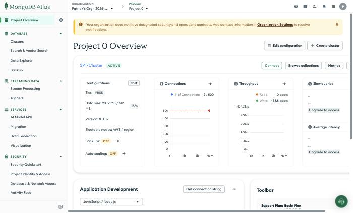
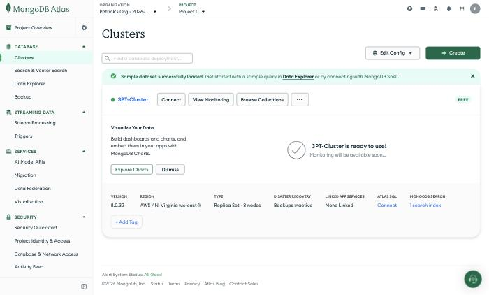
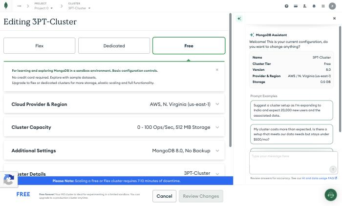
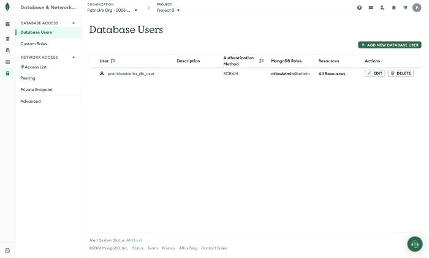
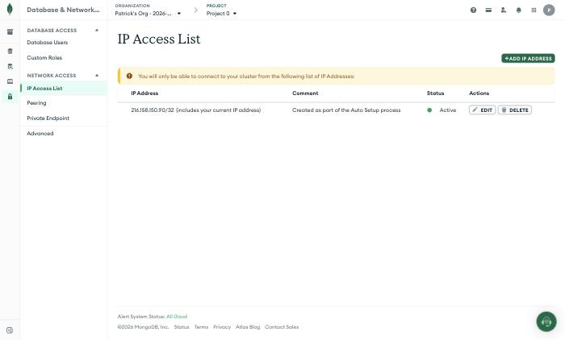
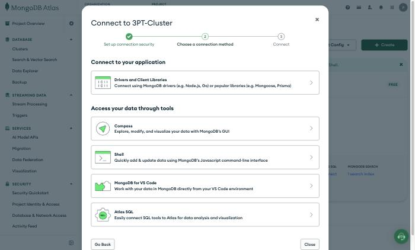
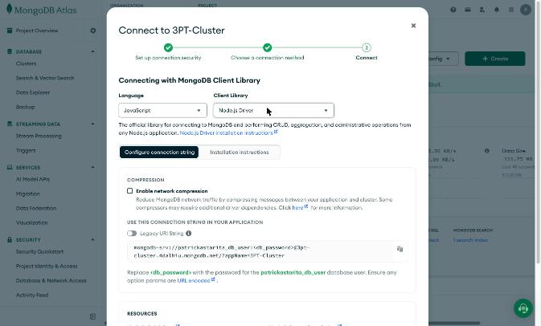
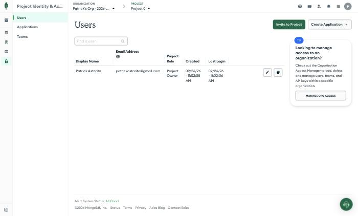
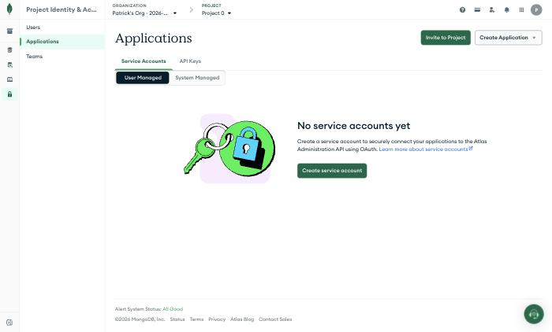
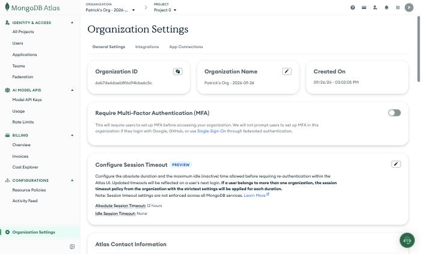
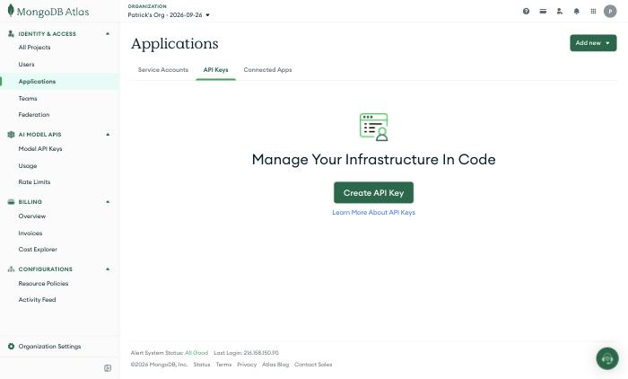
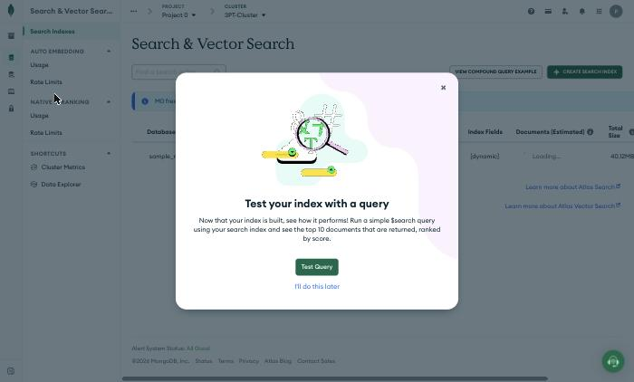
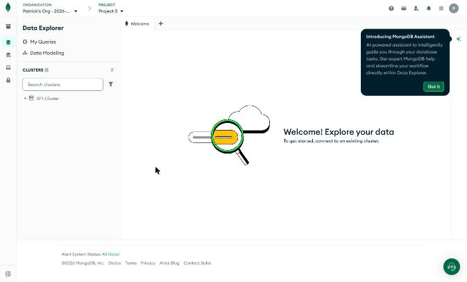

Figure 09 shows the cluster host and the database user name; no password appears anywhere in this
repo. Steps 1 to 6 are done. Step 7 is the one thing left in the console; steps 8 and 9 are terminal.

## 3. What the console offers, and which door opens it

| Affordance | Console | Atlas CLI | MCP tool | 3PT |
|---|---|---|---|---|
| Project, cluster | Deploy | `projects create` · `clusters create --tier M0` | `atlas-create-project` · `atlas-create-free-cluster` | `sandbox.sh up` |
| User, access list | Security Quickstart | `dbusers create` · `accessLists create` | `atlas-create-db-user` · `atlas-create-access-list` | `sandbox.sh up` |
| Connection string | Connect → Drivers | `clusters connectionStrings describe` | `atlas-connect-cluster` | `sandbox.sh uri` |
| **Scale the tier** | Edit configuration | `clusters upgrade --tier` (Free/Flex → up) | **`atlas-upgrade-cluster`** (Free→Flex, Free→M10, Flex→M10, M10–M80) | `sandbox.sh scale <tier>`, grant `atlas.scale` |
| Auto-scaling | Edit → Dedicated → Auto-scale | `atlas api clusters updateCluster` with `autoScaling.compute` | none | `sandbox.sh autoscale on <min> <max>` (M10+) |
| Search, vector index | Search & Vector Search → Create | `clusters search indexes create` | `create-index` (vector and lexical) | `provision.ts` `createSearchIndex` |
| Automated embeddings (Voyage) | Search → Auto Embedding | — | `insert-many` with auto-embedding | transcripts, `docs/04-resources.md` |
| Sample data | Preload on deploy | `clusters sampleData load` | `atlas-load-sample-dataset` | already loaded, 93 MB |
| Pause, resume | Cluster menu | `clusters pause` | `atlas-pause-resume-cluster` | M10+ only; cost control |
| Performance Advisor | Cluster → Performance Advisor | `performanceAdvisor` | `atlas-get-performance-advisor` | an Instrument M-* source, M10+ |
| Atlas Local | — | `deployments setup --type local` | `atlas-local-*` (Docker) | box role `atlas_local` |
| MongoDB Assistant | chat panel on every screen | — | `search-knowledge` | human use; agents get the MCP knowledge tool |

Tool names DERIVED from the MongoDB MCP Server tool reference and the Atlas CLI reference, 2026-09-26.
The MCP server exposes its Atlas tools only when `MDB_MCP_API_CLIENT_ID` and `MDB_MCP_API_CLIENT_SECRET`
are set; that is what both `mcp.json` files do.

## 4. Capacity, and the dynamic-scaling affordance

| Tier | Storage | RAM | Throughput | Connections | Price | Scaling |
|---|---|---|---|---|---|---|
| **Free (M0)** · now | 512 MB | shared | 100 ops/s | 500 | $0 | manual only; up to Flex or M10; 7 to 10 min downtime; pauses after 30 idle days |
| Flex | 5 GB | shared | 500 ops/s | 500 | from $0.011/h, capped at $30/mo | manual only; up to M10 |
| M10 | 10 GB | 2 GB | 1000 IOPS | 1500 | $0.08/h | tier auto-scale (M10 ↔ M20 by default) and storage auto-scale at 90% disk |

DERIVED from the Free and Flex limitation pages, the cluster auto-scaling page, and figures 03 to 05.
Auto-scaling exists only from M10: up when CPU is over 90% for 20 minutes or memory over 90% for 10
minutes, down after 24 quiet hours with CPU under 45%. Below M10 the only lever is an explicit tier
change, which is exactly what an agent can call.

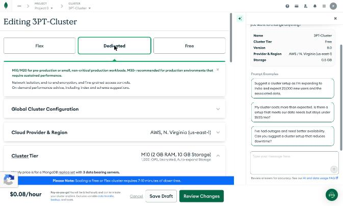
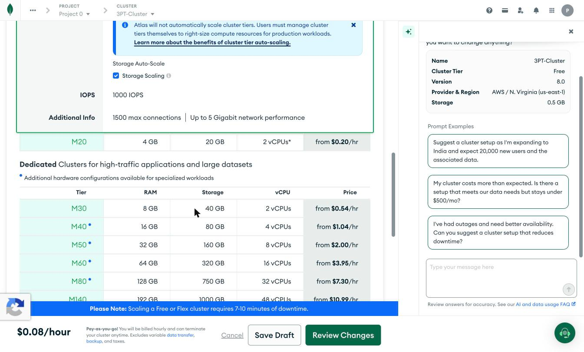

*Question: how does a controlling agent scale the store without a human in the console?*

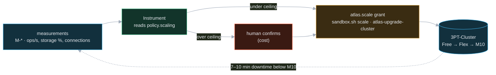

| Knob | Lives in | Default |
|---|---|---|
| `policy.toolGrants.instrument` includes `atlas.scale` | Atlas (`policies`) | not granted; Instrument earns it |
| `policy.scaling.maxTier` | Atlas (`policies`), proposed | `M10` once credits are applied (§4a); `M0` until then, because the org has no payment method and a tier change would be refused |
| trigger | Instrument rule over M-*: storage over 80% of 512 MB, or ops/s over 80 for one iteration | proposed |
| mechanism | `sandbox.sh scale <tier>` (CLI) or `atlas-upgrade-cluster` (MCP) | both wired |

### 4a. The credits, and how they arrive

The hackathon comes with Atlas credits (Patrick, 2026-09-26). They are **not on the org yet**: Billing →
Overview shows $0.00 usage, no payment method, and an empty Available Credits box with an **Apply Code**
button (figure 16). That box is the mechanism: Atlas credits arrive as a promo or activation code and are
applied there, once, to the organization. The resource guide names no code and no amount; it only
points to the Sandbox email and, after the event, to MongoDB for Startups.

| Where the code can come from | Check |
|---|---|
| The Sandbox org itself | the invitation to the hackathon org was found at 15:30 ET; a Sandbox org is normally pre-credited, so check its Billing → Overview after accepting |
| MongoDB staff on site (the guide says Voyage top-ups work this way) | ask at the MongoDB table |
| MongoDB for Startups, after the hackathon | https://www.mongodb.com/startups |

Until a code or a card is on the org, `sandbox.sh scale` and `atlas-upgrade-cluster` will be refused by
Atlas for anything above Free. Free itself needs neither.

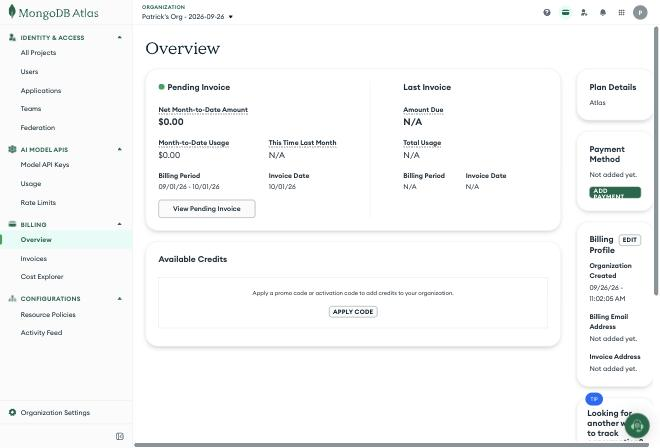

The judged workload fits Free: the harness's own state is kilobytes, the media index is metadata, and
GridFS bytes are the only thing that grows. Scaling is the demonstration, not the need, and the credits
mean the demonstration can run to M10 for real rather than stopping at a dry run.

## 5. What goes in `.env`, from what you already have

| Key | Source | Now |
|---|---|---|
| `ATLAS_ORG_ID` | figure 12 | `6ab7de6daeb8f6a94bbe6c5c` |
| `ATLAS_PROJECT_ID` | the project URL | `6ab7de6daeb8f6a94bbe6cf4` |
| `ATLAS_CLUSTER` | figure 02 | `3PT-Cluster` (the scripts default to `3pt`; set this) |
| `ATLAS_DBUSER`, `ATLAS_DBPASS` | figure 06, your password | set by you |
| `ATLAS_URI` | figure 09 with the password and `/3pt` | set by you |
| `ATLAS_CLIENT_ID`, `ATLAS_CLIENT_SECRET` | step 7, once created | missing |

Then: `pnpm --filter @3pt/battery-atlas run provision`, and `make sandbox` becomes a no-op check
rather than a creator, since everything it would create exists.

## 6. Verified and to confirm

| Item | State |
|---|---|
| Console screens 01 to 15 | captured from the live account, 2026-09-26 15:00 ET |
| MCP tool names, CLI flags, tier limits, auto-scaling thresholds | DERIVED from MongoDB docs fetched the same day |
| Which org is the hackathon Sandbox | **Resolved 15:30 ET:** an Atlas invitation to the organization "Harness Engineering & Model Wrangling Hackathon (.local NYC)", issued to patrickastarita@gmail.com, is the Sandbox. Patrick's Org is a personal account. Accept the invite (sign in as that address, Google button), then create the project and cluster inside the hackathon org and point `.env` at it; 3PT-Cluster in Patrick's Org is not eligible |
| Search index limit on Free | **TO CONFIRM**: the Free limitations page does not state it; Vector Search is offered on M0 (figure 14) |
| Downgrade from Flex or M10 back to Free | **TO CONFIRM**: neither limitations page says; assume one-way |
| `sandbox.sh scale` and `autoscale` | written, not run (no service account yet; no credits or payment method on the org yet) |
| Atlas credits | **not applied**: Billing → Available Credits is empty; the code's source is TO CONFIRM (Sandbox email or MongoDB staff) |

## 7. The Sandbox project, 2026-09-26 15:40 ET

*The invitation was accepted; the org owner's template provisioned the cluster. Everything in §2 to §5
about Patrick's Org now applies here, with these values.*

| Fact | Value | Figure |
|---|---|---|
| Organization | Harness Engineering & Model Wrangling Hackathon (.local NYC) · `ATLAS_ORG_ID=69ef9daf03d2ce35c2657862` | 17 |
| Your role in it | Organization Project Creator: no Billing view, no org-level service accounts | 24, 25 |
| Project | patrickastarita@gmail.com's Sandbox Project · `ATLAS_PROJECT_ID=6ab80ef67d3d0c27d97a4b0e` | 18 |
| Cluster | `Cluster0` · **M10 dedicated**, 2 GB RAM, 10 GB, 2 vCPU · AWS us-west-1 · MongoDB 8.0.32 · backups on · auto-scaling off | 19, 20 |
| Access list | current IP added by this session (216.158.150.90/32) | 22 |
| Database users | **none yet**: Security → Database & Network Access → Add New Database User; then `ATLAS_DBUSER`, `ATLAS_DBPASS`, `ATLAS_URI` | 21 |
| Service account | **none yet**, and project-level creation is available: Project Identity & Access → Applications → Create service account; then `ATLAS_CLIENT_ID`, `ATLAS_CLIENT_SECRET` | 23 |
| Credits | invisible at this role; the org owner pays. The M10 is already running, so scaling to M20 is `sandbox.sh scale M20` and auto-scaling is `sandbox.sh autoscale on M10 M20` once the service account exists |

What this changes: §4's scaling story is live from the start, since M10 is where auto-scaling begins.
Patrick's Org and 3PT-Cluster stay as a scratch environment; nothing judged runs there.

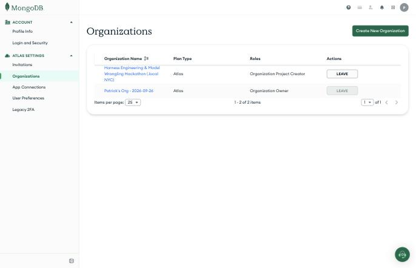
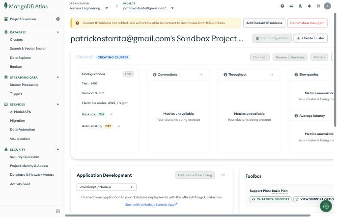
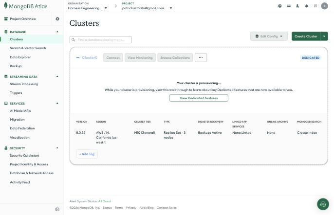
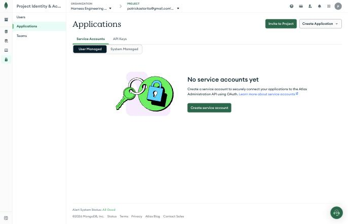
