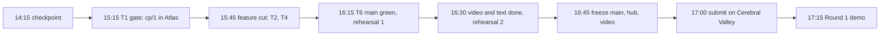

# Term 2 lanes: the checkpoint at 14:15 and the six terminals to 5 PM

*Source of record from 2026-09-26 14:15 ET. Supersedes the L1–L7 board in `docs/02-lanes.md`
(kept for the record; its lanes are closed below). The hub Lane board reads this file's lanes.*
<!-- @s1.16 @s1.04 -->

## 1 · The checkpoint criterion

A checkpoint is taken on the quarter hour named in §5. It passes when every row holds:

| # | Criterion | How it is checked |
|---|---|---|
| K1 | `main` is installable and green | `make check` in a throwaway worktree: `scripts/worktree.sh verify HEAD -- make check` |
| K2 | Every lane below has an owner, a terminal, and a status glyph | Lane board export pasted into §6 |
| K3 | No lane's gate has slipped past its slot without a note in §6 | Steward reads the gates against the clock |
| K4 | Worktrees collected, no stale `lane/` branch | `scripts/worktree.sh gc` |
| K5 | Both principals can run the demo path on their machine | `.env` has `ATLAS_URI` on both; `3pt loop` writes a checkpoint |

## 2 · What the terminals were doing at 14:15

Read from the Claude Code session files for this project. Sessions marked idle finished their brief and can be re-tasked.
<!-- DERIVED: ~/.claude/projects/-Users-Patmac-Documents-Code-3pt-dev-3pt/*.jsonl, mtime and last assistant turn -->

| Session | Brief (first prompt) | Last turn | State | Term 2 lane |
|---|---|---|---|---|
| `0da8447f` | Sandbox VM provisioning, Atlas-compliant, Colima + Ansible | 14:12 fetching MCP tool list, Flex limits | active | T1 |
| `67bf82d3` | Strands journey: answer the four questions with pointers (worktree `lane/strands-journey`) | 14:14 trimming hub index cards to budget | active | T4 |
| `26d644f0` | Parent-dir session: hub deploys, Access, skill sync, segmented commits | 14:13 listing worktrees before a merge | active | T6 |
| `7373e94d` | Tersity pass over every leaf, dispatched five agents | 13:55 done, metric gates the build | idle | T5 |
| `195bf2ed` | Design-system proposals, then merged PRs #1 and #2 | 13:56 done, two things still red on main | idle | T3 |
| `1e70daf2` | README banner, MIT license, open-source checklist | 14:01 done, uncommitted at the time | idle | T6 |
| `59a860ae` | This checkpoint | 14:15 | active | steward |
| `c1b624fa`, `d566ee7f`, `ae92d983` | Rules import, provenance index, monorepo layout | before 13:32 | closed | — |

## 3 · What the git history says

Forty commits since 12:46, all today. Grouped by what they built:
<!-- DERIVED: git log --since=12:00 -->

| Group | Commits | Landed |
|---|---|---|
| Monorepo, three lanes, batteries, worker, cli | 7aae328 3e1d9d5 46f5dfe 792e061 fa89a9d 0fd66df 11212da 5a1edb3 a83a3a8 | 13:12–13:56 |
| Hub leaves, design system, depth, icons, tersity, sketches | ca5051a 1b6063e e69cb01 b168fa2 0086a93 e1d0873 81138a1 131ba4a 419ef83 f0b00fa 000a85c 41f384c | 13:22–13:57 |
| CI, heraldry, deploy resolver | a51d5ec 76ea18e 253f528 1df231e 5dceeea | 13:12–13:47 |
| Docs of record, provenance, decisions, checklist, skill vendoring | dd95c84 a902f5b c7abfdd b51c346 ea5c5a8 7aa0e8f 0818eb4 | 12:58–14:06 |
| Yash, on `origin/main`, not yet pulled here | 613b349 Acme Builders mock firm, Simulator leaf · d9f2a61 117 openly licensed construction photos | 14:12–14:14 |

Two facts the lanes below rest on. Nothing writes to Atlas yet: there is no `.env` on this machine and no Sandbox cluster.
Yash's two commits decide the workload in practice: construction site photos, the direction Patrick argued for in the ICP explorer.

## 4 · Closing L1–L7

| Old lane | Outcome |
|---|---|
| L1 Repo setup | Repo public, Yash pushing to `origin/main`. Atlas Sandbox project still missing → T1 |
| L2 ICP definition | Decided by the data commit: construction GC, Acme Builders. Record it in `docs/12-decisions.md` §1 → T5 |
| L3 Agent contextualization | CLAUDE.md, AGENTS.md, skills and MCP wiring exist. Both machines load them → T6 confirms |
| L4 Workflow & pipeline | Skeleton runs one iteration on the memory store. Atlas collections → T1 |
| L5 Swift app basis | `3PT.app` builds; stays secondary. Judges see the web surface → T3 |
| L6 Resources scan | Done. Credits redeemed as they arrive |
| L7 Hub workspace | Live, gated, both tiers verified. CI secrets still unset → T6 |

## 5 · Term 2: six lanes, one steward

Each lane names the judging criterion it earns (`docs/05-rules.md` § Judging) and a gate that is true or false.

| # | Lane | Owner · terminal | Earns | Gate (true or false) | Slot |
|---|---|---|---|---|---|
| T1 | **Loop on Atlas** | Patrick · `0da8447f` | Technical Demo 35% | `3pt loop` with `ATLAS_URI` set writes `cp/1` to `checkpoints` in the Sandbox cluster; `rollback` returns policy v0. Cluster made from the sandbox email link | 15:15 |
| T2 | **Photos through the loop** | Yash · Yash's machine | Impact 20% · Creativity 15% | `media_index` seeded from the 117 photos; one Instrument pass rewrites a context policy over them and the diff names the photo workload | 15:45 |
| T3 | **The judges' surface** | Yash · re-task `195bf2ed` | Technical Demo | App prototype or Simulator reads harness versions from Atlas, not the mock; approve and roll back work; the demo link opens without login | 16:00 |
| T4 | **The difficulty story** | Patrick · `67bf82d3` | Implementation Difficulty 30% | Strands journey leaf answers the four questions with pointers and passes `make -C hub check`; a one-page Q&A crib: state machine, checkpointing, policy compiler, negotiation | 15:30 |
| T5 | **Demo, video, pitch** | Both · re-task `7373e94d` | The submission | Everything in `docs/18-submission.md`: demo script from the Direction shot list; 60-second video with audio recorded after T1's gate; description text and `Decided:` lines in `docs/12-decisions.md`; rehearsed twice | 16:30 |
| T6 | **Green main, hygiene** | Patrick · `26d644f0` + `1e70daf2` | Admissibility | Yash's commits pulled and the skill drift resolved; dirty tree committed in segments; `make check` green; CI secrets set; checklist rows B-05, B-08, C-01–C-05 ticked; photo credits file | 16:15 |
| — | Steward | Patrick · `59a860ae` | Alignment | This file current; board exported at each checkpoint; freeze called | each ¼ h |

Ordering. T1 unblocks T2 and T3; if T1 slips past 15:45, T3 demos against the memory store and T5 narrates Atlas from the checkpoint doc.
T4 and T6 are independent and start now. T5 starts its script now and shoots at T1's gate.

## 6 · Provisioning each principal

| Need | Patrick | Yash |
|---|---|---|
| Atlas Sandbox project + M0 cluster from the sandbox email (gate 1 of 6) | Create; export org id, service-account keys | Receives `ATLAS_URI` out of band, never through the repo |
| `.env` with `ATLAS_URI` (see `.env.example`) | Missing at 14:15 | Missing |
| Repo collaborator on `pastarita/3pt` | Owner | Done, pushing |
| Hub gate (Access, One-time PIN) | Done | Done |
| GitHub Actions secrets `CLOUDFLARE_API_TOKEN`, `CLOUDFLARE_ACCOUNT_ID` | Set them (T6) | — |
| Public demo host without a gate (checklist C-05) | — | Vercel or an ungated Pages project (T3) |
| Disk | 2.6 GB free; `@3pt/strands` stays excluded from the workspace | — |
| Cerebral Valley submission, both members added | Submits | Confirms membership |
| Agent context: CLAUDE.md, AGENTS.md, the vendored skill | Sync only via `scripts/sync-skill.sh` | Same; the 14:12 commit edited the vendored copy by hand, T6 reconciles |

## 7 · Checkpoint log

Paste the Lane board export under a time heading. Note any gate that slipped.

### 14:15
Term 2 opened. Board reset to T1–T6. T1 blocked on the Sandbox org credentials; everything else open or active as in §2.
