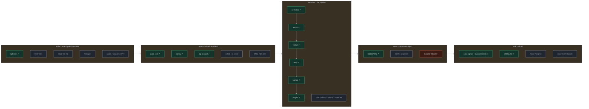
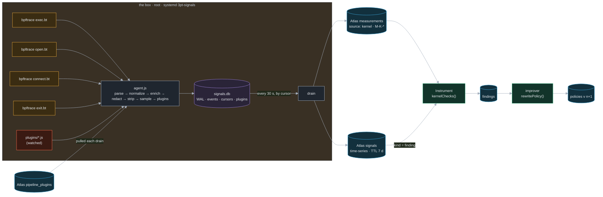

# Kernel signals: the box as a witness

*Contemplation and source of record. Written and implemented 2026-09-26 15:00–16:00 (Patrick). One battery,
`infra/batteries/signals`, one box role, one Instrument check. Cilium-inspired: sensors are declared, attached
by a runtime, and export JSON; the pipeline between the sensor and the cloud is where policy lives. Verified
rows in §9 come from real runs on the Colima box and on the laptop; everything else is design.*

## 1. The decision
<!-- @s1.28 @s1.02 @s1.29 @s1.03 -->

Every measurement the Instrument stage has today is self-reported: traces the harness emits, counts the worker
logs. A harness that rewrites its own rules from its own reports can be wrong about itself. The kernel cannot:
a file open is a file open, a connect is a connect. So the outer evaluation loop gets a second, independent
data source, drawn from the kernel of the machine the workload runs on, and it gets it as a first-class stream
that lands in Atlas like every other stateful thing.

| Question | Decision |
|---|---|
| Where do the signals come from | eBPF on the box (`infra/batteries/box`, Colima, Ubuntu 24.04, kernel 6.8, BTF present). The production app drains into the same pipeline later; the box is where it is proven. |
| What draws them | bpftrace programs, one per sensor, declared like a Tetragon `TracingPolicy`: one hook, JSON lines out. No compiler on the box. |
| What sits between sensor and cloud | A fixed transform chain (normalize → enrich → redact → strip → sample → plugins), the same shape as an OpenTelemetry Collector pipeline or a Vector VRL graph. |
| What makes it durable and parsable | One SQLite file in WAL mode on the box (`node:sqlite`, no dependency): rows plus JSON attrs, cursors, plugins. Any `SELECT` reads it. |
| Where it goes | Atlas: `signals` (time-series, TTL 7 d) for rows, `measurements` (source `kernel`) for windows. A JSONL sink is the offline twin. |
| How code is pushed into the pipeline | Plugins: `module.exports = (signal, ctx) => …`, from a watched directory or from Atlas `pipeline_plugins`, run in a vm context. Decisioning first; inference is one plugin away. |
| How the loop closes | Instrument reads the kernel measurements and the findings a plugin raised, writes `findings`; the improver already turns failed findings into policy. Nothing new in the improver. |

## 2. The box, evaluated

*Question: can this VM run eBPF sensors at all?* Checked 2026-09-26 14:50 on Colima profile `default`
(2 CPU, 4 GiB, aarch64).

| Probe | Result | Consequence |
|---|---|---|
| `uname -r` | 6.8.0-50-generic, Ubuntu 24.04.1 | tracepoints, kprobes, BPF LSM all present |
| `/sys/kernel/btf/vmlinux` | present (6.9 MB) | CO-RE struct navigation works: `(struct sock *)arg0->__sk_common.skc_daddr` |
| `CONFIG_BPF_SYSCALL CONFIG_DEBUG_INFO_BTF CONFIG_KPROBES CONFIG_UPROBES CONFIG_FTRACE_SYSCALLS` | all `=y` | every hook the sensors use |
| tracefs, debugfs | mounted | bpftrace can list and attach |
| `sudo -n true` | passwordless | the unit runs as root; `box.sh exec` can run sensors ad hoc |
| `apt-cache policy bpftrace` | 0.20.2 candidate; installed 14:52 | one apt package, no clang |
| `node --version` | v22.23.3 | `node:sqlite` is built in (unflagged since 22.13) |
| free disk inside the VM | 85 GB of 96 | the store and its WAL are nothing |
| bpftrace 0.20 quirks found | `curtask->real_parent->tgid` trips an assertion (BTF bitfield); `AF_INET` is not defined, use `2`; `bswap()` on a 16-bit field compiles but a shift is clearer | sensors avoid all three |

## 3. The menu

*Question: what may a recipe pick per slot?* `MENU` in `infra/batteries/signals/src/index.ts` is this table as
data; `pnpm --filter @3pt/battery-signals run provision` prints the implemented count per slot.

| Slot | Implemented | Listed for a later recipe | Rejected |
|---|---|---|---|
| probe | bpftrace scripts (apt, one process per sensor) | BCC tools; libbpf CO-RE skeletons; cilium/ebpf, Aya; Tetragon standalone (`tetra getevents -o json` feeds the same pipeline); auditd, `/proc`, strace when there is no BTF or no `CAP_BPF` | |
| sensor | exec, exit (process) · openat by workload comms (file) · tcp_v4_connect (net) | sched, cpu profile, block io, memory (map output, `bpftrace -f json`); DNS and TLS SNI to name the addresses | |
| transform | normalize (OTel log-record shape), enrich (stage, iteration, media, egress class), redact, strip, deterministic sample, plugins | the same chain as OTel Collector processors (filter, transform/OTTL, redaction, tail sampling), Vector VRL, Fluent Bit filters | |
| store | SQLite WAL via `node:sqlite` | JSONL segments with fsync and rotation; a Collector or Vector disk buffer | Cloudflare Durable Object: the namesake, but the box is the edge and must work offline |
| sink | Atlas `signals` (time-series) + `measurements`; JSONL file | Neon Postgres for relational rollups; Atlas Vector Search over finding narratives (the `transcripts_vec` index exists) | |
| feedback | Instrument `kernelChecks()` → `findings`; the improver → policy | Plan reads M-K-* to pick a fix sprint (docs/07 §3.2) | |

## 4. The kit, as implemented (recipe K1)

*Question: what runs where?*

| Piece | File | Moves it took (docs/10 §5 battery recipe: 3) |
|---|---|---|
| battery | `infra/batteries/signals/` (package, descriptor with `SENSORS` and `MENU`, provision, SKILL) | 1 |
| sensors | `sensors/{exec,exit,open,connect}.bt` | inside the battery |
| pipeline, store, drain, agent | `src/{pipeline,store,drain,agent}.ts` | inside the battery |
| box role | `infra/batteries/box/ansible/roles/signals` + `3pt-signals.service`; `signals` in `PHASES`; `box.sh verify` shows the store | the box battery's own recipe |
| collections | `signals`, `pipeline_plugins` in `COLLECTIONS`; index and `TIMESERIES` in the atlas battery; the drain ensures the time-series collection | docs/10 §5 collection recipe: 3 |
| metrics | `M-K-EXEC M-K-OPEN M-K-REREAD M-K-CONN M-K-CONN-UNKNOWN` in `METRICS`; rows M-20…M-24 in docs/07 §3.1 | measurement recipe: 2 |
| feedback | `kernelChecks()` in `@3pt/instrument` (harness lane touched, said so in the commit) | 1 |

## 5. The pipeline contract
<!-- @s1.02 -->

The order is fixed. Redaction runs before anything is written; sampling runs after enrichment so the flags it
keys on exist; plugins run last so they see what the store will see.

| Stage | Does | Knob |
|---|---|---|
| parse | one JSON line → event; a bad line is counted (`dropped`), never thrown | |
| normalize | event → `Signal` {t, host, kind, pid, comm, stage, iteration, attrs}; sensor nanoseconds rebased to wall clock | `SIGNALS_MARKER` (stage, iteration) · `SIGNALS_ITERATION` |
| enrich | `media` (prefix or image extension), `write` (open flags), `egress` ∈ atlas · https · local · other | `SIGNALS_MEDIA_PREFIXES` |
| redact | `scheme://user:pass@` → `scheme://…@`; `key=`, `token:`, `password=` values; tokens ≥ 40 chars → `[h:xxxxxxxx]`; `/home/<u>` → `/home/~`; paths to `.env`, keys, `ACCESS_PASS`, `credentials` → `[secret:xxxxxxxx]` with `secret: true`; `env` and `argv` attrs struck | none: it is not optional |
| strip | drop named attrs | `SIGNALS_STRIP=cgroup,uid` |
| sample | deterministic: sha1(kind, pid, path or addr) under the rate; media opens, findings, agent lines always kept | `SIGNALS_SAMPLE=open=0.1,exit=0.2` |
| plugins | `(signal, ctx) => Signal \| Signal[] \| null`, each in its own `vm` context (no `require`, no `process`, no network), compile time-boxed at 100 ms, a throwing plugin is disabled and logged | `SIGNALS_PLUGIN_DIR`; Atlas `pipeline_plugins` |

**Pushing code.** A plugin is a document: `{ name, code, version, enabled }` in `pipeline_plugins`. The agent pulls the
collection on every drain, loads a higher version, unloads `enabled: false`, and remembers what it loaded in the store's
`plugins` table so the next boot has it before the network does. A file dropped into `plugins/` is the same thing without
the cluster. `plugins/reread-alarm.js` is the worked example: a decisioning engine that raises a `finding` signal the second
time a media path is opened in one iteration. An inference engine is the same contract calling a model: listed, not built.

## 6. The durable object
<!-- @s1.14 -->

One file, `/var/lib/3pt/signals.db` on the box (`.signals/signals.db` here), WAL mode, `synchronous=NORMAL`, one
transaction per 200 ms flush.

| Table | Columns | Why |
|---|---|---|
| `events` | id, t, host, kind, pid, comm, stage, iteration, attrs (JSON) | the signals; indexed by (kind, t) and (iteration, kind) |
| `cursors` | name, pos, at | one watermark per sink; the drain is at-least-once |
| `plugins` | name, source, version, code, at | what Atlas pushed, kept for the next boot |
| `agent_log` | at, line | the agent's own lines, so `--status` needs no journal |

Parsability is SQL. `3pt-signals --query "SELECT kind, count(*) FROM events GROUP BY kind"` opens the file read-only;
the re-read metric itself is one query (`SignalStore.rereadsIn`: media opens whose path was already opened earlier in the
same iteration). Retention is a `DELETE` below the lowest cursor after `SIGNALS_RETENTION_DAYS`.

## 7. Offload routing
<!-- @s1.14 @s1.29 -->

*Question: which store gets which signal, and why that one?*

| Signal | Store | Shape | Reason |
|---|---|---|---|
| every kept row | Atlas `signals` (time-series, `t`, meta {host, kind, stage}, `expireAfterSeconds` 7 d) | raw | the record; cheap to write, expires itself; Charts and `$match` on meta |
| per-batch windows | Atlas `measurements` (source `kernel`) | M-K-* counts | what Instrument already reads; sums across windows |
| `finding` signals | Atlas `signals` (kind = finding) | raw | Instrument reads them by iteration and writes `findings`; the improver never reads raw signals |
| plugins | Atlas `pipeline_plugins` | code | the push path down |
| relational rollups | Neon Postgres | per-iteration table | listed: when a judge wants SQL over the cloud copy |
| finding narratives | Atlas Vector Search | embedding | listed: "have we seen this failure before" is a nearest-neighbour question |

`SIGNALS_SINK=file` writes the same documents as JSONL (`{"c":"signals",…}`, `{"c":"measurements",…}`); it is what CI
and a box with no cluster use, and what §9 verified today.

## 8. Feedback: the loop closes
<!-- @s1.02 @s1.13 @s1.03 -->

| Step | Who | Reads | Writes |
|---|---|---|---|
| 1 | the box | the kernel | `signals`, `measurements` (source kernel) |
| 2 | Instrument (`kernelChecks`) | M-K-* for its iteration; `finding` signals | `findings`: `kernel:witness` (passed, the counts), `kernel:read-once` (fails when M-K-REREAD > 0 and the policy says read once), `kernel:egress` (fails when M-K-CONN-UNKNOWN > 0), one per plugin-raised check |
| 3 | improver (`rewritePolicy`) | failed findings | policy v n+1 with `Learned at cp/N (kernel:read-once): 2 media opens were re-reads …` |
| 4 | Plan | the new policy, M-K-* | a fix sprint when the kernel disagrees with the traces (listed) |

The claim for the judges: the harness rewrote its own rule because the kernel, not the harness, said the rule was broken.

## 9. Verified

| Row | How | Result |
|---|---|---|
| box can run sensors | §2 probes over `colima ssh`, 14:50 | all green; bpftrace 0.20.2 installed |
| exec, open, exit, connect sensors attach and emit JSON | `sudo timeout 3 bpftrace -e …` per hook, 14:58 | exec and exit emitted; open and connect compiled and attached (nothing to see in 3 s) |
| pipeline, store, drain end to end | `pnpm --filter @3pt/battery-signals run replay` on the laptop, 15:01 | 18 lines → 16 rows (1 non-JSON counted, 1 exit sampled out); 2 `finding` rows from `reread-alarm`; 5 measurements incl. `M-K-REREAD=2`, `M-K-CONN-UNKNOWN=1`; URI credentials, a 64-hex name, `/opt/3pt/.env` and `~/.config/3pt/ACCESS_PASS` all redacted in the store |
| workspace | `pnpm turbo run build typecheck`, 15:04 | 42 of 42 tasks green |
| box converged with the `signals` role | `box.sh play workload,signals` then `box.sh verify` | see the commit message and CLAUDE.md state for the outcome |

## 10. Open and decided

| Item | State |
|---|---|
| Probe runtime | **Decided:** bpftrace. Tetragon is the obvious second recipe (K2) when a sensor needs a policy language instead of a script. |
| Correlation to stage and iteration | **Decided:** a marker file the harness writes (`SIGNALS_MARKER`); `SIGNALS_ITERATION` until the CLI writes it. **Open (harness lane):** `3pt loop` should write the marker. |
| Parent pid | **Open:** bpftrace 0.20 asserts on `curtask->real_parent`; `cgroup` and `uid` are captured instead. |
| Plugin execution time | **Open:** compile is time-boxed, calls are not; a runaway plugin stalls the ingest thread. A worker thread per plugin is the fix. |
| Names for addresses | **Open:** the connect sensor sees IPs; a DNS sensor (udp :53) names them. |
| Time-series creation | **Decided:** the drain ensures it from `TIMESERIES`; the atlas battery's provision does the same once its driver lands from `lane/strands-journey`. |
| Recipes K2–K5 | **Listed:** K2 Tetragon standalone → same pipeline · K3 OTel Collector (filelog receiver, processors, file or OTLP exporter, bridge to Atlas) · K4 Vector (file source, VRL remap, http sink to the API) · K5 libbpf CO-RE sensor with a ring buffer for a hot path. Each is one probe or transform swap; the store, drain, and feedback stay. |
