# System map: the implemented architecture, drawn

*Source of record for what exists in the tree on 2026-09-26 (HEAD `8e40630` plus the working tree).
Sixteen Mermaid figures, each derived from the files it names, in the diagram design system of
`docs/10-architecture.md` §3. `docs/10` is the design; this is the recapitulation of what was built
against it. Where the two differ, §17 says so, and this document wins for "what runs today".*

Status words, on every figure. **wired** = called on a path a command exercises today ·
**written** = code exists, nothing calls it · **stub** = declares what it will provide (`battery.provides`)
and no more · **planned** = a record only (`infra/targets.json`, a doc).

| § | Figure | Question it answers |
|---|---|---|
| 1 | The tree | What is in the repo, workspace by workspace |
| 2 | Who imports whom | The exact dependency edges in `package.json` |
| 3 | The core contract | The records and interfaces everything agrees on |
| 4 | One `3pt loop` | What happens, in order, when the loop runs once |
| 5 | The sprint selector | How Plan picks feature, improvement, or fix |
| 6 | Checks by mode | What Instrument writes under each mode |
| 7 | Ten checks, ten grants | What the loop can learn on the demo firm |
| 8 | The backfeed | How findings become the next policy version |
| 9 | Atlas | Every collection, who writes it, who reads it |
| 10 | Keys | Where each key lives and how it reaches a stage |
| 11 | Policy to Strands | The compile step, field by field |
| 12 | The app loop | The second loop: screens, taps, ship, score, undo |
| 13 | The media path | The left side of the triangle, as far as it goes |
| 14 | Data | The demo firm and its three consumers |
| 15 | What runs where | Deployment, as live |
| 16 | CI, the herald, the hub pipeline | What gates a push and a PR |
| 17 | Lineage today, and the ledger | Checkpoints on disk, and every component's status |

## 1. The tree

*Twenty-two pnpm workspaces in three lanes, and the directories beside them that are not workspaces.*
Derived from `pnpm-workspace.yaml` and every `package.json` under `ui/`, `harness/`, `infra/`.

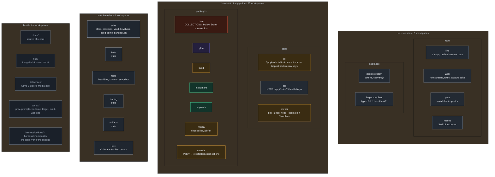

Turborepo runs `build` with `dependsOn: ["^build"]` across all twenty-two; `macos` is a manifest that
lets `turbo build` drive xcodegen and xcodebuild, not a JS package.

## 2. Who imports whom

*Every edge is a line in a `dependencies` block. Nothing is inferred.*
Derived from the twenty-two `package.json` files. External packages are the grey nodes.

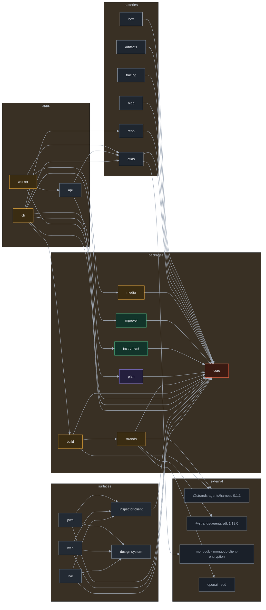

Three rules hold in the built tree: stages import `core` only; batteries are imported by apps, never by
stages; surfaces import `core` for types and reach the harness over HTTP. Two edges deserve a note.
`worker → api` is the one app-to-app edge: the Cloudflare Worker *is* the API's deployment. `api → atlas`
is a dynamic import behind a variable module name, so the Worker bundle never pulls in the driver.

## 3. The core contract

*The records every stage, surface and battery agrees on, and the three things that keep the loop and the
run apart: a frozen policy, a guarded store, injected secrets.*
Derived from `harness/packages/core/src/index.ts`.

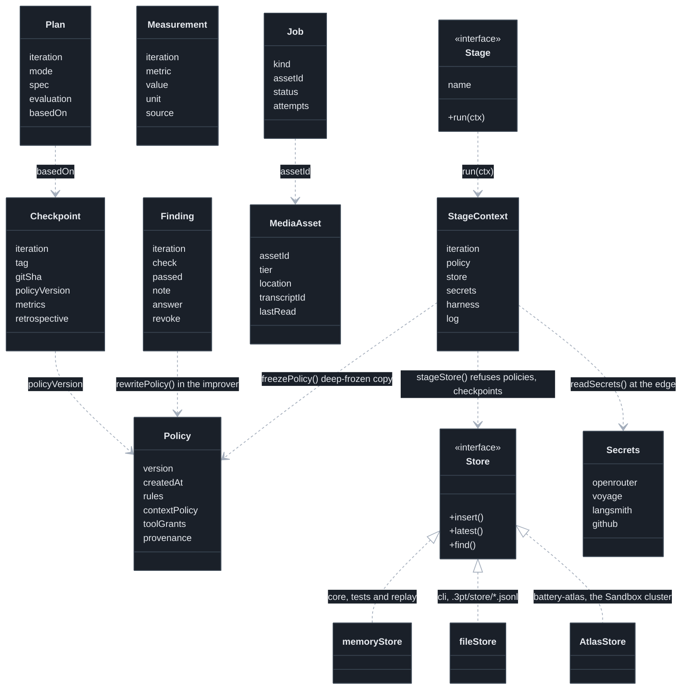

Sixteen collection names live in `COLLECTIONS` and nowhere else. `LOOP_OWNED` is `policies` and
`checkpoints`: a stage that inserts into either throws. `runIteration` runs the three stages in order, never
in parallel. `seedPolicy()` is v0: three rules, token caps of 40k / 120k / 60k, and the grant lists a stage
starts with.

## 4. One `3pt loop`

*What the CLI does, in order, when the loop runs once. `--git` adds the last step.*
Derived from `harness/apps/cli/src/index.ts`, `infra/batteries/atlas/src/vault.ts`,
`harness/packages/improver/src/index.ts`. Status: wired; the Build stage is a dry run unless
`OPENROUTER_API_KEY` resolves.

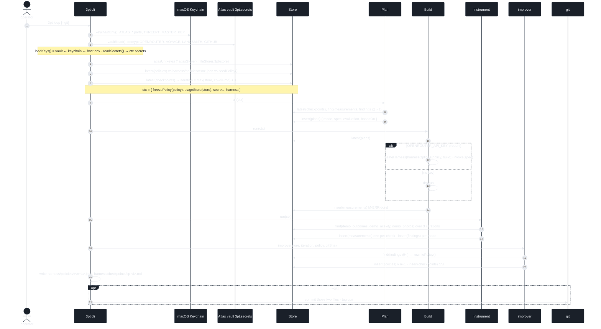

`3pt plan`, `3pt build`, `3pt instrument` run one stage under the same context. `3pt improve` runs the
improver alone. `3pt rollback cp/<i>` reads the policy at the tag, or the file, and inserts it as a new
version, code untouched. `3pt replay [dir]` runs the same loop body over a memory store, one iteration per
month of demo data, and never opens Atlas or git.

## 5. The sprint selector

*How Plan picks the mode for an iteration. Pure: `selectMode()`.*
Derived from `harness/packages/plan/src/index.ts`. `IMPROVE_EVERY = 4`. Status: wired.

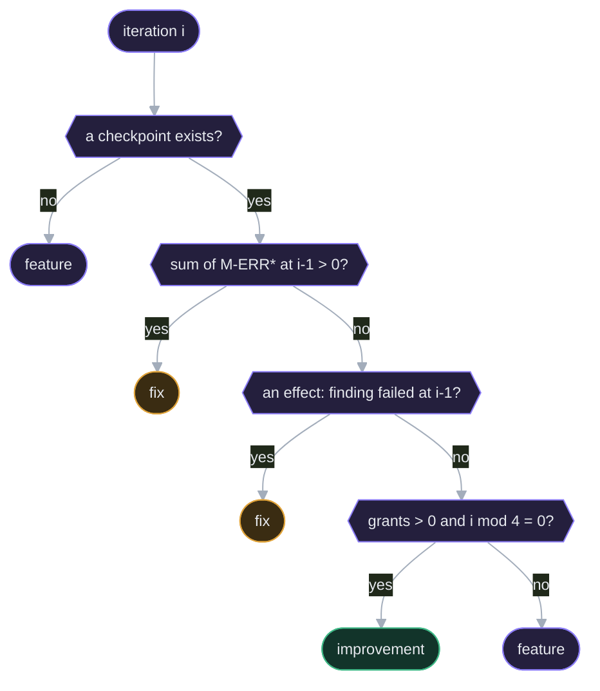

"Grants" counts Build grants that match `field. tool. flag. screen. context.`, the prefixes a finding can
answer with. The plan's `evaluation` line is one sentence per mode; it is what Instrument will check.

## 6. Checks by mode

*What Instrument writes under each mode, for every check in `PROJECT_CHECKS`. Pure: `runChecks()`.*
Derived from `harness/packages/instrument/src/index.ts`. `WINDOW 3` · `MIN_AGE 6` · `COOLDOWN 12`
(demo settings, `docs/10` §4.2). Status: wired.

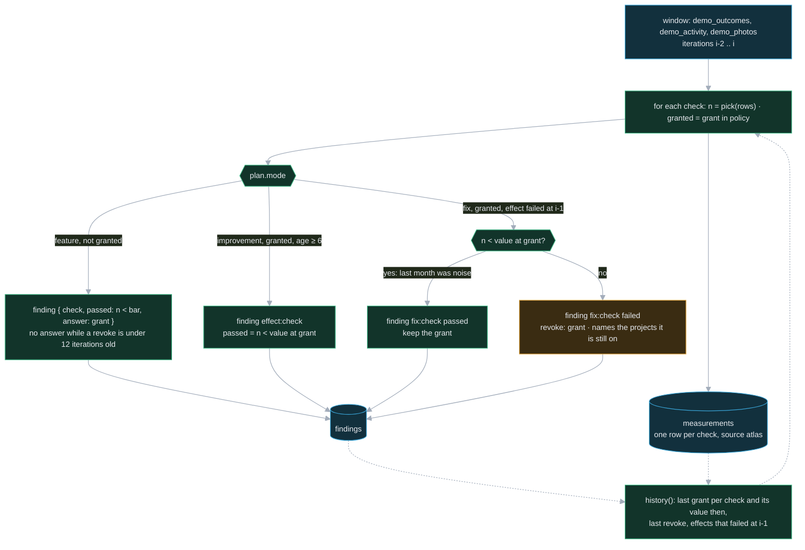

Instrument never touches the policy. A finding carries at most one instruction for the improver:
`answer` (grant this) or `revoke` (remove this). A check with `needs` runs only once its prerequisite grant
is in place.

## 7. Ten checks, ten grants

*Everything the loop can learn on the demo firm. Each check has one bar, one metric, one answering grant.*
Derived from `PROJECT_CHECKS` in `harness/packages/instrument/src/index.ts`. Bar is 3 events or 3 hours of
hand work in the window, except `hazard-photos` at 1. Status: wired; `3pt replay` finds 10 of 10, holds 9.

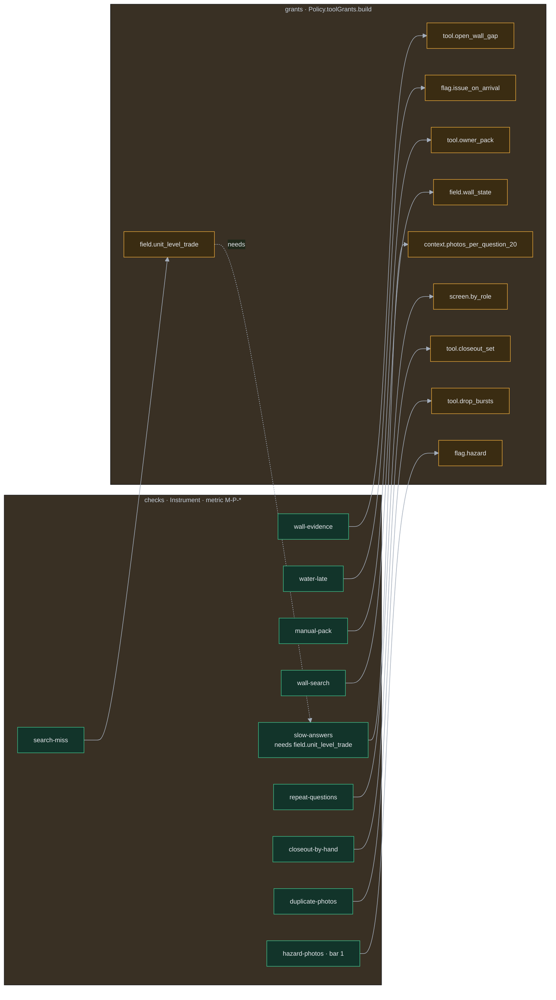

The grants are strings in a policy document. Nothing in the tree executes `tool.owner_pack`; what a grant
does today is change the next policy's `toolGrants.build`, which the Strands compile (§11) turns into
`builtinTools` and the stage's instructions.

## 8. The backfeed

*How the findings of one iteration become the next policy version and its checkpoint. Pure: `rewritePolicy()`;
then two inserts.* <!-- @s1.02 -->
Derived from `harness/packages/improver/src/index.ts`. Status: wired.

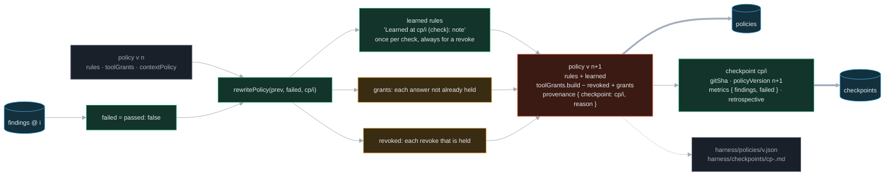

With no failed checks the version still bumps, reason "no failed checks; version bump for lineage".
That is what v1 and v2 on disk are: the Atlas Sandbox has no `demo_*` rows in the window the two live
loops ran over, so every check passed.

## 9. Atlas

*Every collection in `COLLECTIONS`, who writes it, who reads it. Cylinders are collections; the two grey ones
are outside `COLLECTIONS`.* <!-- @s1.14 -->
Derived from `harness/packages/core/src/index.ts`, `infra/batteries/atlas/src/*.ts`, the stage packages,
`harness/apps/api/src/app.ts`. Solid edges write; dashed edges read. Status: provisioned and seeded on
`Cluster0`; the media collections are empty.

```mermaid
%%{init: {"theme":"base","themeVariables":{"background":"#0f1216","primaryColor":"#1a2029","primaryTextColor":"#e6e9ee","primaryBorderColor":"#3a4552","lineColor":"#a3adbb","fontFamily":"ui-monospace, Menlo, monospace","fontSize":"12px"}}}%%
flowchart LR
  subgraph W["writers"]
    direction TB
    IMP["improver"]:::inst
    PL["plan"]:::plan
    BU["build"]:::build
    IN["instrument"]:::inst
    WK["worker tick()"]:::build
    SEED["seed-demo"]:::battery
    APP["api app.ts"]:::surface
    VLT["vault.ts"]:::battery
  end
  subgraph LO["loop-owned · LOOP_OWNED"]
    direction TB
    POL[("policies\nversion unique")]:::atlas
    CPS[("checkpoints\niteration, tag unique")]:::atlas
  end
  subgraph SO["stage output"]
    direction TB
    PLN[("plans")]:::atlas
    MEA[("measurements\niteration, metric")]:::atlas
    FND[("findings\niteration, check")]:::atlas
  end
  subgraph MD["media · empty today"]
    direction TB
    MI[("media_index\nassetId unique · tier, lastRead")]:::atlas
    TR[("transcripts\nassetId unique · transcripts_vec 1024d cosine")]:::atlas
    JB[("jobs\nstatus, createdAt")]:::atlas
  end
  subgraph DM["demo firm"]
    direction TB
    DP[("demo_projects")]:::atlas
    DPH[("demo_photos")]:::atlas
    DA[("demo_activity")]:::atlas
    DO[("demo_outcomes")]:::atlas
    HV[("harness_versions")]:::atlas
  end
  subgraph AL["app loop"]
    direction TB
    AS[("app_state\nts")]:::atlas
    AE[("app_events")]:::atlas
  end
  subgraph KY["keys"]
    direction TB
    SC[("secrets\nname unique · value BinData")]:::atlas
    KV[("encryption.__keyVault\nthe DEK, wrapped")]:::data
    SS[("strands_storage\nwritten, never created")]:::data
  end
  IMP ==> POL & CPS
  PL --> PLN
  BU --> MEA
  IN --> MEA & FND
  WK --> JB
  SEED --> DP & DPH & DA & DO & HV
  APP --> AS & AE
  VLT --> SC & KV
  PL -.-> CPS & MEA & FND
  IN -.-> PLN & FND & MEA & DO & DA & DPH
  IMP -.-> FND & POL
  WK -.-> MI
  APP -.-> AS
  classDef plan fill:#241f3d,stroke:#8b7cf6,color:#e6e9ee
  classDef build fill:#3a2c12,stroke:#e0a33a,color:#e6e9ee
  classDef inst fill:#12342a,stroke:#3fb886,color:#e6e9ee
  classDef atlas fill:#12303d,stroke:#3aa6d9,color:#e6e9ee
  classDef surface fill:#232a33,stroke:#7d8a99,color:#e6e9ee
  classDef battery fill:#1f262f,stroke:#a3adbb,color:#e6e9ee
  classDef data fill:#1a2029,stroke:#6b7684,color:#a3adbb
```

`provision.ts` ensures every collection, the twelve indexes in `INDEXES`, and the vector index; it is
idempotent and prints the plan without a connection. The Store contract is three verbs, so no stage runs an
aggregation; the checks do their arithmetic in memory over a three-iteration window.

## 10. Keys

*Where each key lives and how it reaches a stage. No `.env` is read anywhere.*
Derived from `infra/batteries/atlas/src/{vault,keychain,index}.ts`, `harness/packages/core` (`readSecrets`),
`harness/apps/cli/src/index.ts`, `harness/apps/api/src/{index,keys}.ts`, `harness/apps/worker/src/{main,edge}.ts`,
`wrangler.jsonc`. Status: wired on the Mac; the Worker takes one secret and never sees the vault.

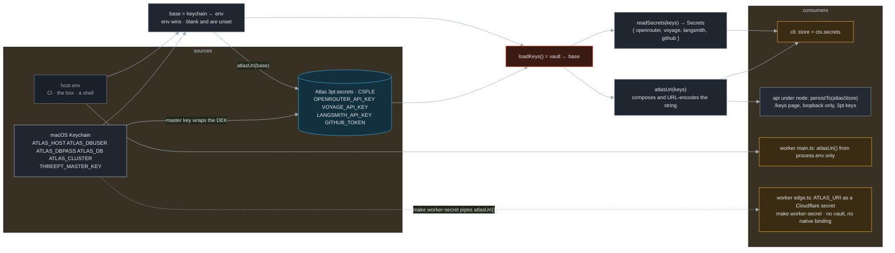

The KMS provider is `local`: the master key is 96 random bytes in the Keychain, and the data key in
`encryption.__keyVault` is wrapped with it. Lose the Keychain entry and the stored values are unreadable.
The key page tests OpenRouter and GitHub keys with a live request; a POST must come from the page's own
origin on loopback.

## 11. Policy to Strands

*The compile step: what each field of a Policy becomes in the options handed to `createHarness()`.*
Derived from `harness/packages/strands/src/index.ts`, `harness/packages/build/src/index.ts`. Status: wired for
Build when a key resolves; Plan and Instrument routes are written, no caller. `AtlasStorage` and
`measurementPlugin` are written, not registered.

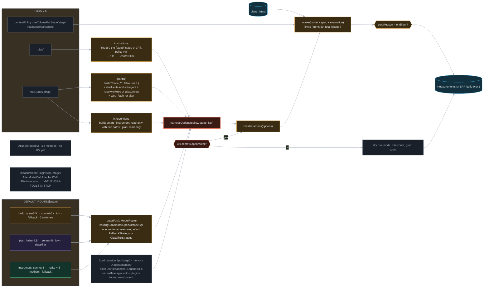

The Strands packages load by dynamic import inside `live()`, so the install loop and CI never need the key.
Every model call goes through OpenRouter with one key. The `docs/12` ledger rows L7 (Storage) and L9
(measurement hooks) are the two grey nodes: shaped, not plugged in.

## 12. The app loop

*The second loop, live on the Worker. Every screen is composed by the harness; every tap is evidence; the
harness ships its own change and undoes it when use says it was worse.* <!-- @s1.29 -->
Derived from `harness/apps/api/src/app.ts`, `ui/apps/web/src/{main,live,bulb}.ts`, `ui/packages/inspector-client/src/index.ts`.
The app at `/app/` is `ui/apps/web` since 2026-09-26 evening; `ui/apps/live` spoke the same endpoints and is no longer served.
`MIN_SIGNALS 4` · `DROP 20`. Status: wired; state in `app_state` and `app_events` when the Worker has Atlas.

**New photos and the media scan.** `POST /app/photos` files a photo with the uploader's tags (unit, trade, wall) and a
note. 3PT does not look inside the image: it reads the note for water and hazard words. Then `scan()` reads every photo
of every live job plus every upload and runs five checks: a word in 3 or more notes (becomes a tag and a search), water
with no `issue` field, a hazard with no hazards block for the safety manager, 3 or more units closed with no pipe photo,
and bursts of 3 or more shots. The first finding that asks for a change ships as a version, and `guard()` can undo it.
The Worker's cron (`*/30 * * * *`) runs `POST /app/scan`, so slow patterns are found with nobody tapping. The app shows
the last scan on "How it learns". Taps from the app reach the loop as Worker blocks (`BLOCK_OF` in `ui/apps/web/src/data.ts`);
`plan()` ignores any id that is not in `BLOCKS`.

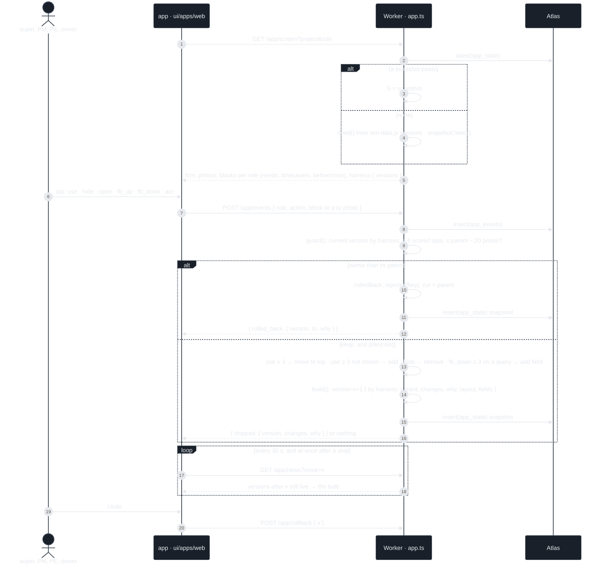

A version's life, as the code keeps it:

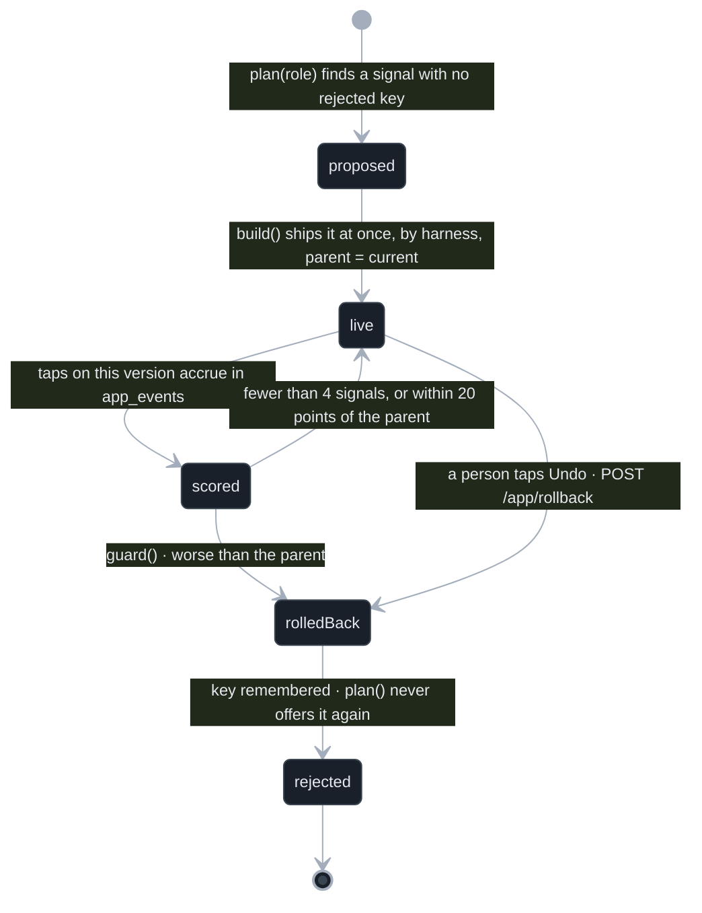

The Worker opens a fresh Store per request and drops its cached state, so every instance shows the same
harness version. Without Atlas, state is per instance and says so in `x-3pt-store`.

## 13. The media path

*The left side of the triangle, as far as it is built: an index, a tiering rule, a queue, and a worker that
fills it. Nothing drains it yet.* <!-- @s1.07 --> <!-- @s1.13 -->
Derived from `harness/packages/media/src/index.ts`, `harness/apps/worker/src/{index,main}.ts`,
`infra/batteries/blob/src/index.ts`, `infra/batteries/atlas/src/index.ts`, `scripts/build-web-site.sh`.

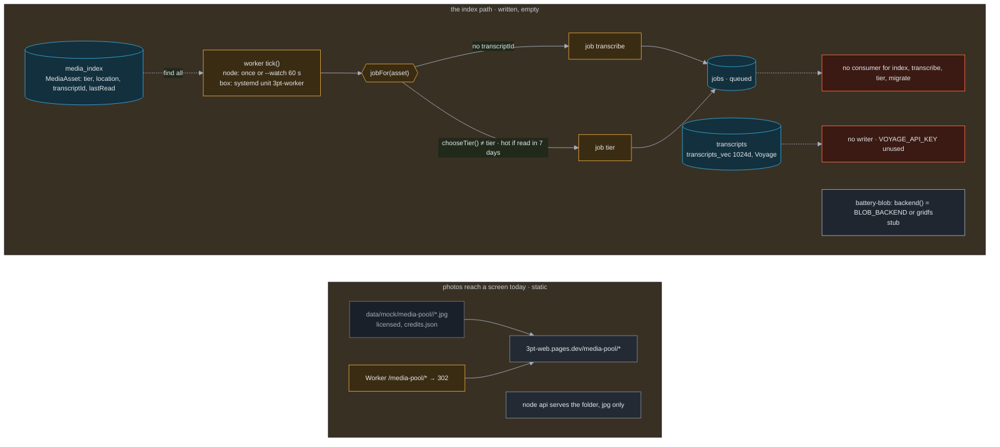

The read-once rule is enforced as a policy line (`readOnceTranscripts: true`) and a predicate
(`needsTranscript`), not yet as a transcriber. The Worker's `scheduled` handler is not wired; `edge.ts`
exports `fetch` only.

## 14. Data

*The demo firm and its three consumers. What is real and what is authored is in `data/mock/README.md`.*
Derived from `data/mock/`, `hub/site/sim-data.js`, `harness/apps/cli/src/replay.ts`,
`infra/batteries/atlas/src/seed-demo.ts`, `harness/apps/api/src/sim.ts`.

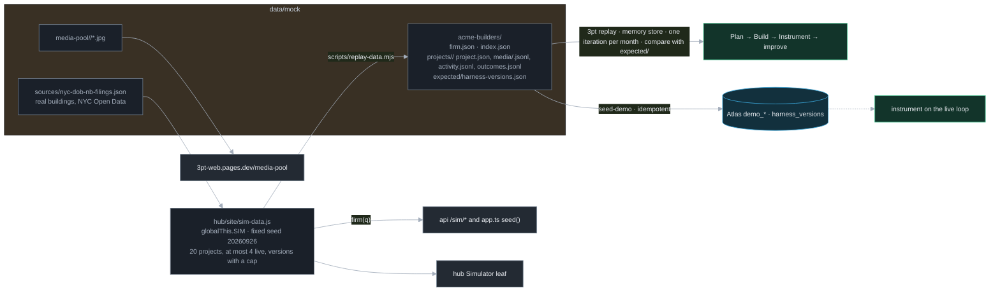

One model, three doors: the browser Simulator, the API's `/sim/*` and the app seed, and the files the loop
replays. The Worker bundle imports `sim-data.js` and `media-pool.js` as globals so it never reads a file.

## 15. What runs where

*Deployment as live at the time of writing. Grey edges are the local machine.*
Derived from `infra/targets.json`, `hub/site/nav.js` `PUBLISHED`, `harness/apps/worker/wrangler.jsonc`,
`scripts/build-web-site.sh`, `scripts/install-loop.sh`, `docs/17-atlas-setup-dossier.md` §7.

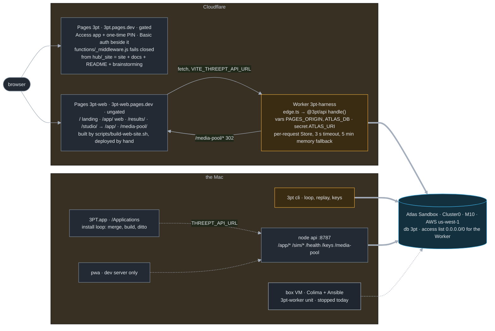

Two things the picture makes plain. The public demo (`/app/`) runs against the Worker and Atlas, not the
local API; the local API exists for the key page, the Swift app and development. And the Worker's `/health`
says `"store":"atlas"` only because `0.0.0.0/0` is on the access list, a row to delete after the hackathon.

## 16. CI, the herald, the hub pipeline

*What gates a push, what gates a PR, and how a document becomes a page.*
Derived from `.github/workflows/{ci,herald,deploy}.yml`, `hub/Makefile`, `hub/tools/*.mjs`, `scripts/prov.mjs`.

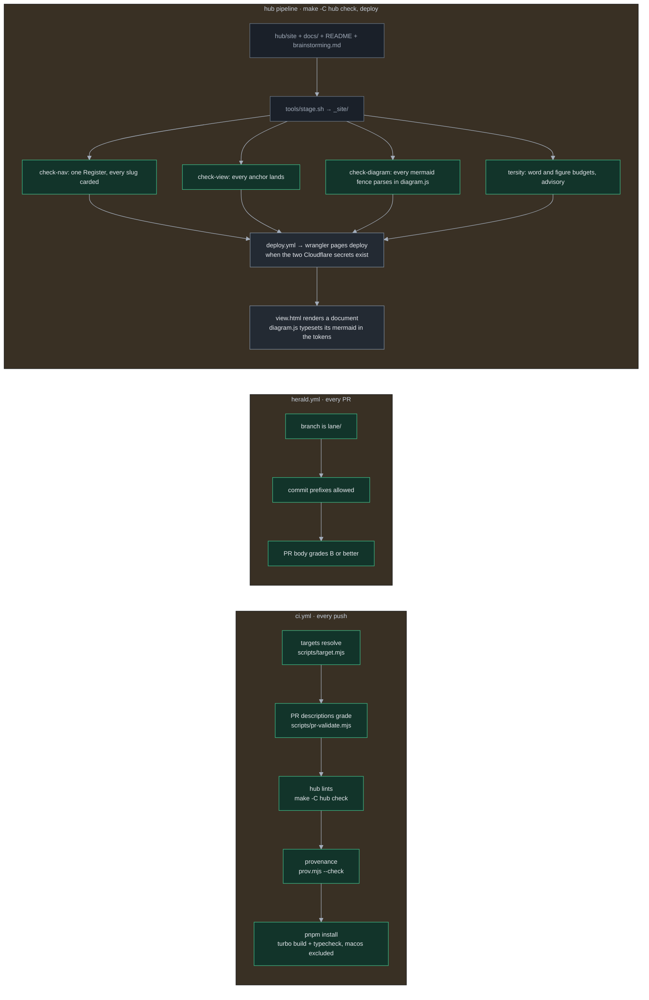

The hub reads Mermaid with its own parser and a closed grammar (flowchart, sequence, state, class, git). Every
figure in this document is inside that grammar; `make -C hub check` proves it.

## 17. Lineage today, and the ledger

*Where the two checkpoints that exist actually live, then every component with its status.*
Derived from `harness/policies/`, `harness/checkpoints/`, `git status`, `git tag`.

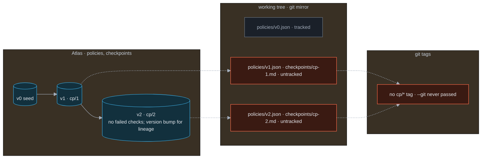

A checkpoint is meant to be a triple: the Atlas document, the two mirrored files, the git tag. Today the first
two exist for cp/1 and cp/2 and the third does not; `3pt rollback` still works from the files.

### The ledger

| Component | Status | Evidence |
|---|---|---|
| `@3pt/core` contract, `runIteration`, `freezePolicy`, `stageStore` | wired | `3pt loop`, `3pt replay` |
| Plan, Instrument, improver | wired | §5, §6, §8; replay finds 10 of 10 grants |
| Build, live path through Strands | wired when `OPENROUTER_API_KEY` resolves | `build/src/index.ts` `live()` |
| Build, dry run | wired | writes `M-ERR-build` |
| `@3pt/strands` Plan and Instrument routes | written | `DEFAULT_ROUTES`; only Build calls `harnessOptions` |
| `AtlasStorage`, `measurementPlugin` | written | no KV, no registration |
| Atlas battery: `atlasStore`, `provision`, `seed-demo`, vault, keychain | wired | `Cluster0` provisioned and seeded; `/health` says atlas |
| `sandbox.sh`, MCP wiring | written | needs `ATLAS_CLIENT_ID` and secret; service account not created |
| Repo battery: `headSha`, `showAt`, `snapshot` | wired | `--git`, `rollback` |
| Blob, tracing, artifacts batteries | stub | `battery.provides` only |
| Box battery | written | VM stopped; `3pt-worker` unit sources `.env` through bash |
| Media package, worker `tick()` | written | no assets in `media_index`, no job consumer |
| Worker `scheduled` | wired | cron `*/30 * * * *` runs the media scan (`POST /app/scan`) |
| API app loop | wired | live at the Worker, state in Atlas |
| API `/policies/latest`, `/checkpoints` | written | served from a memory store seeded with v0, not Atlas |
| API key page | wired | node only, loopback only |
| `live` app | written | builds; no longer served (the web app took `/app/`) |
| `web` app and capture suite | wired | `3pt-web.pages.dev/app/` (bulb, How it learns); Playwright captures |
| `pwa` | planned | builds; no deploy |
| `macos` | written | builds and installs; reads the local API |
| Hub, gate, Viewer, diagram reader | wired | `3pt.pages.dev` |
| CI build, herald | wired | `ci.yml`, `herald.yml` |
| Deploy of `web` and `harness` from Actions | planned | by hand with wrangler today |

### Where this differs from `docs/10`

- `docs/10` §4.1 has no `live`, `box` or `strands` node and no `worker → api` edge. §2 here is the built graph.
- `docs/10` §4.4 shows surfaces reading policies and checkpoints from the API. The built API answers those two
  routes from memory; only `/app/*` and `/health` touch Atlas. The Swift app therefore shows v0.
- `docs/10` §4.7 draws five iterations and a rollback with tags. §17 here shows two iterations, no tags.
- `docs/10` §4.3 lists batteries as if all provide tools. Three are stubs; the grants a policy carries are strings
  the Strands compile maps to `builtinTools`, not calls into a battery.
