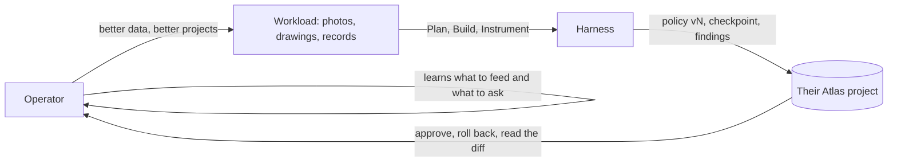

# Implications: own the twin

*Source of record from 2026-09-26 16:30 ET. What 3PT means for a capable operator who is not an engineer:
the contingency it builds toward, what they own, and the levers they hold. Also rendered on the hub lander,
in the README, and as its own card.*
<!-- @s1.19 @s1.20 @s1.23 @s1.24 @s1.25 @s1.28 @s1.29 -->

## 1 · Who this is for

Not the engineer. The person with a real position, a real role, and real technical ability inside a business
that produces media all day: a superintendent with a camera roll, a studio principal with a render farm, an ops
lead with a creative library. They can read a checkpoint, judge a diff, and say "no, roll that back". They will
not write the harness.

| They have | They lack | 3PT gives |
|---|---|---|
| Years of their own data, growing daily | A team to turn it into software | A loop that turns data into rules, and rules into versions they approve |
| Judgment about which outputs are good | A way to feed that judgment back | Findings, rollback, and a policy diff they can read |
| A business worth modelling | The model, and the ownership of it | A digital twin whose every state lives in their own Atlas project |

## 2 · The contingency

Frontier models make it possible for a business to grow its own software infrastructure: a **digital twin** of how
it works, learned from what it already produces. The default path to that twin runs through closed platforms that
keep the data, keep the learned improvements, and rent the result back.

The contingency 3PT builds toward is the other path. The twin is developed by a frontier-model-enabled harness the
business runs itself. The data, the improvements, and the steering stay with the business.

## 3 · What they own

| Owned | Where it lives | How it is theirs |
|---|---|---|
| The data | Their Atlas project (`media_index`, `signals`) and their box | Never leaves without redaction and stripping (`docs/20-kernel-signals.md` §5); Atlas is in their org |
| The improvements | `policies`, versioned; `checkpoints`, one per iteration | Rules, context policies, and tool grants are data, so they carry the value, not the vendor's weights |
| The history | `checkpoints` with git sha, policy version, metrics, retrospective | `3pt rollback cp/<i>` restores any state; nothing is lost to a silent upgrade |
| The building blocks | Repeated parts of their outputs, offered back by the harness | `docs/06-goal-and-use-case.md` § Use case, step 4: composition instead of repetition |
| The steering | Findings and approvals, in their words | The next policy is rewritten from their feedback, not from a product roadmap |

## 4 · The levers they hold

The system improves without code from the operator. Each lever is something they already do at work.

| Lever | What they do | What moves |
|---|---|---|
| Better data | Photograph consistently, label what matters, keep the records | `media_index` gets denser; the context policy reads fewer, better items |
| Better representative projects | Curate the jobs that show the firm at its best | The harness learns the signature, not the noise (`docs/06` § two streams) |
| Better feedback | Say what was wrong, approve what was right | Findings drive the rewrite; rollback undoes the rest |
| Learning the loop | Watch which inputs the harness turns up or down | They learn to generate the data that earns feedback, and ask for the feedback that earns data |

The operator gets better at running the harness at the same rate the harness gets better at running the business.
That symmetry is the whole point of an outer loop that the owner can read.

## 5 · What exists today, and what is next

| Claim | Grade | Evidence |
|---|---|---|
| Rules, context policies, tool grants are data and are versioned | built | `Policy` in `harness/packages/core`; `harness/policies/v<n>.json` |
| Every iteration checkpoints to their Atlas | built | `checkpoints` in `COLLECTIONS`; `atlasStore()` in the atlas battery |
| Rollback restores a prior state | built | `3pt rollback cp/<i>` in `harness/apps/cli` |
| Kernel signals stay on their box until redacted | built | `infra/batteries/signals`, `docs/20-kernel-signals.md` |
| The harness offers building blocks back | next | `docs/06` § Use case step 3 and 4 |
| A non-technical operator steers it from the app | next | `docs/06` § The UI we want; `ui/` |

## 6 · The name

"Implications" is the working title. Alternatives, if a better one is wanted: **Own the twin**, **Sovereignty**,
**What it means for you**, **The contingency**. The slug on the hub is `implications`; renaming it is one row in
`hub/site/3pt-data.js` and `hub/site/nav.js`.
