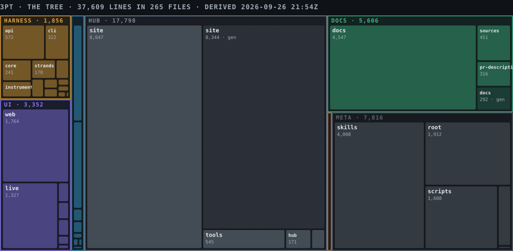

# The cut: the hub, ranked and sculpted for the room

**Status** 2026-09-26 · first-round judging (17:15 to 18:45), Top 6 at 19:00. The video is posted:
https://youtu.be/MxAMXWKRcvc ("3pt (Three Point Harness)", public). Hub leaf: `index.html` § Start here. Registered as **DY**.

The room gives us three minutes and a screen. The hub had 51 cards over four clusters and six figures
above them; finding the right door took a scroll. This document ranks every hub asset against what a
judge needs to see, cuts the index to twelve doors in four beats, and draws the tree so the corpus
itself is one figure.

## 1 · The four beats

The video (README § Gist → § How it works → the app) tells the story in four beats. Every asset is
ranked by which beat it serves.

| Beat | What the judge must believe | The one sentence |
|---|---|---|
| **A · Architecture** | The loop is the product; the run cannot change the rules, the improver can | Plan → Build → Instrument under a frozen policy; findings rewrite the policy; every version is a checkpoint in Atlas. |
| **D · Design** | The surfaces are composed from one token source, and the app is live | One `:root`, three surfaces; the harness composes a screen per role. |
| **P · Process** | Everything was built today, on the record, by two people and their agents | Spoken, typed, committed: 88 segments, 148 commits, every figure DERIVED or AUTHORED. |
| **C · Corpus** | The repo is one tree with lanes, and the docs are the source of record | Three lanes, batteries, a hub that renders the repo and never holds it. |

## 2 · Ranking

Qualifiers, each 1 to 5, AUTHORED: **E**vidence (how much of it is real: built > derived > simulated > authored),
**L**egibility (a judge gets it in twenty seconds), **N**arrative (it backs a beat of the video),
**U**niqueness (no other asset shows it). Figures and words per figure are DERIVED from
`make -C hub tersity`; commits from `git log -- hub/site/<leaf>`.

| # | Asset | Beat | Grade | Backs | Figs | w/fig | E | L | N | U | Score |
|---:|---|:-:|---|---|---:|---:|:-:|:-:|:-:|:-:|---:|
| 1 | **How it works** `how-it-works.html` | A | built · figures drawn from harness code, `replay-data.js` generated | the loop | 8 | 61 | 5 | 4 | 5 | 5 | **19** |
| 2 | **Results** `results.html` | A | derived · 92 replayed months, five figures | the loop | 5 | 40 | 4 | 5 | 5 | 4 | **18** |
| 3 | **App, live** `app.html` → https://3pt-web.pages.dev/app/ | D | built · screens composed by the harness over the Worker, store `atlas` | the app | 0 | ∞ | 5 | 5 | 5 | 3 | **18** |
| 4 | **Timeline** `timeline.html` | P | derived · 14 sessions, 88 segments, commits per prompt | provenance | 3 | 59 | 5 | 4 | 3 | 5 | **17** |
| 5 | **Architecture** `architecture.html` | A | authored · the three lanes drawn; doc DA behind it | the tree | 5 | 86 | 3 | 5 | 4 | 4 | **16** |
| 6 | **README** DR | C | authored · the video's script, the four-row gist | all | 2 | — | 4 | 4 | 5 | 2 | **15** |
| 7 | **Product tour & demo** `tour.html` | C | built · the 64-second player, first-run tour | the video | 4 | 51 | 3 | 5 | 5 | 2 | **15** |
| 8 | **Design system** `design-system.html` | D | authored + derived · tokens, three directions, compiled specimen, ballot | the surfaces | 11 | 79 | 4 | 3 | 3 | 5 | **15** |
| 9 | **Strands, answered** `strands-journey.html` | A | derived · every claim a chip into docs, code, Strands | why not prompts | 12 | 40 | 4 | 3 | 3 | 4 | **14** |
| 10 | **Simulator** `sim.html` | C | simulated · Acme Builders version by version, fixed seed | the app | 0 | ∞ | 2 | 4 | 4 | 3 | **13** |
| 11 | **Direction** `direction.html` | D | authored · the storyboard, 17 figures | the video | 17 | 52 | 3 | 3 | 4 | 3 | **13** |
| 12 | **The cut + the tree** DY (this page) | C | derived · the treemap, the ranking | the corpus | 1 | — | 4 | 4 | 3 | 5 | **16** |
| 13 | Changelog `changelog.html` | P | authored · waves with shas | today only | 3 | 58 | 4 | 4 | 2 | 2 | 12 |
| 14 | Open-source checklist `checklist.html` | P | derived · three ledgers, a command per row | admissibility | 5 | 46 | 4 | 4 | 2 | 2 | 12 |
| 15 | Components `components.html` | D | built · the live component library | the app | 0 | ∞ | 4 | 4 | 2 | 2 | 12 |
| 16 | Sketch gallery `sketches.html` | D | authored · vocabulary, eight sketches | — | 9 | 50 | 2 | 4 | 2 | 3 | 11 |
| 17 | Setup cascade `setup.html` | A | authored · eight slots, then provision | Atlas | 3 | 81 | 3 | 3 | 3 | 2 | 11 |
| 18 | Lane board `lanes.html` | P | authored · owners, status, next | — | 1 | 115 | 3 | 4 | 2 | 2 | 11 |
| 19 | Icons `icons.html` | D | built · thirty Phosphor glyphs | — | 3 | 61 | 3 | 4 | 1 | 2 | 10 |
| 20 | Submission `submission.html` | P | authored · form, film, claims, order | — | 7 | 120 | 3 | 3 | 2 | 2 | 10 |
| 21 | Use case `use-case.html` | C | authored · a firm, four steps | the app | 5 | 109 | 2 | 4 | 3 | 1 | 10 |
| 22 | Vision `vision.html` | C | authored | — | 6 | 83 | 2 | 4 | 3 | 1 | 10 |
| 23 | Goal `goal.html` | C | authored | — | 5 | 91 | 2 | 4 | 2 | 1 | 9 |
| 24 | Rules & judging `rules.html` | P | authored · the banned list | not a dashboard | 5 | 79 | 3 | 4 | 1 | 1 | 9 |
| 25 | ICP explorer `icp-explorer.html` | decide | authored · five directions scored | — | 2 | 72 | 2 | 3 | 1 | 3 | 9 |
| 26 | The 24 document twins (D0 … DS) | record | source of record, read through the Viewer | Q&A crib | — | — | 5 | 1 | 1 | 1 | 8 |

## 3 · The cut

Twelve doors on the index, three per beat, in rank order inside the beat. Everything else stays
registered and carded, folded under its cluster; the lint still walks every slug.

| Beat | 1 | 2 | 3 |
|---|---|---|---|
| **A · Architecture** | How it works | Results | Architecture |
| **D · Design** | App, live | Design system | Components |
| **P · Process** | Timeline | Changelog | Checklist |
| **C · Corpus** | README | Product tour & demo (the video) | The cut + the tree (DY) |

**Cut from above the fold** (still on the page, folded under *The day*): the who-drives figure, the
day rail and clock, the decide band (its 3:45 PM call is past), the changelog meter, the stat tiles.
The loop figure stays: it is the product in one picture.

**In the hero:** two buttons, *Watch the video* and *Open the app*. The Published strip carries the
video link on every leaf.

## 4 · Sequence for the room

| Minute | Door | Say |
|---|---|---|
| 0:00 | Video, or the loop figure on the index | Plan, Build, Instrument; the improver rewrites the policy; Atlas holds every version. |
| 0:40 | How it works | Eight figures drawn from the code: a grant's life, the wall between run and improver. |
| 1:20 | Results | 92 months replayed: 57 feature, 23 improvement, 12 fix sprints; what it kept and undid. |
| 1:50 | App, live | The harness composed this screen; `/health` says `store: atlas`. |
| 2:20 | Timeline | Spoken, typed, committed: everything today, on the record. |
| Q&A | The cut | Any question maps to a beat; the beat maps to three doors. Crib: docs/18 §7. |

## 5 · The tree, drawn

DERIVED by `node scripts/treemap.mjs` from `git ls-files` (tracked source; fonts, photos, records,
lockfiles and binary assets skipped; generated files counted but dashed).

| Lane | Lines | Share | What it is |
|---|---:|---:|---|
| hub | 17,733 | 47.2% | the hub site and tools; 8,344 of it generated (`prov-data.js`, `replay-data.js`, `sim-data.js`) |
| docs | 5,606 | 14.9% | the documents of record |
| meta | 7,811 | 20.8% | scripts (1,608), the vendored hub-workspace skill (4,008), root files, CI |
| ui | 3,352 | 8.9% | `apps/web` 1,764 · `apps/live` 1,327 · design-system 65 · inspector-client 67 · pwa · macos |
| harness | 1,284 | 3.4% | cli 322 · core 241 · instrument 182 · strands 178 · worker 97 · improver 87 · build 51 · plan 47 · media 18 |
| infra | 980 | 2.6% | atlas 423 · box 381 · repo, blob, artifacts, tracing |
| data | 201 | 0.5% | the mock firm's README and credits (records skipped) |

Reading: the harness that is the product is three and a half percent of the tree, and the leaf that
explains it (How it works) is drawn from those lines. Say that in the room: small core, large record.

## 6 · Dedupe: typed assets, and where the same fact lives twice

The design system leaf § 7 already draws the pipeline (`design/tokens.json` → `build.mjs` → `3pt.css`,
`tokens.css`, `Tokens.swift`) and says "paths proposed, not built". The tree confirms it is not built.
Each row is one fact carried by hand in two places, with the typed source that would end it.

| # | Fact | Lives in | Also lives in | Typed source (proposed) | Verdict |
|---|---|---|---|---|---|
| T1 | The dark palette (`--bg` … `--alert`, three stage hues, the flag) | `hub/site/3pt.css` `:root` | `ui/packages/design-system/src/index.ts` `color` ("values mirror 3pt.css; change there first, then here") | `design/tokens.json` (DTCG) → generate both; lint: no hex outside it | **dedupe next**; the leaf's F-e figure is the plan |
| T2 | Cluster registry (orient · decide · build · record, colour) | `nav.js` `CLUSTERS` | `3pt-data.js` `T.CLUSTERS` | one file; the Shell reads the Model | deliberate (Shell renders before the Model loads); linted equal by `check-nav.mjs` |
| T3 | Outside surfaces and their state (hub, repo, Atlas, demo, API, video, form) | `nav.js` `PUBLISHED` | `docs/15` § C rows · `docs/18` § 3 artifacts | `PUBLISHED` is the source; docs cite it | **dedupe**: docs/15 C-02 now points at the strip's link |
| T4 | Iconography | `nav.js` `GLYPH` (hand-drawn, one per leaf) | `hub/site/phosphor.js` (thirty Phosphor glyphs for app surfaces) | two systems by decision: hub glyphs are the project's iconography, Phosphor is the app's | keep both; say so on `icons.html` |
| T5 | The orient subjects | five leaves (`vision.html` …) | five document twins (D0, D6, D5, DL, DU) | leaf is the door, document is the record; `FOLD` folds the twins | deliberate |
| T6 | Three app surfaces | `ui/apps/web` (role app + capture suite) | `ui/apps/live` (screens composed by the harness over `/app/screen`) · `hub/site/app.html` (prototype, one screen per role) | `live` is the one the video shows; `web` is the capture harness; `app.html` is the hub's door | **retire `app.html` as a leaf after the room**; card the live link instead |
| T7 | Tallies (documents, lanes, segments, cites) | derived at load on each leaf | typed in prose in `docs/` | leaves derive; docs may type, they are exempt | fine |
| T8 | The event clock | `T.EVENT` | the day rail ticks on the index (`decide 15:45` typed) | one `T.EVENT` with the decide tick | small; folded now |

The typed-asset move (T1) is one commit: `design/tokens.json`, a `design/build.mjs` that writes
`hub/site/3pt.css :root` and `ui/packages/design-system/src/index.ts`, and a check that greps for hex
outside those outputs. The spec (`docs/19` § 7) already holds the naming.

## 7 · What changed on the hub for this

- `hub/site/nav.js`: the Published strip is the outermost bar, fixed across the full width above the rail on every leaf; it carries the video link (`public · YouTube · 60 s`); DY registered and routed.
- `hub/site/index.html`: the loop figure, then Start here (twelve doors in four beats), then the four clusters folded, then *The day* folded. Hero buttons: video, app.
- `scripts/treemap.mjs` → `docs/assets/treemap.svg`, this page's figure.
- `docs/15` C-02 ticked with the link.
