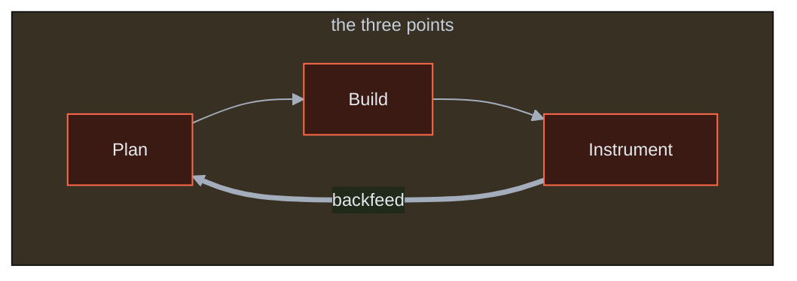
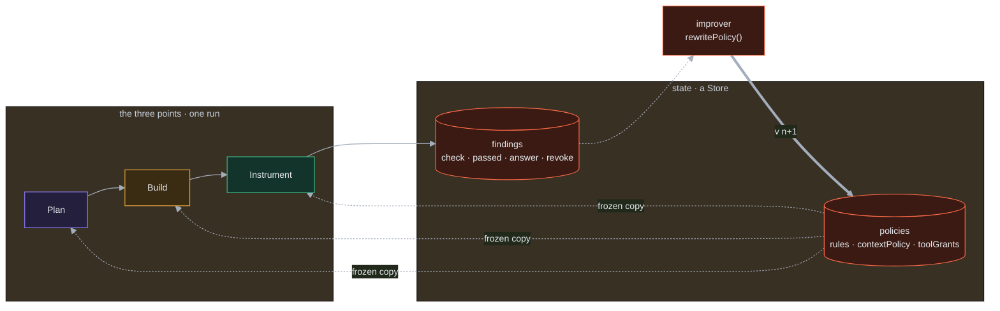
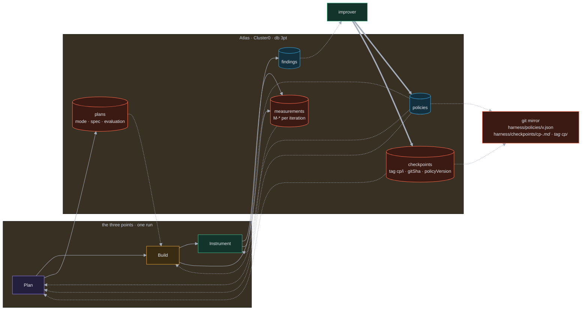
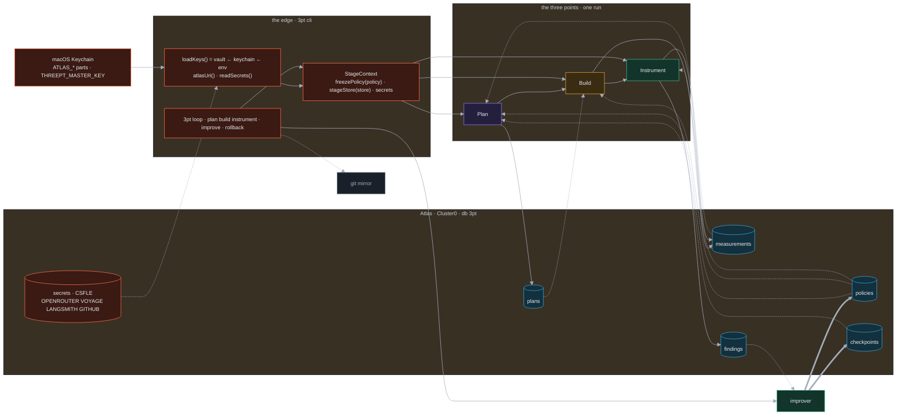
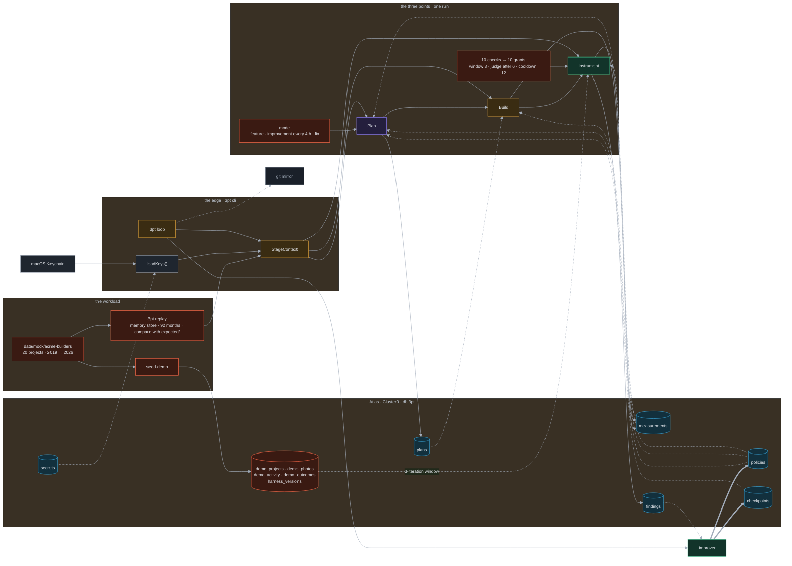
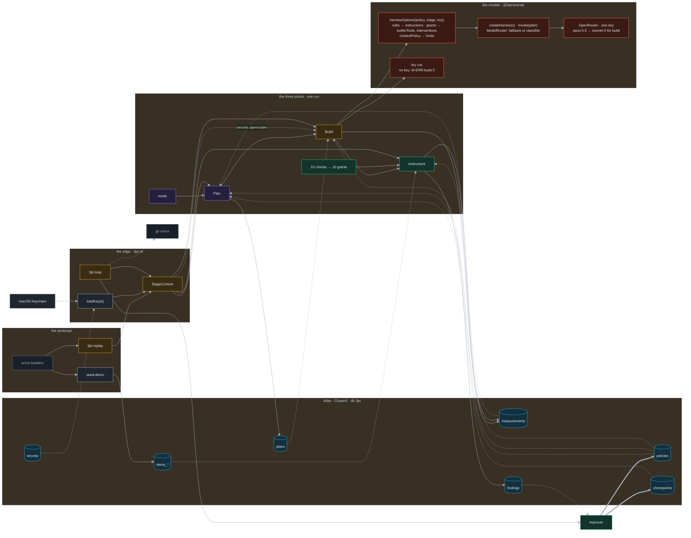
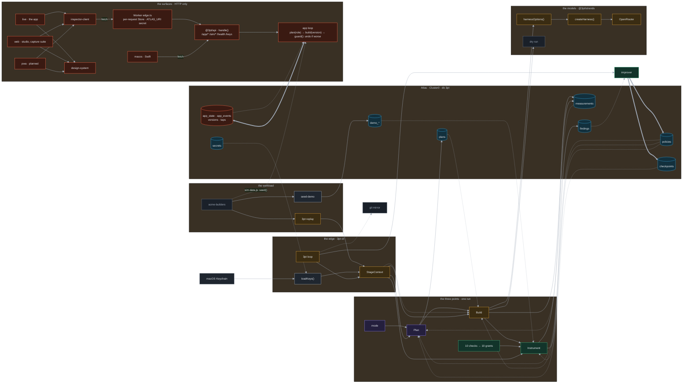
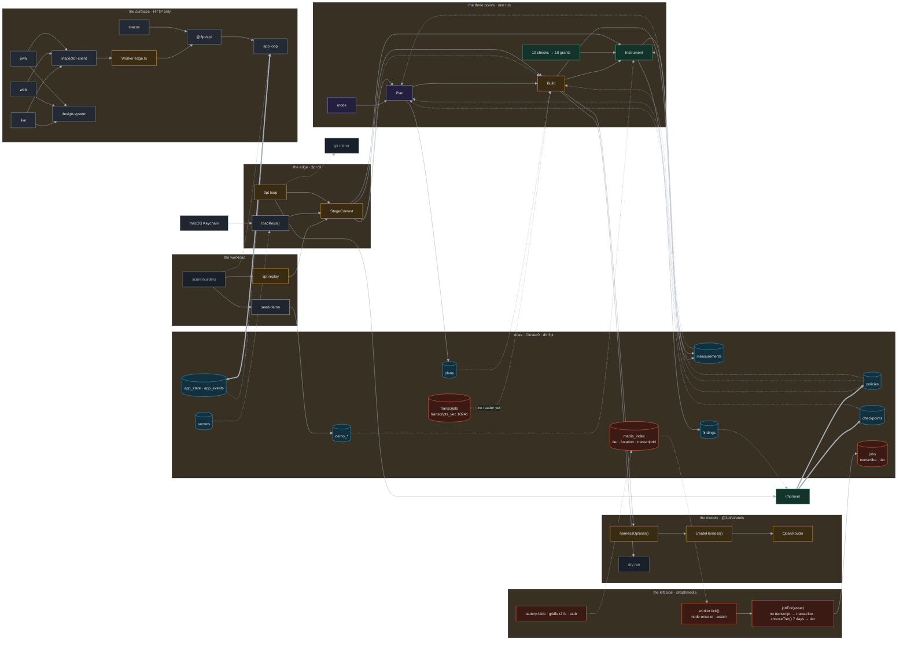
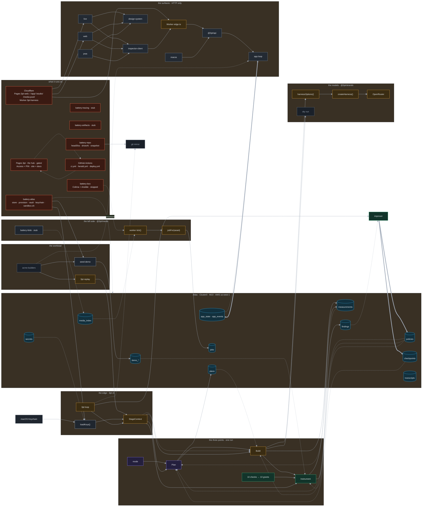

# From three points to the tree: the architecture, disclosed rung by rung

*Nine Mermaid figures, one per rung. Rung 0 is the three points of the vision; rung 8 is the tree as built
on 2026-09-26. Each rung is the previous figure plus what that rung adds, and nothing is taken away.
The full, per-file map is `docs/20-system-map.md`; this document is the way in.*

**How to read the growth.** Three fiducials hold from rung to rung, so the eye can find what moved:

1. **Ids.** A node keeps its id and label from the rung it enters. `P`, `B`, `I` are the three points on every rung.
2. **Regions.** Subgraphs enter in a fixed order and never reorder: `PTS` the points, `STATE` what persists,
   `EDGE` what injects, `WORK` the workload, `MODEL` the models, `SURF` the surfaces, `MEDIA` the left side,
   `INFRA` what it runs on. A region may gain a longer title; it does not move.
3. **Colour.** Red (`flag`) marks what entered at this rung. On the next rung the same node wears its lane colour.
   Edges: solid = a call or import · dashed = a read through the Store · thick = the backfeed.

Each rung names the files it is drawn from. Status words are those of `docs/20` §0.

## Rung 0 · The three points

*One iteration is Plan, then Build, then Instrument, and what Instrument learns feeds the next Plan.*
From `docs/00-vision.md`. Everything else in this document is the machinery that makes the thick edge true.

## Rung 1 · The harness as data

*The backfeed is not an edge from Instrument to Plan. It passes through a document: the Policy. Stages read a
frozen copy; Instrument writes findings; a separate improver rewrites the Policy. The loop and the run are apart.*
From `harness/packages/core/src/index.ts` (`Policy`, `Finding`, `freezePolicy`, `stageStore`),
`harness/packages/improver/src/index.ts`.

New: `POL` `FND` `IMP` and the region `STATE`. The rung 0 edge `I ==> P` becomes the path `I → FND → IMP ⇒ POL ⇢ P`.

## Rung 2 · State in Atlas, mirrored in git

*The Store is MongoDB Atlas. Each stage writes its own collection; the improver alone writes the two loop-owned
ones, and pairs each policy with a checkpoint. The CLI mirrors both to files a tag can pin.*
From `COLLECTIONS` and `LOOP_OWNED` in core, `infra/batteries/atlas/src/{index,store,provision}.ts`,
`harness/apps/cli/src/index.ts` (`checkpoint()`, `rollback()`).

New: `PLN` `MEA` `CPS` in `STATE`, and `GIT`. Status: wired; cp/1 and cp/2 exist as files, no tag yet.

## Rung 3 · The edge

*Nothing in the points reads the environment. A command at the edge resolves keys, opens the Store, freezes
the policy, guards the Store, and hands a context in. Keys come from the Keychain and an encrypted collection.*
From `harness/apps/cli/src/index.ts`, `infra/batteries/atlas/src/{vault,keychain}.ts`, `readSecrets` in core.

New: region `EDGE` with `CLI` `LK` `SEC`; `KC`; `SC` in `STATE`. Status: wired.

## Rung 4 · The workload

*What the loop improves against. A demo firm's outcomes, activity and photos sit in Atlas; Plan picks a sprint
mode from the last checkpoint; Instrument runs ten checks over a three-iteration window, and a failed check
names the grant that answers it. Replay runs the whole loop over 92 months in memory.*
From `harness/packages/plan` (`selectMode`), `harness/packages/instrument` (`PROJECT_CHECKS`, `runChecks`),
`harness/apps/cli/src/replay.ts`, `infra/batteries/atlas/src/seed-demo.ts`, `data/mock/acme-builders/`.

New: region `WORK` with `ACME` `SEED` `RPL`; `DM` in `STATE`; `MODE` beside Plan; `CHK` beside Instrument. Status: wired.

## Rung 5 · The models

*Build does not run the plan itself. It compiles the Policy into the options of a Strands harness: rules become
instructions, grants become tools and interventions, the token cap becomes a limit, and a router picks a model
through OpenRouter. Without the key it is a dry run, so the loop never needs a model to close.*
From `harness/packages/strands/src/index.ts`, `harness/packages/build/src/index.ts`.

New: region `MODEL` with `STR` `CH` `OR` `DRY`. Status: wired when `OPENROUTER_API_KEY` resolves; Plan and
Instrument routes written, no caller.

## Rung 6 · The surfaces, and the second loop

*People reach the harness only over HTTP. The API composes every screen from the current harness version and
takes every tap back as an event; on the Worker it runs a second, self-approving loop that ships a layout or
field change and undoes it when use scores it worse. The surfaces are inspectors and one app.*
From `harness/apps/api/src/{handler,app}.ts`, `harness/apps/worker/src/edge.ts`, `ui/apps/{live,web,pwa,macos}`,
`ui/packages/{inspector-client,design-system}`.

New: region `SURF` with `API` `APPL` `WRK` `LIVE` `WEB` `PWA` `MAC` `IC` `DS`; `AS` in `STATE`. Status: wired;
`pwa` planned, `macos` local.

## Rung 7 · The left side of the triangle

*The media the harness will one day read once and index. An asset record, a tiering rule, a queue, and a worker
tick that fills it. Written and provisioned; no asset is indexed and nothing drains the queue.*
From `harness/packages/media/src/index.ts`, `harness/apps/worker/src/{index,main}.ts`, `infra/batteries/blob`.

New: region `MEDIA` with `TICK` `JF` `BLOB`; `MI` `JB` `TR` in `STATE`. Status: written.

## Rung 8 · What it runs on

*The batteries that stand each thing up, and where each piece is deployed. This is the full tree; `docs/20`
§15 and §16 draw the deployment and the CI on their own.*
From `infra/batteries/*`, `infra/targets.json`, `.github/workflows/*.yml`, `hub/`.

New: region `INFRA` with the six batteries, `CF` the two Pages projects, `HUB`, `CI`, `BOX`. Status: atlas and
repo wired; blob, tracing, artifacts stub; box written and stopped; Pages and Worker live.

## The rungs at a glance

| Rung | Region entered | Nodes entered | Status |
|---|---|---|---|
| 0 | `PTS` | P, B, I | the vision |
| 1 | `STATE` | POL, FND, IMP | wired |
| 2 | | CPS, PLN, MEA, GIT | wired; no tag yet |
| 3 | `EDGE` | CLI, LK, SEC, KC, SC | wired |
| 4 | `WORK` | MODE, CHK, DM, ACME, SEED, RPL | wired |
| 5 | `MODEL` | STR, CH, OR, DRY | wired with a key; dry otherwise |
| 6 | `SURF` | API, APPL, WRK, IC, DS, LIVE, WEB, PWA, MAC, AS | wired; pwa planned, macos local |
| 7 | `MEDIA` | TICK, JF, BLOB, MI, JB, TR | written |
| 8 | `INFRA` | BA, BR, BT, BF, BX, CF, HUB, CI | mixed; see `docs/20` §17 |

Forty-nine nodes and eight regions from three points. What the loop rewrites is still one document, `POL`,
and the thick edge into it is still the only thick edge.
