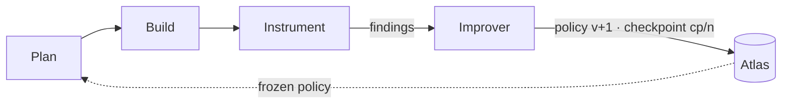

# Talking points: the technical interview

*Status 2026-09-26 · for the room after the video. Registered as **DH**. The README is the primer and stays
so; this is the technical explainer beside it: the order to say things in, the mechanism a level deeper than
README § How it works, what is real today, and the questions to expect. Every claim points at the file that
makes it true. The canvas leaf (`hub/site/canvas.html`) is the screen to drive while these are said.*

## 0 · The order of the talk

**Use case → the three points → expand.** Start where the judge can picture it, then show the mechanism, then
widen to what the mechanism buys.

**Beat 1 · The use case** (surfaces: Use case, App prototype, Results · README § Gist, § Who it is for)
- A general contractor's week: photos come in from every site, and a super, a PM and a project engineer each
  need a different cut of them. Today that cut is made by hand: the OAC photo pack, the closeout walk, the
  turnover package.
- Acme Builders is the demo firm. Real, licensed construction photos; authored people and numbers.
- The app has no designer for its screens. Every screen is composed per role by the harness, and every tap goes
  back as an event. Open the app, tap, then show the "New from the harness" bulb: it shipped that itself.

**Beat 2 · The three points** (surfaces: How it works, Architecture · README § How it works, § Architecture)
- Plan → Build → Instrument under a frozen policy. Instrument writes findings; the improver turns findings into
  the next policy version; every version is a checkpoint in Atlas tagged `cp/<n>`, and rollback is a query.
- The run cannot change the rules. `freezePolicy()` and `stageStore()` make that a thrown error, not a norm.
- Atlas is the only memory: rules, plans, measurements, findings, checkpoints, screens, taps, and the API keys.

**Beat 3 · Expand** (surfaces: Design system, Strands journey, Timeline, Submission · README § The harness over time, § The data)
- Built on AWS Strands as a policy-to-harness compiler: change the policy, change the agent.
- One token source composes three surfaces; the hub renders the repo and grades itself for tersity.
- The whole thing was built today, on the record: spoken, typed, committed, every figure DERIVED or AUTHORED.
- What a week would add: media tiering wired, the gate answered from policy, traces read by Instrument, an
  inspector over the checkpoint lineage.

## 1 · The three points, as a mechanism

| Point | What it does | What it may write | Say this |
|---|---|---|---|
| **Plan** | Reads the last checkpoint and last iteration's measurements. Picks one sprint mode: feature, improvement, or fix. Writes one plan. | `plans` | "One sprint at a time, never parallel. The mode comes from the numbers, not from a person." |
| **Build** | Compiles the policy into a Strands harness: model routes through OpenRouter, tool grants, a risk gate. Runs the plan. | `measurements`, its own worktree | "The policy is the compiler input. Change the policy, change the agent." |
| **Instrument** | Runs ten checks against the demo firm's data stream. Each failed check names a lesson, and often the tool grant that would answer it. | `findings`, `measurements` | "Instrument cannot rewrite anything. It reports. That separation is the safety story." |
| **Improver** | Outer loop. A failed check adds its rule once; an `answer` grants a tool to Build; a `revoke` removes one that did not work. Bumps the version, writes the checkpoint, tags git. | `policies`, `checkpoints` | "The run and the loop are separate. A stage sees a frozen copy and a store that refuses writes to what the loop owns." |

The guard is code, not convention: `freezePolicy()` deep-freezes what a stage receives, and `stageStore()` throws
on any insert into `policies` or `checkpoints`. (`harness/packages/core/src/index.ts`)

## 2 · Why it centres on MongoDB

| Collection | Written by | Read by | The point to make |
|---|---|---|---|
| `policies` | improver | every stage, the compiler | The harness's rules are documents, versioned. Diff two versions and you see what it learned. |
| `checkpoints` | improver | Plan, the inspector, `3pt rollback` | Git sha + policy version + metrics + retrospective. `cp/<n>` is also a git tag. |
| `plans`, `measurements`, `findings` | the three stages | the next iteration | The evidence chain from a run to a rule. |
| `app_state`, `app_events` | the app loop, through the Worker | Plan, Instrument, the live app | Every tap from every role, and the screen composition it changed. This is the input stream. |
| `harness_versions` | the app loop | the app's "New from the harness" bulb | What the harness shipped by itself, with why, per role. |
| `secrets` | the keys page | `loadKeys()` at the edge | API keys are encrypted client-side (CSFLE) and stored in Atlas; the master key stays in the Mac's Keychain. No `.env`. |
| `media_index`, `transcripts`, `jobs` | the worker (left side) | Build, Instrument | Hot and cold tiers are a policy the harness rewrites; a photo is read once, its transcript is the source of truth. |

Three sentences that carry it:

- "One cluster, many doors. The CLI, the Worker on Cloudflare, the keys page and the MCP server all open the
  same `Cluster0`. The Worker opens a client per request and closes it, because Workers cannot hold a socket."
- "Rollback is a query. `3pt rollback cp/2` reads that checkpoint's policy and writes it as a new version, so
  history is never rewritten."
- "Provision is idempotent. `COLLECTIONS` and `INDEXES` are the only place a collection is named; the provision
  script makes the cluster match them." (`infra/batteries/atlas`)

## 3 · How an iteration runs, minute by minute

1. `3pt loop` loads keys: Atlas vault ← Keychain ← host env. Stages never see a URI or a key name.
2. Plan reads `checkpoints` (latest) and `measurements` (iteration − 1). A rising miss rate picks *improvement*;
   a failed grant picks *fix*; otherwise *feature*.
3. Build calls `harnessOptions(policy, 'build', key)`: rules become the system prompt, `toolGrants.build` becomes
   `builtinTools`, the route becomes a `ModelRouter` over OpenRouter, the gate is Strands' `smart` classifier.
   Today's default: Opus 5.5 at high effort, Sonnet 5 as fallback.
4. Instrument runs the ten checks: `search-miss`, `wall-evidence`, `water-late`, `manual-pack`, `wall-search`,
   `slow-answers`, `repeat-questions`, `closeout-by-hand`, `duplicate-photos`, `hazard-photos`. Each speaks the
   trade: supers, PMs, PEs, the OAC photo pack, the turnover package.
5. The improver writes `policies` v+1 and `checkpoints` cp/n, `harness/policies/v<n>.json` and
   `harness/checkpoints/cp-<n>.md`; `--git` commits and tags.

## 4 · Self-driving: the affordances

- **The app approves itself.** A tap is an event. Plan turns events into one change. The change ships at once.
  Instrument compares use before and after. A drop rolls it back. No person is in the approval path.
  (`app.ts` `selfApprove`, commit `f9c22a1`)
- **Screens are composed, not designed.** `GET /app/screen?role=super` returns the blocks and their order the
  current harness version chose for that role. Blocks never decide which blocks show.
- **Grants are the vocabulary of learning.** A finding can name the tool that would answer it. Ten checks, ten
  grants. The harness grows capabilities it can name, and revokes ones that did not pay.
- **The data stream is the teacher.** Photos arrive weekly; taps arrive constantly. Both are Atlas documents.
  The loop reads nothing else.
- **The gate is part of the policy.** In the first live Build today, the sprint ran seven shell calls and the
  policy's risk gate halted it before an unreviewed script in `infra/`. That is the design working, not failing.

## 5 · Built on Strands, and what that buys

3PT is a policy-to-harness compiler over AWS Strands (`docs/12-strands-archaeology.md`, `docs/18-strands-questions.md`).
Struck: our own loop, router, sessions. Kept: `createHarness`, `ModelRouter`, hooks, interventions, sessions,
memory. A policy field maps to a Strands option: `routes` → `ModelRouter`; `toolGrants` → `builtinTools`;
`rules` → instructions; the gate → `interventions`. The measurement plugin registers `AfterModelCall` and
`AfterToolCall` hooks and writes `M-TURNS`, `M-TOOLS`, `M-STOP` into `measurements`.

## 6 · What is real today, and what is not

| Claim | State | Evidence |
|---|---|---|
| Loop runs, persists checkpoints to Atlas, rolls back | real | `3pt loop`, `checkpoints` in Cluster0, `cp/1`, `cp/2` |
| Worker serves the app from Atlas | real | `/health` says `"store":"atlas"` |
| Keys resolve from the Atlas vault | real | keys page test: "works" |
| Build runs a live Strands sprint through OpenRouter | real, once | seven tool calls, halted at the gate |
| 92-month replay in Results | simulated | `replay-data.js`, generated by `3pt replay` from the checks |
| Acme Builders, its people and numbers | authored | photos are real, licensed; everything else is example data |
| Media tiering, transcripts, vector search | written, not wired | `docs/18` §5 gaps |

Say the second column out loud before anyone asks.

## 7 · Questions to expect

| Question | Answer |
|---|---|
| Is this RAG? | No. Nothing is retrieved into a prompt as the product. The product is the policy rewrite; photos are the workload that stresses memory and tiering. |
| Why Mongo and not files? | Because the harness runs in three places (Mac, Worker, box) and must see one state. Documents fit policies and findings; CSFLE fits keys; tags on checkpoints fit rollback. |
| What did it actually learn? | Show `policies` v0 → v2 in the Atlas explorer: rules added once per failed check, grants added by `answer`. |
| What stops it hurting itself? | Frozen policy, a store that refuses loop-owned writes, a risk gate on Build, checkpoints with rollback. |
| What would you do with a week? | Wire the media left side; answer the gate from policy; make Instrument read LangSmith traces; the inspector canvas over checkpoints. |

## 8 · Driving the canvas

Open **Canvas** in the rail. Every leaf and document is a live thumbnail on one board, grouped by cluster.
Drag to pan, wheel to zoom, **Fit** to see all. The **path** runs the talk in order: press **Next** and the board
centres on the surface for the current beat. Click any thumbnail to open it.

| Beat | Surfaces on the path, in order |
|---|---|
| 1 · Use case | Use case, App prototype, Results, Simulator |
| 2 · The three points | How it works, Architecture, README |
| 3 · Expand | Design system, Strands journey, Timeline, Lane board, Submission |
