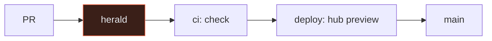

# PR: Herald gate, CI check, PR heraldry, deploy-target resolver, and the CI/deployment contemplation

**Branch:** `lane/ci-heraldry` · **Base:** `main` (`0fd66df`) · **Status:** Ready

## 1 · Coat of Arms

```
╔══════════════════════════════════════════╗
║   lane/ci-heraldry                       ║
╠══════════════════════════════════════════╣
║            ⚜  MODERATE  ⚜                ║
║                                          ║
║              🔴 🛡 🟣                      ║
║       check ✗          herald A          ║
║          ⚙ × 2     📖 × 1                 ║
║                                          ║
║   ⌘ policy v0 · cp/— · claude-code       ║
║      seeds @s1.16 · new seed             ║
║                                          ║
║      📁 17  |  +724 / −112              ║
╠══════════════════════════════════════════╣
║   "Primum ramus, deinde aedificium"      ║
║   First the branch, then the building    ║
╚══════════════════════════════════════════╝
```

**Compact:** ⚜ 🔴🟣 🛡 ⚙×2 📖×1 check ✗ herald A · ⌘ v0 cp/— · 📁17 +724/−112

| Element | Value | Meaning |
|---|---|---|
| Magnitude | moderate | every future PR passes through what this adds; nothing it adds is large |
| Tincture | ci 🔴 `#ff6b4a`, docs 🟣 `#8b7cf6` | the herald, the CI workflow and the resolver; the contemplation doc and the filing rules |
| Charges | ⚙ × 2 · 📖 × 1 | two `ci:` commits, one `docs:` commit; the `docs(pr):` commit is excluded |
| Dexter supporter | check ✗ | `make check` is red on `main` as committed at the Install step (stale lockfile, `@3pt/build` missing); every other step is green. See §5 |
| Sinister supporter | herald A | this file, graded by `scripts/pr-validate.mjs` |
| Escutcheon | ⌘ policy v0 · cp/— · claude-code | `harness/policies/v0.json` is the only policy; no `cp/` tag exists yet; built by a Claude Code session, by hand, not by the Build stage |
| Seeds | @s1.16 · new seed | the install loop and lanes (@s1.16); the heraldry itself is imported from the Lanternade Control convention, a new seed for this repo |
| Motto | "Primum ramus, deinde aedificium" | first the branch, then the building |

## 2 · Summary

Adds the first gate on every PR (branch name, commit prefixes, description grade) before any build, a CI workflow that runs what `make check` runs, a six-section PR description convention with its grader and filing rules, a one-record-per-deployable resolver, and the contemplation doc on build and deploy infrastructure, topology, credits and Atlas usage by tier. **Context:** the hub had CI; the monorepo, the branching mechanism and the deploy topology had none, and the credit ledger had never been read against what it can fund.

## 3 · Changes

| Change | Where | Status |
|---|---|---|
| Herald workflow: `lane/<slug>` branch, allowed prefixes, body ≥ B | `.github/workflows/herald.yml` | ✅ |
| CI workflow: resolver check, description grades, hub lints, provenance, install, build + typecheck | `.github/workflows/ci.yml` | ✅ (Install step red on main, see §5) |
| Six-section PR template | `.github/PULL_REQUEST_TEMPLATE.md` | ✅ |
| Filing system and completeness degree tracker rules | `docs/pr-descriptions/README.md` | ✅ |
| Grader, exit 1 below B; `--stdin` for the herald | `scripts/pr-validate.mjs` | ✅ |
| Deploy-target record and resolver (`list · resolve · matrix · check`) | `infra/targets.json`, `scripts/target.mjs` | ✅ |
| Contemplation: build, deploy, topology (2 diagrams), Atlas by tier, credits, branching, next steps | `docs/13-ci-and-deployment.md` | ✅ |
| Hub leaf DC and Register entry; README, CLAUDE, AGENTS rows; prefix rule gains `hub:` `ci:` and `lane/<slug>` | `hub/site/*`, `README.md`, `CLAUDE.md`, `AGENTS.md` | ✅ |

**Deliberately not in this PR:** branch protection on `main` (one `gh api` call, listed in D13 §7); `wrangler.jsonc` for the Worker; the `3pt-web` Pages project; `harness-tick.yml`; the fix for the stale lockfile (harness lane).



## 4 · Provenance

- **Seeds:** `@s1.16` (lanes, the install loop, main must always install) is what the CI gate protects. The heraldry is a **new seed** here: adapted from `lc_dev/release/docs/CONTRIBUTING.md` §4 and the research garden's PR template, cut to six sections for a hackathon. Atlas facts were looked up on 2026-09-26: Data API end of life 2025-09-30; Node driver on Cloudflare Workers via `nodejs_compat` since 2025-01; Flex 5 GB / 500 ops per second; Free 0.5 GB / 100 ops per second; Online Archive M10+ only; `mongodb/atlas-github-action@v0.2.0` with service accounts.
- **Harness:** policy `v0`, checkpoint none, built by `claude-code` by hand; sprint mode `feature`.
- **Base and last content commit:** `0fd66df..3be2966`; reproduce with `git diff --shortstat 0fd66df..3be2966`.

| SHA | Subject |
|---|---|
| `6112ef8` | `ci: herald gate on PRs, CI check workflow, PR heraldry template and grader, deploy-target resolver` |
| `d2bcbae` | `docs: CI and deployment contemplation (D13): build, deploy, topology, credits, Atlas usage by tier; hub leaf and tables` |
| `3be2966` | `ci: herald.yml as block mappings so the workflow parses; bake the D13 seed cite` |

## 5 · Test plan and attestation

- [x] `make -C hub check` in the lane worktree on the rebased tree: nav 0 errors, view clean, provenance 0 gaps
- [x] `node scripts/target.mjs check`: 7 targets, every workflow present, secrets are names only
- [x] `node scripts/pr-validate.mjs .github/PULL_REQUEST_TEMPLATE.md`: grade B with placeholders, as intended (a blank template must not grade A)
- [x] `node scripts/pr-validate.mjs` on this file: see §6
- [x] `pnpm install --frozen-lockfile` in the worktree: **fails** on `main` as committed (`@3pt/build@workspace:*` absent, lockfile stale); `turbo run build typecheck` therefore not reached
- [x] First run on the PR: `ci.yml` red at Install exactly as predicted (stale lockfile); `herald.yml` registered zero jobs because of flow-mapped `env:` with expressions, fixed in the third commit
- [ ] Second run, after the fix: herald should pass; `ci.yml` stays red at Install until the harness lane regenerates the lockfile

| Gate | Result |
|---|---|
| herald (branch · prefixes · body) | ✗ first run did not parse (flow-mapped env); fixed, re-run pending. Locally under bash: branch matches, all three subjects carry an allowed prefix, body grades A |
| check (resolver · descriptions · hub lints · provenance) | ✅ locally |
| check (install · build · typecheck) | ✗ confirmed in CI: `pnpm-lock.yaml` has no importer for `harness/packages/strands`; not this PR's change, named in D13 §0 and §7 |
| preview walked | ⚪ the hub preview appears once `CLOUDFLARE_*` secrets exist; until then `make -C hub preview` locally, walked the CI leaf and the card |

## 6 · Completeness

```
docs/pr-descriptions/PR_DESCRIPTION_CI_HERALDRY.md
  ✓ 1 · Coat of Arms
  ✓ 2 · Summary
  ✓ 3 · Changes
  ✓ 4 · Provenance
  ✓ 5 · Test plan and attestation
  ✓ 6 · Completeness
  ✓ ASCII block present (the compact line never replaces it)
  ✓ compact line present
  ✓ escutcheon names the harness policy version
  ✓ a seed cite (@sN.NN) or "new seed"
  ✓ commits table with at least one SHA
  ✓ gates table names check and herald
  ✓ no attribution line
  ──── completeness 100%  grade A
```
