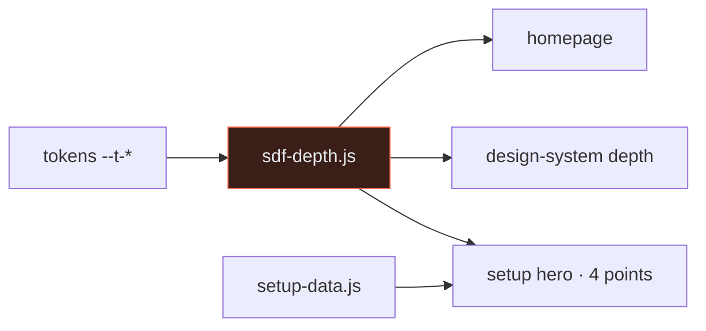

# PR: Depth shader, Phosphor icon set, the setup cascade, and a graphic design-system leaf

**Branch:** `lane/ds-depth-icons` · **Base:** `main` (`000a85c`) · **Status:** Ready · **Stacked:** carries PR #1's three heraldry commits by cherry-pick so the grader and this file exist here; land #1 first and they drop out as already upstream.

## 1 · Coat of Arms

```
╔══════════════════════════════════════════╗
║   lane/ds-depth-icons                    ║
╠══════════════════════════════════════════╣
║              ⚜  MAJOR  ⚜                 ║
║                                          ║
║              ⚫ 🛡 🟣                      ║
║       check ✗          herald A          ║
║              ⌂ × 6                       ║
║                                          ║
║   ⌘ policy v0 · cp/— · claude-code       ║
║          seeds: new seed                 ║
║                                          ║
║      📁 13  |  +856 / −117             ║
╠══════════════════════════════════════════╣
║   "Tria puncta, unus nucleus"            ║
║   Three points, one core                 ║
╚══════════════════════════════════════════╝
```

**Compact:** ⚜ ⚫🟣 🛡 ⌂×6 check ✗ herald A · ⌘ v0 cp/— · 📁13 +856/−117

| Element | Value | Meaning |
|---|---|---|
| Magnitude | major | two new leaves, two new modules, a shader, and the design-system leaf rewritten at 40% less prose |
| Tincture | hub ⚫ `#6b7684`, docs 🟣 `#8b7cf6` | every commit is a hub leaf or module; one doc of record (D14) |
| Charges | ⌂ × 6 | six `hub:` commits; the `docs(pr):` commit and the three carried PR #1 commits are excluded |
| Dexter supporter | check ✗ | `make -C hub check` on the rebased tree: nav 0 errors, view clean, diagrams OK, provenance 0 gaps, then fails because main's Makefile runs `tools/tersity.mjs`, which is not committed. Not this PR's file; see §5 |
| Sinister supporter | herald A | this file, graded by `scripts/pr-validate.mjs` |
| Escutcheon | ⌘ policy v0 · cp/— · claude-code | built by a Claude Code session plus one subagent for the prose cut; no checkpoint tagged yet |
| Seeds | new seed | the depth motif, the icon set, the cascade and the 40% rule all come from today's prompts, not the transcript |
| Motto | "Tria puncta, unus nucleus" | three points, one core |

## 2 · Summary

Gives the hub depth: a signed-distance-field shader draws the triangle mark as a lit height field behind the homepage, inside the design-system specimens, and, in its four-point mode, as the tetrahedron with the batteries core at the centre on a new Setup cascade leaf where a non-technical operator picks one provider per slot (MongoDB, OpenRouter or Vercel AI Gateway, GridFS or R2 or S3, Cloudflare or AWS) and gets signup links, env keys and the scripted provision step. Adds a thirty-icon Phosphor utility set, and cuts the design-system leaf's prose by a measured 40% in favour of six inline SVG figures and eighty citable ids. **Context:** the design system read as a wall of text, the batteries had no operator-facing surface, and app surfaces had no utility icons.

## 3 · Changes

| Change | Where | Status |
|---|---|---|
| SDF depth shader: tokens in, WebGL out; reduced motion, offscreen pause, no-WebGL fallback; four-point tetrahedron mode | `hub/site/sdf-depth.js` | ✅ |
| Field fixed behind the homepage at low intensity | `hub/site/index.html` | ✅ |
| Depth section: field behind a specimen and inside stat tiles, intensity and scale dials | `hub/site/design-system.html` | ✅ |
| Phosphor subset, thirty icons with their 3PT meanings, MIT; Icons leaf | `hub/site/phosphor.js`, `hub/site/icons.html` | ✅ |
| Setup cascade: eight slots, 21 providers, links, env keys, scripts, grants, derived .env, slots→grants→stages figure, four-system matrix | `hub/site/setup.html`, `hub/site/setup-data.js` | ✅ |
| Doc of record for the cascade; proposes the gateway battery | `docs/14-setup-cascade.md` | ✅ |
| Design-system leaf: prose 3572 → 2136 words, figures F-a..F-f, ids I1..K12, Register, stylesheet collision fixes | `hub/site/design-system.html` | ✅ |
| Registrations: three leaves and one doc (DP) in nav, Register, hub cards; README, CLAUDE, AGENTS rows | `hub/site/nav.js`, `hub/site/3pt-data.js`, `hub/site/index.html`, `README.md`, `CLAUDE.md`, `AGENTS.md` | ✅ |

**Deliberately not in this PR:** the gateway battery itself (proposed in D14); storing cascade choices in Atlas instead of the browser; the SF Symbols mapping for the thirty icons; the fix for main's missing `tersity.mjs`.



## 4 · Provenance

- **Seeds:** new seed. The depth motif, the icon library, the cascade over the batteries and the 40% rule were asked for in this session (2026-09-26 afternoon). Phosphor: `github.com/phosphor-icons/core`, MIT, regular weight, pulled today. The batteries, grants and stages come from `infra/README.md` and `docs/10-architecture.md` §4.3; credits from `docs/04-resources.md`.
- **Harness:** policy `v0`, checkpoint none, built by `claude-code` with one subagent (the prose cut); sprint mode `feature`.
- **Base and last content commit:** `000a85c..2b8153a`; reproduce with `git diff --shortstat 000a85c..2b8153a`. Commits after `2b8153a` are PR #1's, carried.

| SHA | Subject |
|---|---|
| `b7081a2` | `hub: signed-distance-field depth behind the homepage and a depth section on the design system leaf` |
| `0a5e6ce` | `hub: depth section on the design system leaf, the field behind a specimen and inside its tiles, intensity and scale dials` |
| `e439abf` | `hub: Phosphor utility icon set, thirty glyphs vendored with their 3PT meanings, and the Icons leaf` |
| `bdda30d` | `hub: four-point mode for the depth shader, the tetrahedron with the batteries core at the centroid joined to the three points` |
| `3b73dd8` | `hub: Setup cascade leaf and Model, the batteries as a first-class onboarding surface; docs/14` |
| `2b8153a` | `hub: design system leaf at 40% less prose, six inline SVG figures, citable ids and a derived Register` |

## 5 · Test plan and attestation

- [x] Homepage, design-system depth section (light and dark), Icons leaf, Setup leaf (hero, cards, flow figure, matrix) walked in Chrome over a local stage: no console errors
- [x] Design-system Register renders 80 ids; chip click copies; subagent verified ballot, contrast, fit, generated code and specimen still work after the cut
- [x] Word count before and after the cut measured with tags, script and style stripped: 3572 → 2136
- [x] `make -C hub check` after rebase onto `000a85c`: nav 0 errors, view clean, links resolve, diagram lint 0 unresolved, provenance 0 gaps; **then** `node tools/tersity.mjs` MODULE_NOT_FOUND
- [x] Rebase conflicts in `nav.js` and `index.html` (main added the App prototype leaf) resolved keeping both
- [ ] `herald.yml` and `ci.yml` on this PR: results in the checks tab

| Gate | Result |
|---|---|
| herald (branch · prefixes · body) | ⚪ runs on open. Locally: branch matches; all 6 subjects carry `hub:`; body grades A |
| check (resolver · descriptions · hub lints · diagrams · provenance) | ✅ locally, up to the tersity step |
| check (tersity) | ✗ main's `hub/Makefile` runs `tools/tersity.mjs`, which is not in the tree; not this PR's change |
| check (install · build · typecheck) | ✗ still red on main (stale lockfile, PR #1 §5); unchanged here |
| preview walked | ⚪ Pages secrets not set; walked over `tools/serve.py` instead |

## 6 · Completeness

```
docs/pr-descriptions/PR_DESCRIPTION_DS_DEPTH_ICONS.md
  ✓ 1 · Coat of Arms
  ✓ 2 · Summary
  ✓ 3 · Changes
  ✓ 4 · Provenance
  ✓ 5 · Test plan and attestation
  ✓ 6 · Completeness
  ✓ ASCII block present (the compact line never replaces it)
  ✓ compact line present
  ✓ escutcheon names the harness policy version
  ✓ a seed cite (@sN.NN) or "new seed"
  ✓ commits table with at least one SHA
  ✓ gates table names check and herald
  ✓ no attribution line
  ──── completeness 100%  grade A
```
